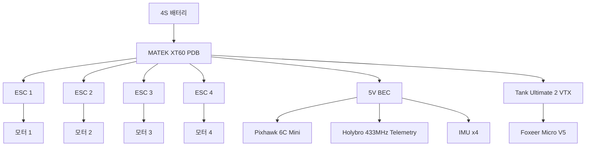
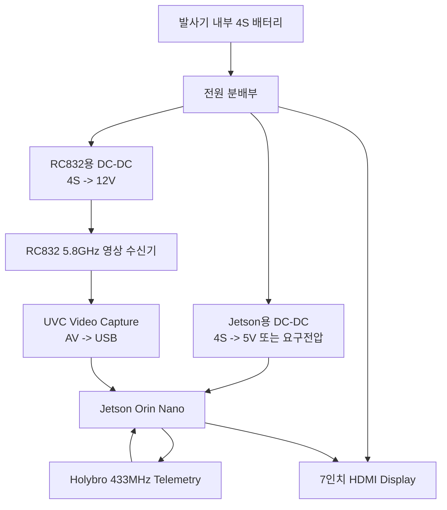

# 전장 설계

## 드론 내부 전장 설계

```mermaid
flowchart TD
    BAT[4S 배터리] --> PDB[MATEK XT60 PDB]

    PDB --> ESC1[ESC 1]
    PDB --> ESC2[ESC 2]
    PDB --> ESC3[ESC 3]
    PDB --> ESC4[ESC 4]

    ESC1 --> M1[모터 1]
    ESC2 --> M2[모터 2]
    ESC3 --> M3[모터 3]
    ESC4 --> M4[모터 4]

    PDB --> BEC[5V BEC]
    BEC --> FC[Pixhawk 6C Mini]
    BEC --> TEL[Holybro 433MHz Telemetry]
    BEC --> IMU[IMU x4]

    PDB --> VTX[Tank Ultimate 2 VTX]
    VTX --> CAM[Foxeer Micro V5]
```

## 발사기 내부 전장 설계

```mermaid
flowchart TD
    BAT[발사기 내부 4S 배터리] --> PDB[전원 분배부]

    PDB --> JET_BEC[Jetson용 DC-DC<br/>4S -> 5V 또는 요구전압]
    JET_BEC --> JET[Jetson Orin Nano]

    PDB --> DISP[7인치 HDMI Display]

    PDB --> RC_BEC[RC832용 DC-DC<br/>4S -> 12V]
    RC_BEC --> RC832[RC832 5.8GHz 영상 수신기]

    RC832 --> UVC[UVC Video Capture<br/>AV -> USB]
    UVC --> JET

    JET --> TEL[Holybro 433MHz Telemetry]

    TEL --> JET
    JET --> DISP
```