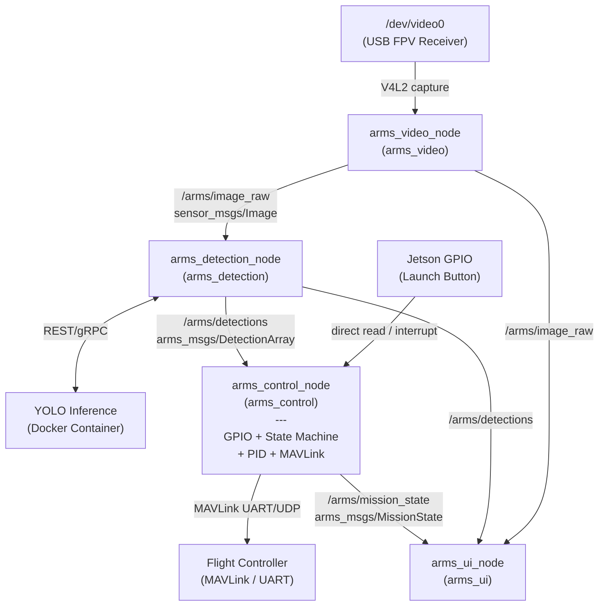
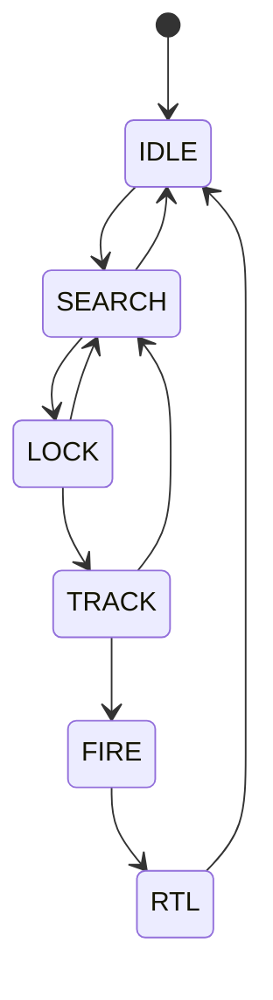
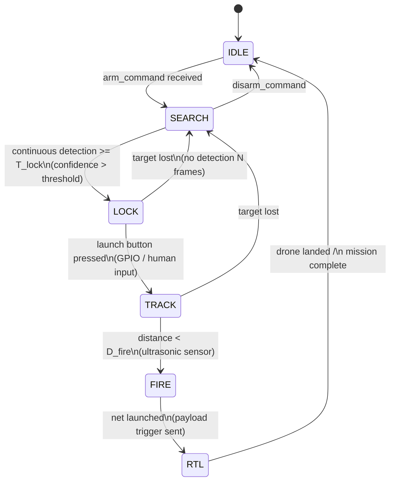

# A.R.M.S. 소프트웨어 설계 문서

- Anti-drone Reusable Modular System — Software Architecture

---

## 목차

1. [시스템 개요](#1-시스템-개요)
2. [ROS 패키지 구조](#2-ros-패키지-구조)
3. [노드 및 토픽 구조](#3-노드-및-토픽-구조)
4. [상태 머신](#4-상태-머신-arms_control-내부)
5. [영상 수신 (arms_video)](#5-영상-수신-arms_video)
6. [객체 인식 (arms_detection)](#6-객체-인식-arms_detection)
7. [비행 제어 및 상태 관리 (arms_control)](#7-비행-제어-및-상태-관리-arms_control)
8. [오퍼레이터 UI (arms_ui)](#8-오퍼레이터-ui-arms_ui)
9. [런치 파일 구조](#9-런치-파일-구조)
10. [전체 데이터 흐름 요약](#10-전체-데이터-흐름-요약)
11. [개발 순서](#11-개발-순서-권장)

---

## 1. 시스템 개요

### 1.1 물리 구성


### 1.2 소프트웨어 레이어

```
+----------------------------------------------------------+
|                    Operator Interface                    |
|                    (Monitor Display)                     |
+----------------------------------------------------------+
|   Video Pipeline   |  Detection  |   Flight Control      |
|  (V4L2 -> ROS)     |  (YOLO)     |   State Machine +     |
|                    |             |   PID + MAVLink       |
+----------------------------------------------------------+
|              ROS 2 Middleware (Humble)                   |
+----------------------------------------------------------+
|            Jetson Hardware (CUDA, V4L2, UART)            |
+----------------------------------------------------------+
```

---

## 2. ROS 패키지 구조

```
arms_ws/
└── src/
    ├── arms_bringup/          # launch files, top-level config
    ├── arms_video/            # V4L2 -> ROS Image topic
    ├── arms_detection/        # YOLO Docker bridge + detection topic
    ├── arms_control/          # State machine + PID controller + MAVLink telemetry
    ├── arms_ui/               # Operator display (rqt plugin or OpenCV window)
    └── arms_msgs/             # Custom message/service definitions
```

---

## 3. 노드 및 토픽 구조

### 3.1 노드 그래프



- 영상 수신 (arms_video_node)
  - publish
    - `/arms/image_raw`
- 객체 인식 (arms_detection_node)
  - subscribe
    - `/arms/image_raw`
  - publish
    - `/arms/detections`
- 제어 (arms_control_node)
  - subscribe
    - `/arms/detections`
  - publish
    - `/arms/mission_state`
- UI (arms_ui_node)
  - subscribe
    - `/arms/image_raw`
    - `/arms/detections`
    - `/arms/mission_state`

### 3.2 커스텀 메시지 정의

```
# arms_msgs/BoundingBox.msg
float32 x_center    # normalized [0.0, 1.0]
float32 y_center    # normalized [0.0, 1.0]
float32 width       # normalized [0.0, 1.0]
float32 height      # normalized [0.0, 1.0]
float32 confidence
int32   class_id
string  class_name
```

```
# arms_msgs/DetectionArray.msg
std_msgs/Header header
BoundingBox[]   detections
```

```
# arms_msgs/MissionState.msg
std_msgs/Header header
string          state                # IDLE | SEARCH | LOCK | TRACK | FIRE | RTL
float32         lock_elapsed_sec     # continuous detection duration so far [s]
float32         error_x              # current normalized pixel error (for UI)
float32         error_y
bool            target_locked
```

---

## 4. 상태 머신 (arms_control 내부)

### 4.1 상태별 동작 정의



| 상태       | 드론 동작                    | 제어 출력                 | UI 표시                   |
| ---------- | ---------------------------- | ------------------------- | ------------------------- |
| **IDLE**   | 정지 대기                    | 제어 없음 (Disarmed)      | 회색 테두리               |
| **SEARCH** | Arm                          | 고정 스로틀, roll/pitch=0 | 노란색, "Searching..."    |
| **LOCK**   | 목표 추적 시작, 잠금 확인 중 | PID 활성화 (약한 스로톨)  | 주황색 박스, "Locking..." |
| **TRACK**  | 완전 추적                    | PID 활성화 (풀 스로틀)    | 빨간 박스, "LOCKED"       |
| **FIRE**   | 추적 유지 + 발사             | PID 유지 + 발사 트리거    | 빨간 박스, "FIRED!"       |
| **RTL**    | 귀환                         | MAVLink RTL 명령          | "Returning..."            |

### 4.2 상태 전이 다이어그램 (조건 포함)



### 4.3 전이 조건 파라미터

```yaml
# arms_control/config/control_params.yaml (mission section)
mission:
  detection_confidence_threshold: 0.65
  lock_duration_sec: 2.0 # continuous detection duration required to enter LOCK [s]
  lost_frames_threshold: 10 # frames without detection -> back to SEARCH
  lock_box_tolerance: 0.15 # normalized bbox center tolerance from frame center
  fire_distance_m: 3.0 # ultrasonic distance threshold to trigger FIRE (net launch) [m]
```

---

## 5. 영상 수신 (arms_video)

### 5.1 구성

- FPV 수신기 → USB Video Capture 장치 (`/dev/video0`)
- V4L2 드라이버를 통해 프레임 수신
- `image_transport` 를 통해 `/arms/image_raw` 발행
- 해상도/FPS는 런치 파라미터로 설정

### 5.2 런치 파라미터

```yaml
# arms_video/config/video_params.yaml
video:
  device: "/dev/video0"
  width: 1280
  height: 720
  fps: 30
  pixel_format: "YUYV" # or MJPG depending on capture card
  topic_name: "/arms/image_raw"
  camera_info_url: "" # optional calibration
```

### 5.3 노드 구현 요약

```
arms_video_node
  - v4l2_capture() loop at target FPS
  - convert frame to sensor_msgs/Image (BGR8)
  - publish /arms/image_raw
  - optional: publish /arms/image_compressed for UI bandwidth
```

---

## 6. 객체 인식 (arms_detection)

### 6.1 Docker 통합 구조

호스트 측 ROS2 노드 없이, Docker 컨테이너가 ROS2 네트워크에 직접 참여한다.

```
+---[ Jetson (Host) ]-----------------------------+
|                                                 |
|  /arms/image_raw  (ROS2 topic, DDS)             |
|       |                                         |
|       | network_mode: host                      |
|       v                                         |
|  +---[ Docker Container ]------------------+    |
|  |  arms_detection_node.py                 |    |
|  |  - Base: ultralytics:latest-jetson-     |    |
|  |          jetpack6 + ROS2 Humble         |    |
|  |  - Subscribes /arms/image_raw           |    |
|  |  - Ultralytics YOLO inference (CUDA)    |    |
|  |  - Publishes /arms/detections           |    |
|  +------------------------------------------+   |
|                                                 |
+-------------------------------------------------+
```

`network_mode: host` 로 컨테이너가 호스트 네트워크 스택을 공유하므로
DDS 멀티캐스트 discovery가 별도 설정 없이 동작한다.

### 6.2 Docker Compose

```yaml
# arms_detection/docker/docker-compose.yml
services:
  arms_detection:
    build:
      context: ../.. # arms_ws/src/ — arms_msgs 소스 접근용
      dockerfile: arms_detection/docker/Dockerfile
    image: arms/detection:latest
    network_mode: host # DDS 통신 핵심 설정
    runtime: nvidia
    environment:
      - NVIDIA_VISIBLE_DEVICES=all
      - ROS_DOMAIN_ID=${ROS_DOMAIN_ID:-0}
      - ARMS_MODEL=/models/drone.pt
      - ARMS_CONF=0.5
      - ARMS_IOU=0.45
    volumes:
      - ./models:/models:ro
    restart: unless-stopped
```

### 6.3 Dockerfile 구성

```
Base : ultralytics/ultralytics:latest-jetson-jetpack6
  +-- ROS2 Humble (rclpy, sensor_msgs, rosidl)
  +-- arms_msgs (소스 COPY 후 colcon build)
  +-- arms_detection_node.py
```

### 6.4 추론 흐름

```
/arms/image_raw (sensor_msgs/Image)
        |
        | DDS (network_mode: host)
        v
arms_detection_node.py (Docker 내부)
        |
   np.frombuffer → numpy array
        |
   YOLO.predict()
        |
   BoundingBox 변환 (normalized coords)
        |
        v
/arms/detections (arms_msgs/DetectionArray)
```

---

## 7. 비행 제어 및 상태 관리 (arms_control)

### 7.1 좌표계 및 오차 정의

하늘을 향하는 카메라 기준으로 픽셀 오차를 드론 제어 오차로 변환한다.

```
  Image Frame (sky-facing camera, drone body frame)

        ^ pitch+ (drone forward)
        |
        |
  ------+------> roll+ (drone right)
        |
        |
  (0,0) = image center

  error_x = (bbox_cx - img_cx) / img_w    [-0.5, +0.5]
  error_y = (bbox_cy - img_cy) / img_h    [-0.5, +0.5]
```

**카메라 장착 방향에 따라 roll/pitch 매핑 주의 필요.**

### 7.2 PID 제어

$$
u(t) = K_p \cdot e(t) + K_i \int_0^t e(\tau)d\tau + K_d \frac{de(t)}{dt}
$$

- `error_x` → **roll 각도** 명령 [deg]
- `error_y` → **pitch 각도** 명령 [deg]
- **throttle** → 상수 (파라미터로 설정)
- **yaw** → 0 (고정 또는 별도 로직)

```
roll_angle  = PID_roll (error_x)    # [deg], clamped to max_tilt_deg
pitch_angle = PID_pitch(error_y)    # [deg], clamped to max_tilt_deg
throttle    = CONSTANT_THROTTLE
yaw_angle   = 0.0                   # hold heading
```

### 7.3 PID 파라미터

arms_control은 C++ (ament_cmake) 로 구현되며, ROS2 파라미터로 런타임 설정이 가능하다.

```yaml
# arms_control/config/control_params.yaml
arms_control_node:
  ros__parameters:
    control:
      roll_pid:
        kp: 15.0
        ki: 0.5
        kd: 1.0
        output_limit: 30.0 # max roll angle [deg], anti-windup clamp 도 동일 값 적용
      pitch_pid:
        kp: 15.0
        ki: 0.5
        kd: 1.0
        output_limit: 30.0 # max pitch angle [deg]
      throttle: 0.55 # constant throttle [0.0, 1.0]
      control_rate_hz: 30.0

    mavlink:
      connection: "udp:127.0.0.1:14550" # SITL
      # connection: "/dev/ttyTHS1"        # 실 기체 (Jetson UART)
      baud: 115200
      system_id: 255
      component_id: 1

    gpio:
      enabled: false # 실 기체: true
      launch_button_pin: 18 # BOARD 핀 번호 (libgpiod)
```

PID 구현 특이사항:

- **anti-windup**: integral 값을 `[-output_limit/ki, +output_limit/ki]` 로 clamp
- **derivative kick 방지**: 첫 번째 호출에서 미분항 생략
- **출력 단위**: [deg], MAVSDK `Offboard::Attitude` 에 직접 전달 (deg→rad 변환은 MAVSDK 내부 처리)

### 7.4 MAVLink 명령

제어 명령은 `SET_ATTITUDE_TARGET` (MAVLink #82) 메시지에 쿼터니언 자세값을 담아 전송.

```
MAVLink Message: SET_ATTITUDE_TARGET (#82)
  - type_mask: 0b00000111  (ignore body rates, use attitude quaternion)
  - q[0..3]     <- quaternion from (roll_angle, pitch_angle, yaw_angle)
  - thrust      <- throttle

  roll_angle, pitch_angle: PID 출력 [deg] -> rad 변환 후 quaternion 생성
  yaw_angle  : 0.0 (heading 고정)
```

> `RC_CHANNELS_OVERRIDE` (#70) 방식은 FC의 각도 제어 모드(Angle/Stabilize)에 의존하므로,
> `SET_ATTITUDE_TARGET`으로 직접 자세를 지정하는 것이 더 정확.

### 7.5 arms_control_node 내부 구조

```
arms_control_node
  |
  +-- [Subscribers]
  |     /arms/detections  (DetectionArray)
  |
  +-- [GPIO]
  |     Jetson GPIO pin (Launch Button) — interrupt callback
  |
  +-- [Publishers]
  |     /arms/mission_state  (MissionState)
  |
  +-- [State Machine]
  |     evaluate detections -> update state
  |     launch button (GPIO, LOCK 상태) -> TRACK 전이
  |     distance < D_fire (TRACK 상태) -> FIRE 전이
  |
  +-- [PID Controller]  (active in LOCK / TRACK / FIRE)
  |     error_x -> roll_angle  [deg]
  |     error_y -> pitch_angle [deg]
  |
  +-- [MAVLink Interface]
        (roll_angle, pitch_angle, yaw_angle) -> quaternion
        SET_ATTITUDE_TARGET (quaternion + thrust) -> FC
        RTL command -> FC (RTL state)
```

### 7.6 제어 루프 흐름

```
/arms/detections  +  GPIO (launch button)
         |
         v
  [State Machine]
    +---------------+
    | update state  |
    | (per detection|
    |  callback)    |
    +---------------+
         |
    state == LOCK / TRACK / FIRE?
         | yes
         v
  compute error_x, error_y from best detection
         |
         v
  PID roll, PID pitch
         |
         v
  pack MAVLink SET_ATTITUDE_TARGET
         |
         v
  UART -> Flight Controller
         |
  publish /arms/mission_state (for UI)
```

---

## 8. 오퍼레이터 UI (arms_ui)

### 8.1 화면 레이아웃

```
+----------------------------------------------------+
|  A.R.M.S.  [STATE: TRACK]              2026-05-08  |
+----------------------------------------------------+
|                                                    |
|           FPV CAMERA FEED                          |
|                                                    |
|         +--------+                                 |
|         | TARGET |  <- red bounding box            |
|         +--------+                                 |
|              o    <- frame center crosshair        |
|                                                    |
+----------------------------------------------------+
|  conf: 0.87  |  err_x: +0.03  |  err_y: -0.01      |
|  roll: +0.12 |  pitch: -0.04  |  thr: 0.55         |
+----------------------------------------------------+
```

### 8.2 UI 구현

- OpenCV `imshow` 기반 경량 구현 (or rqt plugin)
- launch 버튼은 GPIO로 직접 처리 (UI에서 별도 발행 없음)

---

## 9. 런치 파일 구조

### 9.1 전체 런치

```python
# arms_bringup/launch/arms_full.launch.py

launch_arguments:
  - device:    "/dev/video0"
  - model:     "yolov8n_drone.pt"
  - serial:    "/dev/ttyTHS1"

nodes:
  - arms_video_node      (arms_video)
  - arms_detection_node  (arms_detection)
  - arms_control_node    (arms_control)
  - arms_ui_node         (arms_ui)
```

---

## 10. 전체 데이터 흐름 요약

```
FPV Receiver (USB)
      |
      | V4L2 frame
      v
arms_video_node
      |
      | /arms/image_raw  [sensor_msgs/Image, 30Hz]
      +---------> arms_ui_node (display)
      |
      v
arms_detection_node
      | (HTTP to Docker YOLO, ~20-30Hz)
      |
      | /arms/detections  [arms_msgs/DetectionArray]
      +---------> arms_ui_node (overlay boxes)
      |
      v
arms_control_node  (launch button read directly via Jetson GPIO)
      | (state machine + PID)
      |
      | /arms/mission_state  [arms_msgs/MissionState]
      +---------> arms_ui_node (state display)
      |
      | MAVLink UART
      v
Flight Controller --> ESC --> Motors
                  --> Payload Trigger (FIRE state)
```

---

## 11. 개발 순서 (권장)

```
Phase 1: Infra
  [x] ROS workspace + package skeleton
  [x] arms_msgs 정의
  [ ] arms_video: V4L2 수신 + topic 발행 검증

Phase 2: Perception
  [ ] Docker YOLO 서버 구축 및 단독 테스트
  [ ] arms_detection: HTTP bridge + DetectionArray 발행
  [ ] arms_ui: 영상 + 바운딩박스 오버레이 표시

Phase 3: Control
  [ ] arms_control: PID 구현 + MAVLink 연결
  [ ] SITL(Software-In-The-Loop)로 PID 튜닝
  [ ] 실기체 테스트

Phase 4: Mission
  [ ] arms_control: 상태 머신 구현 (control_node 내부)
  [ ] launch 버튼 GPIO 입력 연동
  [ ] RTL 명령 연동
  [ ] 통합 테스트
```

---

_Document version: 0.1 — 2026-05-08_
