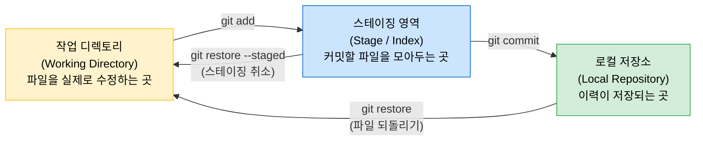

# Git & GitHub 사용 가이드

## 요약

### 개발 전 원격 레포지토리와 동기화

```bash
git pull
```

### 개발 후 commit 만들어서 push하기

```bash
git add .                           # 수정된 파일 모두 스테이징
git commit -m "commit message"      # 커밋 생성
git push                            # github에 업로드
```

## 목차

1. [Git이 뭐고 왜 쓰나?](#1-git이-뭐고-왜-쓰나)
2. [GitHub는 뭐가 다른가?](#2-github는-뭐가-다른가)
3. [핵심 개념](#3-핵심-개념)
4. [작업 흐름 한눈에 보기](#4-작업-흐름-한눈에-보기)
5. [자주 쓰는 명령어](#5-자주-쓰는-명령어)
6. [자주 쓰는 패턴](#6-자주-쓰는-패턴)

## 1. Git이 뭐고 왜 쓰나?

### 없으면 어떻게 되나?

혼자 작업할 때 흔히 이런 상황이 생긴다:

```
arms_control.py
arms_control_backup.py
arms_control_최종.py
arms_control_최종2.py
arms_control_진짜최종.py
```

팀으로 작업하면 더 심해진다. 누가 어디를 고쳤는지 모르고, 두 사람이 같은 파일을 동시에 수정하면 한 명의 작업이 날아간다.

### Git이 해주는 것

Git은 **버전 관리 시스템(VCS)** 이다. 파일의 변경 이력을 전부 추적해서:

- 언제, 누가, 무엇을, 왜 바꿨는지 기록한다
- 과거 어느 시점으로도 되돌아갈 수 있다
- 여러 사람이 동시에 작업해도 충돌을 정리할 수 있다
- 기능별로 독립된 작업공간(브랜치)을 만들 수 있다

## 2. GitHub는 뭐가 다른가?

|          | Git                           | GitHub                                         |
| -------- | ----------------------------- | ---------------------------------------------- |
| 정체     | 버전 관리 **도구** (프로그램) | Git 저장소를 올려두는 **원격 서버** (웹사이트) |
| 설치     | 내 컴퓨터에 설치              | 브라우저로 접속                                |
| 오프라인 | 가능                          | 불가능                                         |
| 역할     | 변경 이력 추적                | 팀원들이 코드를 공유하는 중심점                |

비유하자면:

- **Git** = 내 컴퓨터의 작업 일지
- **GitHub** = 팀 전체가 공유하는 구글 드라이브

## 3. 핵심 개념

### 3.1 저장소 (Repository, Repo)

프로젝트 폴더 + Git이 관리하는 모든 이력. `.git/` 폴더가 숨겨져 있으면 그 폴더는 Git 저장소다.

- **로컬 저장소**: 내 컴퓨터에 있는 것
- **원격 저장소 (remote)**: GitHub에 올라가 있는 것. 보통 `origin`이라는 이름으로 부른다.

### 3.2 커밋 (Commit)

변경 사항을 이력에 저장하는 단위. 저장 버튼이 아니라 **체크포인트**다.
좋은 커밋 하나 = "이 작업을 했다"는 의미 있는 단위.

```
[커밋 A] 최초 프로젝트 구조 생성
    ↓
[커밋 B] arms_control 상태머신 IDLE→SEARCH 구현
    ↓
[커밋 C] PID 파라미터 config 파일 추가
    ↓
[커밋 D] arms_detection Docker 파일 laptop용 추가
```

각 커밋은 **되돌아갈 수 있는 지점**이다.

### 3.3 브랜치 (Branch)

독립된 작업 공간. 기본 브랜치는 `main`이다.

```
main:    A --- B --- C ----------------------- M
                      \                       /
feature:               D --- E --- F --- G ---
```

`feature` 브랜치에서 마음껏 실험하다가 완성되면 `main`으로 합친다(merge). `main`은 항상 동작하는 상태를 유지한다.

### 3.4 스테이징 (Staging) — 가장 헷갈리는 개념

Git에는 파일이 거치는 세 가지 구역이 있다:



**왜 스테이징이 필요한가?**

파일 5개를 동시에 수정했어도, 커밋은 의미 단위로 나눌 수 있다.

```
수정한 파일들:
  arms_control.py   (상태머신 버그 수정)
  config.yaml       (상태머신 버그 수정)
  arms_detection.py (전혀 다른 작업: 모델 경로 변경)

→ 커밋 1: arms_control.py + config.yaml 만 stage → "상태머신 버그 수정"
→ 커밋 2: arms_detection.py 만 stage → "detection 모델 경로 설정"
```

## 4. 작업 흐름 한눈에 보기

```
GitHub (origin)
      │
      │  git clone (최초 1회)
      ↓
로컬 저장소
      │
      │  (브랜치에서 작업)
      │
      ↓
작업 디렉토리에서 파일 수정
      │
      │  git add <파일>
      ↓
스테이징 영역 (커밋할 것들 모음)
      │
      │  git commit -m "메시지"
      ↓
로컬 저장소 (이력 저장됨)
      │
      │  git push
      ↓
GitHub (origin) — 팀원들이 볼 수 있음
```

## 5. 자주 쓰는 명령어

### 기본 흐름

```bash
# ① 저장소를 내 컴퓨터로 복사 (최초 1회)
git clone https://github.com/your-org/A.R.M.S..git
cd A.R.M.S.-Anti-drone-Reusable-Modular-System

# ② 파일 수정 (실제 코딩)
#    ... arms_control.py 등 수정 ...

# ③ 뭐가 바뀌었는지 확인
git status

# ④ 커밋할 파일을 전부 스테이징
git add .

# ⑤ 스테이징된 내용을 이력에 저장
git commit -m "arms_control: IDLE→SEARCH 상태전이 구현"

# ⑥ 로컬 커밋을 GitHub에 올리기
git push
```

각 단계의 자세한 설명은 아래와 같다.

### 5.1 `git clone` — 원격 저장소를 내 컴퓨터로 복사

```bash
git clone <URL>
```

**예시:**

```bash
git clone https://github.com/your-org/A.R.M.S..git
```

- 최초 1회만 하면 된다.
- 해당 폴더로 들어가면 바로 git 저장소 상태다.

### 5.2 `git add` — 파일을 스테이징 영역에 올리기

```bash
# 특정 파일만
git add arms_control.py

# 특정 폴더 전체
git add arms_ws/src/arms_control/

# 현재 폴더의 모든 변경 파일 (주의: 불필요한 파일이 포함될 수 있음)
git add .
```

**현재 상태 확인:**

```bash
git status
```

출력 예시:

```
Changes to be committed:        ← 스테이징 완료 (초록)
  modified:   arms_control.py

Changes not staged for commit:  ← 수정됐지만 아직 스테이징 안 됨 (빨강)
  modified:   config.yaml

Untracked files:                ← git이 모르는 새 파일
  new_feature.py
```

### 5.3 `git commit` — 스테이징된 내용을 이력에 저장

```bash
git commit -m "커밋 메시지"
```

**예시:**

```bash
git commit -m "arms_control: SEARCH→LOCK 상태전이 조건 수정"
```

**좋은 커밋 메시지 규칙:**

- 무엇을 했는지가 아니라 **왜** 했는지도 담는다
- 현재형으로 쓴다: "수정함" → "수정"
- 앞에 영역 명시: `arms_control:`, `docker:`, `docs:` 등

```
나쁜 예: "코드 수정"
좋은 예: "arms_detection: confidence threshold 0.5→0.65로 상향 (오탐 감소)"
```

### 5.4 `git push` — 로컬 커밋을 GitHub에 올리기

```bash
git push

# 처음 push하는 브랜치라면
git push -u origin <브랜치명>
git push -u origin feature/pid-tuning
```

- push 전에는 팀원들이 내 변경 사항을 볼 수 없다.
- `git push`는 커밋된 것만 올린다. 스테이징만 된 것은 올라가지 않는다.

### 5.5 `git pull` — GitHub의 최신 내용을 받아오기

```bash
git pull
```

- `git fetch` + `git merge`를 합친 명령어.
- 작업 시작 전에 항상 먼저 `git pull`을 실행하는 습관을 들이자.

```
팀원이 push → GitHub 업데이트 → 내가 git pull → 내 로컬에 반영
```

## 6. 자주 쓰는 패턴

### 개발 전 원격 레포지토리와 동기화

```bash
git pull
```

### 개발 후 commit 만들어서 push하기

```bash
git add .                           # 수정된 파일 모두 스테이징
git commit -m "commit message"      # 커밋 생성
git push                            # github에 업로드
```

### push가 거부됨 (rejected)

```
! [rejected] main -> main (fetch first)
```

팀원이 먼저 push한 내용이 있다. 내 것을 올리기 전에 먼저 받아야 한다:

```bash
git pull
# 충돌 있으면 해결 후
git push
```

## 유용한 명령어 모음

| 상황                  | 명령어                        |
| --------------------- | ----------------------------- |
| 저장소 처음 받기      | `git clone <URL>`             |
| 현재 상태 확인        | `git status`                  |
| 변경 내용 보기        | `git diff`                    |
| 파일 스테이징         | `git add <파일>`              |
| 커밋                  | `git commit -m "메시지"`      |
| GitHub에 올리기       | `git push`                    |
| 최신 받아오기         | `git pull`                    |
| 새 브랜치 만들고 이동 | `git checkout -b <브랜치명>`  |
| 브랜치 이동           | `git checkout <브랜치명>`     |
| 커밋 이력 보기        | `git log --oneline`           |
| 작업 임시 저장        | `git stash` / `git stash pop` |
