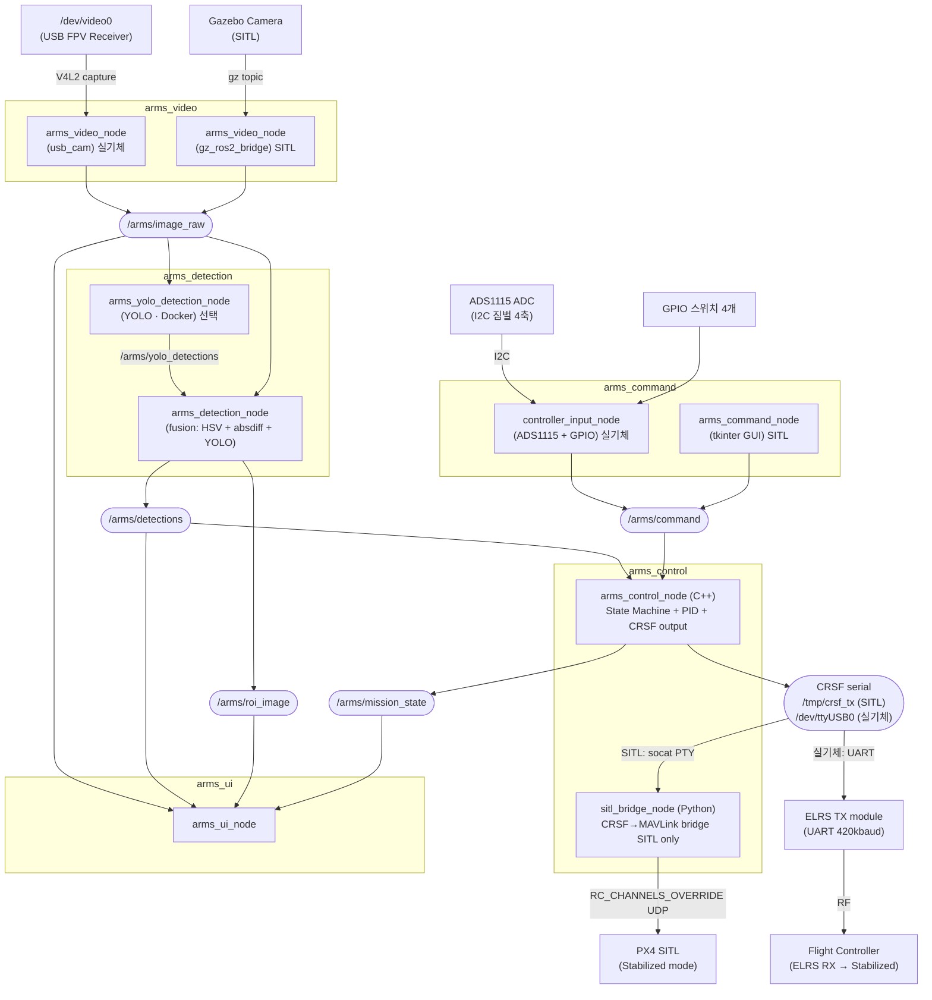
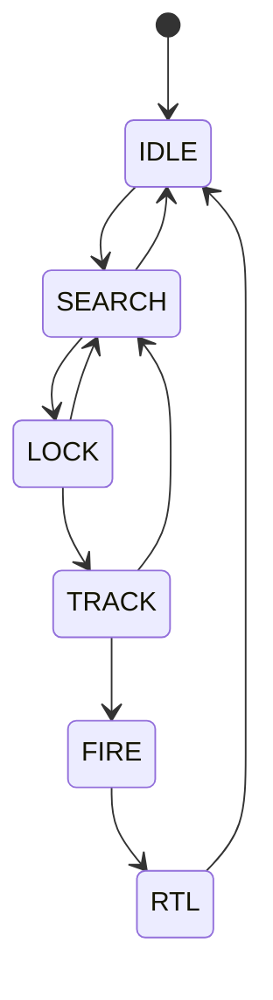
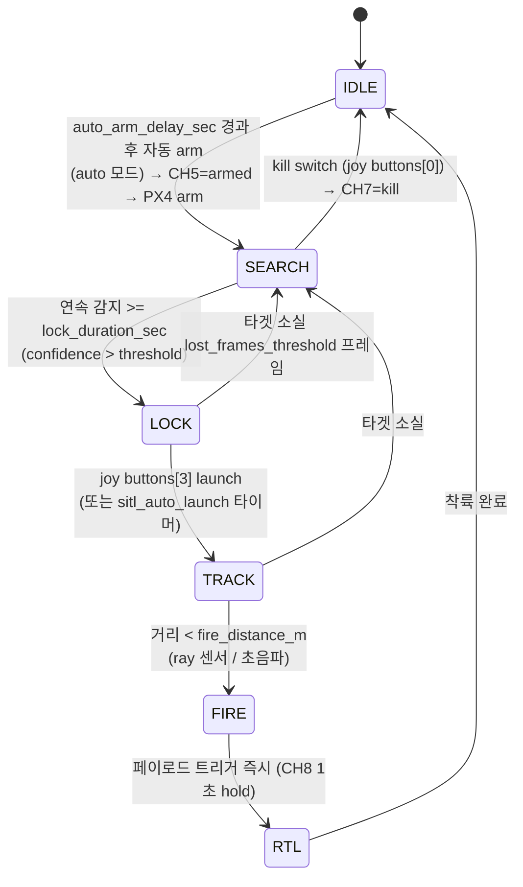

# A.R.M.S. 소프트웨어 설계 문서

_Anti-drone Reusable Modular System — Software Architecture_

## 목차

1. [시스템 개요](#1-시스템-개요)
2. [ROS 패키지 구조](#2-ros-패키지-구조)
3. [노드 및 토픽 구조](#3-노드-및-토픽-구조)
4. [상태 머신](#4-상태-머신-arms_control-내부)
5. [영상 수신 (arms_video)](#5-영상-수신-arms_video)
6. [객체 인식 (arms_detection)](#6-객체-인식-arms_detection)
7. [비행 제어 및 통신 (arms_control)](#7-비행-제어-및-통신-arms_control)
8. [오퍼레이터 UI (arms_ui)](#8-오퍼레이터-ui-arms_ui)
9. [런치 파일 구조](#9-런치-파일-구조)
10. [전체 데이터 흐름 요약](#10-전체-데이터-흐름-요약)

## 1. 시스템 개요

### 1.1 물리 구성


### 1.2 소프트웨어 레이어

```
+----------------------------------------------------------+
|                    Operator Interface                    |
|                    (Monitor Display)                     |
+----------------------------------------------------------+
|   Video Pipeline   |  Detection  |      Control         |
|  (V4L2 -> ROS)     |  (YOLO)     |  PID + State Machine |
|                    |             |  CRSF serial output  |
+----------------------------------------------------------+
|              ROS 2 Middleware (Humble)                   |
+----------------------------------------------------------+
|         Jetson Hardware (CUDA, V4L2, UART/ELRS)          |
+----------------------------------------------------------+
```

## 2. ROS 패키지 구조

```
arms_ws/
└── src/
    ├── arms_bringup/          # 최상위 런치 파일 및 설정
    ├── arms_video/            # 영상 소스 추상화 (usb_cam / gz_ros2_bridge)
    ├── arms_detection/        # 융합 검출 노드 + YOLO Docker 노드
    ├── arms_command/          # 조종 인터페이스 (tkinter GUI / ADS1115 + GPIO)
    ├── arms_control/          # 상태 머신 + PID + CRSF 출력 (C++/Python hybrid)
    │     ├── src/             #   C++: arms_control_node, crsf_output
    │     └── arms_control/    #   Python: sitl_bridge_node (SITL 전용)
    ├── arms_ui/               # 오퍼레이터 디스플레이 (OpenCV 오버레이)
    └── arms_msgs/             # 커스텀 메시지 정의
```

> `arms_control`은 C++/Python hybrid ament_cmake 패키지다.  
> 실기체에서는 C++ 노드만, SITL에서는 C++ 노드 + Python bridge 노드를 함께 실행한다.

## 3. 노드 및 토픽 구조

### 3.1 노드 그래프



| 노드                       | subscribe                                                                                | publish                                                   |
| -------------------------- | ---------------------------------------------------------------------------------------- | --------------------------------------------------------- |
| `arms_video_node`          | —                                                                                        | `/arms/image_raw`                                         |
| `arms_yolo_detection_node` | `/arms/image_raw`                                                                        | `/arms/yolo_detections`                                   |
| `arms_detection_node`      | `/arms/image_raw`<br/>`/arms/yolo_detections`                                            | `/arms/detections`<br/>`/arms/roi_image`                  |
| `arms_command_node`        | `/arms/mission_state`                                                                    | `/arms/command`                                                    |
| `controller_input_node`    | —                                                                                        | `/arms/command`                                                    |
| `arms_control_node`        | `/arms/detections`<br/>`/arms/command`<br/>`/arms/scan_raw`<br/>`/arms/reset_cmd`                | `/arms/mission_state`<br/>`/arms/control_debug`<br/>CRSF serial |
| `sitl_bridge_node`         | CRSF serial (`/tmp/crsf_rx`)                                                             | MAVLink RC_CHANNELS_OVERRIDE → PX4                        |
| `arms_ui_node`             | `/arms/image_raw`<br/>`/arms/detections`<br/>`/arms/mission_state`<br/>`/arms/roi_image` | —                                                         |
| `gz_scan_bridge`           | `/arms_drone/upward_ray/scan` (gz)                                                       | `/arms/scan_raw`                                          |

### 3.2 노드별 역할

| 노드                       | 패키지           | 역할                                                                                                              | 실행 환경     |
| -------------------------- | ---------------- | ----------------------------------------------------------------------------------------------------------------- | ------------- |
| `arms_video_node`          | `arms_video`     | 영상 소스 추상화. 실기체는 usb_cam, SITL은 gz_ros2_bridge로 `/arms/image_raw` 발행                                | 호스트        |
| `arms_yolo_detection_node` | `arms_detection` | YOLO 추론 후 `/arms/yolo_detections` 발행. **선택적** — Docker 컨테이너 안에서 실행                               | Docker (선택) |
| `arms_detection_node`      | `arms_detection` | HSV·absdiff·YOLO 결과를 융합해 `/arms/detections` 발행. YOLO 노드 없이도 독립 동작 가능                           | 호스트        |
| `arms_command_node`        | `arms_command`   | SITL용 tkinter GUI 패널. 드래그 스틱·스위치 클릭으로 `/arms/command` 발행                                                  | 호스트        |
| `controller_input_node`    | `arms_command`   | ADS1115 ADC(I2C)로 짐벌 4축 읽기 + GPIO 스위치 4개 읽기 → `sensor_msgs/Joy` `/arms/command` 발행. fake_mode 지원          | 호스트        |
| `arms_control_node`        | `arms_control`   | 상태 머신 + PID 제어. `/arms/command`에서 조종 입력을 받아 auto/manual 모드 전환. CRSF 프레임을 시리얼로 직접 출력         | 호스트        |
| `sitl_bridge_node`         | `arms_control`   | **SITL 전용.** 가상 시리얼(`/tmp/crsf_rx`)에서 CRSF 수신 → MAVLink `RC_CHANNELS_OVERRIDE` 50Hz → PX4. CH5↑=ARM, CH6↑=LAND | 호스트 (SITL) |
| `arms_ui_node`             | `arms_ui`        | 카메라 영상에 바운딩박스·상태·오차값 오버레이해서 OpenCV 윈도우로 표시                                            | 호스트        |
| `gz_scan_bridge`           | `ros_gz_bridge`  | SITL 전용. Gazebo 거리 센서 토픽을 ROS2로 브릿지                                                                   | 호스트        |

### 3.3 커스텀 메시지 정의

```
# arms_msgs/BoundingBox.msg
float32 x_center    # normalized [0.0, 1.0]
float32 y_center    # normalized [0.0, 1.0]
float32 width       # normalized [0.0, 1.0]
float32 height      # normalized [0.0, 1.0]
float32 confidence
int32   class_id
string  class_name
```

```
# arms_msgs/DetectionArray.msg
std_msgs/Header header
BoundingBox[]   detections
```

```
# arms_msgs/MissionState.msg
std_msgs/Header header
string          state                # IDLE | SEARCH | LOCK | TRACK | FIRE | RTL
float32         lock_elapsed_sec     # continuous detection duration so far [s]
float32         error_x              # current normalized pixel error (for UI)
float32         error_y
bool            target_locked
float32         kp_now               # 현재 적용 중인 P 게인 (시간 램프 값)
```

## 4. 상태 머신 (arms_control 내부)

### 4.1 상태별 동작 정의

| 상태       | 드론 동작                       | CRSF 출력                                              | UI 표시                   |
| ---------- | ------------------------------- | ------------------------------------------------------ | ------------------------- |
| **IDLE**   | 정지 대기                       | CH3=min, CH1/2=center, CH5=disarm                      | 회색 테두리               |
| **SEARCH** | Arm 완료, 타겟 탐색 중          | CH3=hover, CH5=armed                                   | 노란색, "Searching..."    |
| **LOCK**   | 타겟 포착 확인 중 (잠금 타이머) | CH3=hover, CH5=armed                                   | 주황색 박스, "Locking..." |
| **TRACK**  | 위치 보정 추적                  | PID → CH1/2 + track_throttle → CH3                    | 빨간 박스, "LOCKED"       |
| **FIRE**   | 추적 유지 + 페이로드 즉시 발사  | PID 유지 + CH8=fire (1초 hold)                         | 빨간 박스, "FIRED!"       |
| **RTL**    | 귀환 및 착륙                    | CH6=land (SITL bridge: AUTO LAND 모드 전환)            | "Returning..."            |

### 4.2 상태 전이 다이어그램



### 4.3 상태 전이 조건



> `/arms/reset_cmd` 수신 시 어느 상태에서든 SEARCH로 강제 복귀.

### 4.4 전이 조건 파라미터

```yaml
# arms_control/config/control_params.yaml
mission:
  detection_confidence_threshold: 0.65
  lock_duration_sec: 2.0
  lost_frames_threshold: 10
  fire_distance_m: 5.0
  sitl_auto_launch: false
  auto_launch_delay_sec: 1.0
  auto_arm_delay_sec: 5.0      # IDLE 진입 후 자동 arm 대기 시간 [s]

control:
  track_throttle: 0.85
  kp_start: 60.0
  kp_max: 150.0
  kp_ramp_sec: 5.0
```

## 5. 영상 수신 (arms_video)

### 5.1 구성

arms_video_node는 영상 소스에 따라 두 가지 모드로 동작한다.
어느 모드든 `/arms/image_raw`를 동일하게 발행하므로 downstream 노드(detection, UI)는 소스를 알 필요가 없다.

**실기체 모드**

- FPV 수신기 → USB Video Capture 장치 (`/dev/video0`)
- V4L2 드라이버를 통해 프레임 수신
- `image_transport`를 통해 `/arms/image_raw` 발행

**SITL 모드**

- Gazebo가 발행하는 카메라 토픽을 구독
- `/arms/image_raw`로 relay 발행 (포맷 변환만 수행)

### 5.2 런치 파라미터

```yaml
# arms_video/config/video_params.yaml
video:
  mode: "v4l2" # "v4l2" (실기체) | "gazebo" (SITL)
  device: "/dev/video0"
  width: 1280
  height: 720
  fps: 30
  pixel_format: "YUYV"
  topic_name: "/arms/image_raw"
```

## 6. 객체 인식 (arms_detection)

### 6.1 Docker 통합 구조

```
/arms/image_raw (sensor_msgs/Image)
        |
        | DDS (network_mode: host)
        v
    arms_detection_node.py (Docker 내부)
        |
    YOLO inference
        |
    BoundingBox 변환 (normalized coords)
        |
        v
/arms/detections (arms_msgs/DetectionArray)
```

### 6.2 Docker Compose

```bash
# Jetson
docker compose -f docker-compose.jetson.yml up --build

# 노트북 (x86)
docker compose -f docker-compose.laptop.yml up --build
```

### 6.3 Dockerfile 구성

- base image
  - Jetson : `ultralytics/ultralytics:latest-jetson-jetpack6`
  - Laptop : `ultralytics/ultralytics:latest`
- 구성
  - ROS2 Humble (rclpy, sensor_msgs, rosidl)
  - arms_msgs (소스 COPY 후 colcon build)
  - arms_detection_node.py

### 6.4 YOLO 모델 학습 및 변환

- 데이터셋: [Roboflow — Balloon Project](https://universe.roboflow.com/balloon-kutdi/balloon-project-az6w8)에서 다운로드. 풍선을 단일 클래스로 학습
- 모델: YOLOv11 small
- 경량화: FP16 양자화 후 TensorRT 형식으로 변환

| 플랫폼       | TensorRT 변환                  |
| ------------ | ------------------------------ |
| 노트북 (x86) | `trtexec` (CUDA 드라이버 필요) |
| Jetson (ARM) | `trtexec` (JetPack 내장)       |

> TensorRT engine은 변환한 GPU 아키텍처에서만 동작한다.

## 7. 비행 제어 및 통신 (arms_control)

### 7.1 아키텍처 개요

`arms_control`이 제어와 통신 출력을 모두 담당한다.
FC와의 인터페이스는 **CRSF 시리얼 프로토콜** 하나로 통일된다.

```
실기체:
  arms_control_node → CRSF serial (UART) → ELRS TX → [RF] → ELRS RX → FC

SITL:
  arms_control_node → CRSF serial (/tmp/crsf_tx)
                              ↓ socat PTY pair
  sitl_bridge_node  ← CRSF serial (/tmp/crsf_rx)
                              ↓
                       RC_CHANNELS_OVERRIDE (MAVLink UDP) → PX4
```

### 7.2 CRSF 채널 매핑

| CH | 기능        | 값                              | PX4 RC_MAP (실기체)  |
|----|-------------|----------------------------------|----------------------|
| 1  | roll        | -1..1 → 172..1811               | RC_MAP_ROLL=1        |
| 2  | pitch       | -1..1 → 172..1811               | RC_MAP_PITCH=2       |
| 3  | throttle    | 0..1 → 172..1811                | RC_MAP_THROTTLE=3    |
| 4  | yaw         | -1..1 → 172..1811 (auto: 992)  | RC_MAP_YAW=4         |
| 5  | arm switch  | IDLE=172, else=1811             | RC_MAP_ARM_SW=5      |
| 6  | land switch | 정상=172, RTL/LAND=1811         | RC_MAP_LAND_SW=6     |
| 7  | kill switch | 정상=172, kill=1811             | RC_MAP_KILL_SW=7     |
| 8  | launch/fire | 정상=172, FIRE=1811 (1s hold)  | RC_MAP_AUX1=8        |

CRSF 프레임 포맷: `[0xC8][24][0x16][22 bytes: 16ch × 11bit][CRC8-DVB-S2]`  
전송 속도: 460800 baud (표준 ELRS 420000과 근접값)

### 7.3 auto / manual 모드

`joy buttons[2]` 토글로 arms_control_node 내부에서 전환한다. PX4 flight mode는 항상 **Stabilized 고정**.

| 모드   | CH1-4 소스                       | CH5-8 소스             |
|--------|----------------------------------|------------------------|
| auto   | PID 계산 (roll/pitch/thrust)     | 상태 머신 + joy buttons |
| manual | joy axes[0-3] 패스스루           | joy buttons[0-3]        |

### 7.4 좌표계 및 오차 정의

```
  Image Frame (sky-facing camera, drone body frame)

        ^ pitch+ (drone forward)
        |
        |
  ------+------> roll+ (drone right)
        |
  (0,0) = image center

  error_x = (bbox_cx - img_cx) / img_w    [-0.5, +0.5]
  error_y = (bbox_cy - img_cy) / img_h    [-0.5, +0.5]
```

### 7.5 PID 제어

$$
u(t) = K_p \cdot e(t) + K_i \int_0^t e(\tau)d\tau + K_d \frac{de(t)}{dt}
$$

- `error_x` → **roll 각도** 명령 [deg] → CH1 (정규화 후 CRSF 변환)
- `error_y` → **pitch 각도** 명령 [deg] → CH2
- **throttle** → 상수 (파라미터) → CH3
- **yaw** → 0 고정 → CH4=992

```yaml
# arms_control/config/control_params.yaml
arms_control_node:
  ros__parameters:
    control:
      roll_pid:
        kp: 15.0
        ki: 0.5
        kd: 1.0
        output_limit: 90.0
      pitch_pid:
        kp: 15.0
        ki: 0.5
        kd: 1.0
        output_limit: 90.0
      throttle: 0.55
      track_throttle: 0.85
      kp_start: 60.0
      kp_max: 150.0
      kp_ramp_sec: 5.0
      control_rate_hz: 30.0
    crsf:
      port: "/tmp/crsf_tx"      # SITL: socat PTY / 실기체: /dev/ttyUSB0 등
      max_angle_deg: 35.0       # roll/pitch deg → CRSF 정규화 기준각
```

PID 구현 특이사항:

- **anti-windup**: integral 값을 `[-output_limit/ki, +output_limit/ki]` 로 clamp
- **derivative kick 방지**: 첫 번째 호출에서 미분항 생략
- **시간 기반 P 램프**: TRACK 진입 직후 kp_start에서 kp_ramp_sec 동안 kp_max까지 선형 증가

### 7.6 sitl_bridge_node 동작 (SITL 전용)

```
CRSF serial (/tmp/crsf_rx)
  └─ decode frame → channels[0..15]
        │
        ├─ CH5 172→1811 (상승 에지) → MAV_CMD_COMPONENT_ARM_DISARM (arm)
        ├─ CH5 1811→172 (하강 에지) → MAV_CMD_COMPONENT_ARM_DISARM (disarm)
        ├─ CH6 172→1811 (상승 에지) → MAV_CMD_DO_SET_MODE (AUTO LAND)
        └─ CH1-4, CH7, CH8 → RC_CHANNELS_OVERRIDE (50Hz, UDP → PX4)
```

### 7.7 arms_control_node 내부 구조

```
arms_control_node
  |
  +-- [Subscribers]
  |     /arms/detections   (DetectionArray)
  |     /arms/scan_raw     (LaserScan → 거리 캐시)
  |     /arms/command               (Joy → 조종 입력 + 버튼)
  |     /arms/reset_cmd    (Empty → 강제 SEARCH 복귀)
  |
  +-- [Publishers]
  |     /arms/mission_state   (MissionState, 30Hz)
  |     /arms/control_debug   (Vector3, 30Hz — UI 화살표용)
  |
  +-- [Serial Output]
  |     CRSF frames → crsf.port (30Hz)
  |
  +-- [State Machine]
  |     evaluate detections → update state
  |     auto arm after auto_arm_delay_sec
  |     launch button (joy buttons[3]) → LOCK→TRACK
  |     distance < fire_distance_m (TRACK) → FIRE
  |
  +-- [PID Controller]  (TRACK / FIRE 상태에서 활성)
        error_x → roll_deg  [deg]
        error_y → pitch_deg [deg]
```

## 8. 오퍼레이터 UI (arms_ui)

### 8.1 화면 레이아웃

```
+----------------------------------------------------+
|  A.R.M.S.  [STATE: TRACK]              2026-05-08  |
+----------------------------------------------------+
|                                                    |
|           FPV CAMERA FEED                          |
|                                                    |
|         +--------+                                 |
|         | TARGET |  <- red bounding box            |
|         +--------+                                 |
|              o    <- frame center crosshair        |
|                                                    |
+----------------------------------------------------+
|  conf: 0.87  |  err_x: +0.03  |  err_y: -0.01      |
|  roll: +0.12 |  pitch: -0.04  |  thr: 0.55         |
+----------------------------------------------------+
```

## 9. 런치 파일 구조

### 9.1 SITL 런치

```
# arms_bringup/launch/arms_sitl_flying.launch.py  (메인 SITL 런치)

전제: run_arms.sh 실행 시 socat PTY 쌍 자동 생성
  socat PTY,link=/tmp/crsf_tx PTY,link=/tmp/crsf_rx

nodes:
  - gz_scan_bridge          (ros_gz_bridge)  Gazebo 거리 센서 → /arms/scan_raw
  - arms_detection_node     (arms_detection)
  - arms_control_node       (arms_control)   상태머신 + PID + CRSF → /tmp/crsf_tx
  - sitl_bridge_node        (arms_control)   /tmp/crsf_rx → MAVLink UDP → PX4
  - arms_ui_node            (arms_ui)
  - arms_command_node       (arms_command)   tkinter GUI → /arms/command 발행

별도 실행:
  PX4 SITL: cd PX4-Autopilot && make px4_sitl gz_arms_drone
  YOLO (선택): docker compose -f docker-compose.laptop.yml up

# arms_control/launch/control_sitl.launch.py  (단독 실행용)
  arms_control_node + sitl_bridge_node
```

### 9.2 실기체 런치

```
# arms_bringup/launch/arms_full.launch.py

nodes:
  - arms_control_node  (arms_control)   상태머신 + PID + CRSF → /dev/ttyUSB0
      파라미터: crsf_port=/dev/ttyUSB0
  - arms_ui_node       (arms_ui)

# arms_command/launch/command.launch.py  (별도 실행)
  - controller_input_node  (arms_command)  ADS1115 조종기 + GPIO → /arms/command

별도 실행:
  docker compose -f docker-compose.jetson.yml up

# arms_control/launch/control_real.launch.py  (단독 실행용)
  arms_control_node only
```

## 10. 전체 데이터 흐름 요약

```
FPV Receiver (USB)          Gazebo Camera (SITL)
      |                             |
      | V4L2                        | gz topic
      v                             v
arms_video_node  ──────────────────────────────────────
      |
      | /arms/image_raw  [sensor_msgs/Image, 30Hz]
      +──────────────────────────────> arms_ui_node (display)
      |
      v
arms_detection_node  (Docker 컨테이너 내부, YOLO inference)
      |
      | /arms/detections  [arms_msgs/DetectionArray]
      +──────────────────────────────> arms_ui_node (overlay boxes)
      |
      v
arms_control_node  (state machine + PID)
      |
      | /arms/mission_state  [arms_msgs/MissionState, 30Hz]
      +──────────────────────────────> arms_ui_node (state display)
      |
      | CRSF serial (30Hz)
      |   CH1: roll   CH2: pitch   CH3: throttle   CH4: yaw
      |   CH5: arm    CH6: land    CH7: kill        CH8: fire
      |
      +─── SITL ──────────────────────────────────────────────
      |    /tmp/crsf_tx → [socat] → /tmp/crsf_rx
      |         sitl_bridge_node
      |           ├─ CH5↑ → ARM (MAVLink)
      |           ├─ CH6↑ → AUTO LAND (MAVLink)
      |           └─ CH1-8 → RC_CHANNELS_OVERRIDE (50Hz UDP)
      |                              → PX4 Stabilized
      |
      +─── 실기체 ─────────────────────────────────────────────
           /dev/ttyUSB0 (UART 460800)
                → ELRS TX module → [RF 433/868/915MHz]
                       → ELRS RX → FC (Stabilized mode)
                                     ├─ ESC → Motors
                                     └─ AUX1 (CH8) → Payload servo
```

---

_Document version: 0.5 — 2026-07-08_
