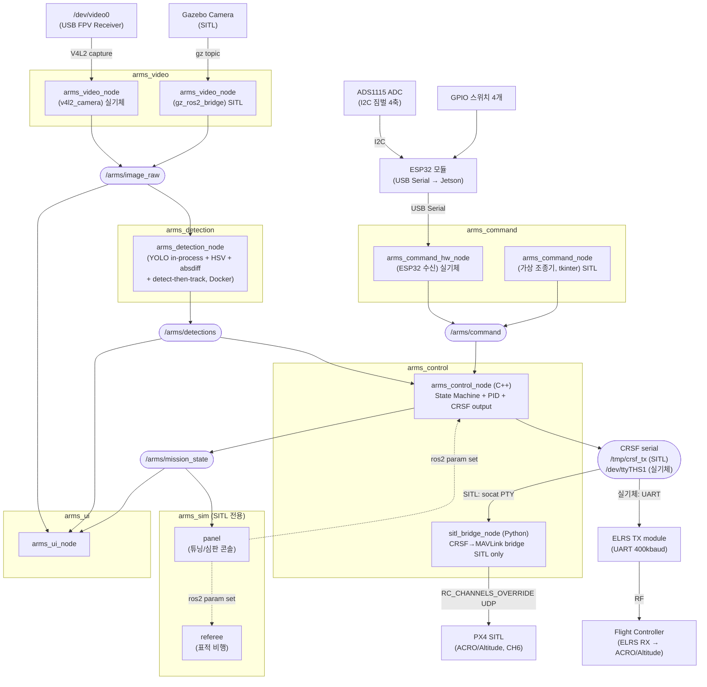
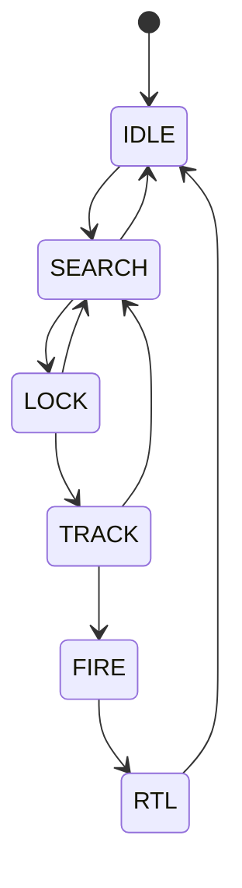
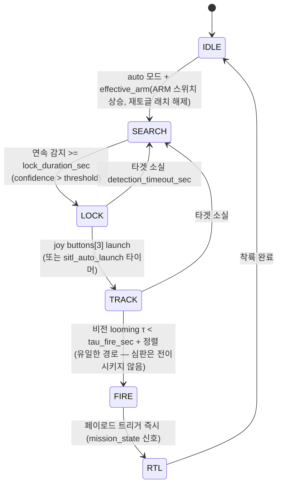
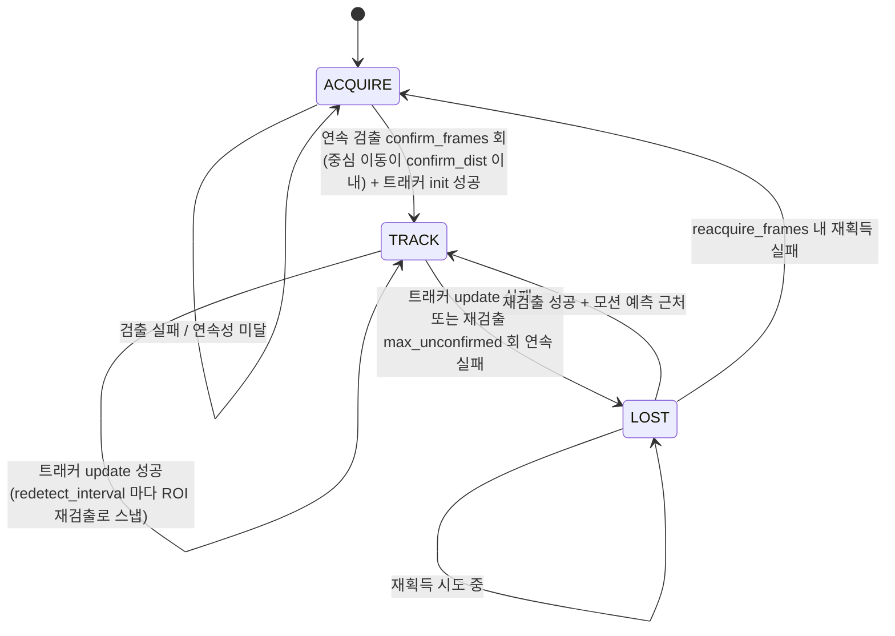

# A.R.M.S. 소프트웨어 설계 문서

_Anti-drone Reusable Modular System — Software Architecture_

## 목차

1. [시스템 개요](#1-시스템-개요)
2. [ROS 패키지 구조](#2-ros-패키지-구조)
3. [노드 및 토픽 구조](#3-노드-및-토픽-구조)
4. [상태 머신](#4-상태-머신-arms_control-내부)
5. [영상 수신 (arms_video)](#5-영상-수신-arms_video)
6. [객체 인식 (arms_detection)](#6-객체-인식-arms_detection)
7. [비행 제어 및 통신 (arms_control)](#7-비행-제어-및-통신-arms_control)
8. [조종 입력 (arms_command)](#8-조종-입력-arms_command)
9. [오퍼레이터 UI (arms_ui)](#9-오퍼레이터-ui-arms_ui)
10. [런치 파일 구조](#10-런치-파일-구조)
11. [전체 데이터 흐름 요약](#11-전체-데이터-흐름-요약)

## 1. 시스템 개요

### 1.1 물리 구성


### 1.2 소프트웨어 레이어

```
+----------------------------------------------------------+
|                    Operator Interface                    |
|                    (Monitor Display)                     |
+----------------------------------------------------------+
|   Video Pipeline   |  Detection  |      Control         |
|  (V4L2 -> ROS)     |  (YOLO)     |  PID + State Machine |
|                    |             |  CRSF serial output  |
+----------------------------------------------------------+
|              ROS 2 Middleware (Humble)                   |
+----------------------------------------------------------+
|         Jetson Hardware (CUDA, V4L2, UART/ELRS)          |
+----------------------------------------------------------+
```

## 2. ROS 패키지 구조

```
arms_ws/
└── src/
    ├── arms_bringup/          # 최상위 런치 파일 및 설정
    ├── arms_video/            # 영상 소스 추상화 (v4l2_camera / gz_ros2_bridge)
    ├── arms_detection/        # 융합 검출 노드 (YOLO in-process + HSV + absdiff, Docker)
    ├── arms_command/          # 조종 입력 → /arms/command (SITL 가상 조종기 / 실기체 ESP32+ADS1115+GPIO)
    ├── arms_sim/              # SITL 전용: 표적 심판(referee) + 튜닝/심판 콘솔(panel)
    ├── arms_control/          # 상태 머신 + PID + CRSF 출력 (C++/Python hybrid)
    │     ├── src/             #   C++: arms_control_node, crsf_output
    │     └── arms_control/    #   Python: sitl_bridge_node (SITL 전용)
    ├── arms_ui/               # 오퍼레이터 디스플레이 (OpenCV 오버레이)
    └── arms_msgs/             # 커스텀 메시지 정의
```

## 3. 노드 및 토픽 구조

### 3.1 노드 그래프



| 노드                   | subscribe                                                                                    | publish                                                                                   |
| ---------------------- | -------------------------------------------------------------------------------------------- | ----------------------------------------------------------------------------------------- |
| `arms_video_node`      | —                                                                                            | `/arms/image_raw`                                                                         |
| `arms_detection_node`  | `/arms/image_raw`                                                                            | `/arms/detections`<br/>`/arms/debug_image`<br/>`/arms/debug_absdiff`                      |
| `arms_command_node`    | —                                                                                            | `/arms/command` (가상 조종기, SITL)                                                       |
| `arms_command_hw_node` | —                                                                                            | `/arms/command` (실기체 ESP32)                                                            |
| `panel` (`arms_sim`)   | `/arms/mission_state`                                                                        | — (`ros2 param set` 으로 튜닝/심판 제어)                                                  |
| `referee` (`arms_sim`) | — (ROS 구독 없음, gz 로만 동작)                                                              | — (gz set_pose 로 표적 비행)                                                              |
| `arms_control_node`    | `/arms/detections`<br/>`/arms/command`                                                       | `/arms/mission_state`<br/>`/arms/control_debug`<br/>`/arms/debug_looming`<br/>CRSF serial |
| `sitl_bridge_node`     | CRSF serial (`/tmp/crsf_rx`)                                                                 | MAVLink RC_CHANNELS_OVERRIDE → PX4                                                        |
| `arms_ui_node`         | `/arms/image_raw`<br/>`/arms/detections`<br/>`/arms/mission_state`<br/>`/arms/control_debug` | —                                                                                         |

### 3.2 노드별 역할

| 노드                   | 패키지           | 역할                                                                                                                                                                            | 실행 환경                     |
| ---------------------- | ---------------- | ------------------------------------------------------------------------------------------------------------------------------------------------------------------------------- | ----------------------------- |
| `arms_video_node`      | `arms_video`     | 영상 소스 추상화. 실기체는 v4l2_camera, SITL은 gz_ros2_bridge로 `/arms/image_raw` 발행                                                                                          | 호스트                        |
| `arms_detection_node`  | `arms_detection` | YOLO(in-process)·HSV·absdiff 를 우선순위 융합 + detect-then-track(CSRT/KCF, ROI) 후 `/arms/detections` 발행. 실기체는 GPU Docker, SITL/호스트는 YOLO 자동 비활성(HSV/absdiff만) | Docker(실기체) / 호스트(SITL) |
| `arms_command_node`    | `arms_command`   | **SITL 가상 조종기.** 드래그 스틱·KILL/ARM/MODE/LAUNCH 버튼으로 `/arms/command`(Joy) 발행. 실기체 물리 조종기의 SITL 쌍둥이 (발행자는 이 노드 하나뿐 → 레이스 방지)             | 호스트 (SITL)                 |
| `arms_command_hw_node` | `arms_command`   | ESP32 모듈이 ADS1115(I2C 짐벌 4축) + GPIO 스위치를 읽어 USB Serial로 Jetson에 전달 → `sensor_msgs/Joy` `/arms/command` 발행. fake_mode 지원                                     | 호스트 (실기체)               |
| `panel`                | `arms_sim`       | **SITL 전용 튜닝/심판 콘솔.** PID·τ·PN 등 arms_control 파라미터 + 표적 고도/속도 등 referee 파라미터를 `ros2 param set` 으로 실시간 제어. 미션 상태 표시. 노드별로 묶은 그룹 UI | 호스트 (SITL)                 |
| `referee`              | `arms_sim`       | **SITL 전용 표적.** 표적(풍선/드론)을 gz set_pose 로 비행시킨다. 미션 상태·제어에는 관여하지 않는 순수 시각 표적                                                                | 호스트 (SITL)                 |
| `arms_control_node`    | `arms_control`   | 상태 머신 + PID 제어. `/arms/command`에서 조종 입력을 받아 auto/manual 모드 전환. CRSF 프레임을 시리얼로 직접 출력                                                              | 호스트                        |
| `sitl_bridge_node`     | `arms_control`   | **SITL 전용.** 가상 시리얼(`/tmp/crsf_rx`)에서 CRSF 수신 → MAVLink `RC_CHANNELS_OVERRIDE` 50Hz → PX4. CH5=arm(레벨), CH6=flight mode(ACRO/Altitude)                             | 호스트 (SITL)                 |
| `arms_ui_node`         | `arms_ui`        | 카메라 영상에 바운딩박스·상태·오차값 오버레이해서 OpenCV 윈도우로 표시                                                                                                          | 호스트                        |

## 4. 상태 머신 (arms_control 내부)

### 4.1 상태별 동작 정의

| 상태       | 드론 동작                       | CRSF 출력                                                      | 서보 잠금장치              | UI 표시                   |
| ---------- | ------------------------------- | -------------------------------------------------------------- | -------------------------- | ------------------------- |
| **IDLE**   | 정지 대기                       | CH3=min, CH1/2=center, CH5=disarm                              | **OPEN**(진입 시)          | 회색 테두리               |
| **SEARCH** | 타겟 탐색 중 (FC 미무장)        | CH3=min, CH5=disarm                                            | **LOCK**(IDLE→SEARCH 엣지) | 노란색, "Searching..."    |
| **LOCK**   | 타겟 포착 확인 중 (잠금 타이머) | CH5=disarm (기본; 클램프 물린 채 대기)                         | LOCK 유지                  | 주황색 박스, "Locking..." |
| **TRACK**  | 위치 보정 추적                  | **CH5=arm** + PID → CH1/2 + track_throttle → CH3               | **OPEN**(LOCK→TRACK 엣지)  | 빨간 박스, "LOCKED"       |
| **FIRE**   | 추적 유지 + 페이로드 즉시 발사  | CH5=arm, PID 유지 (전용 fire 채널 없음; mission_state로 신호)  | OPEN 유지                  | 빨간 박스, "FIRED!"       |
| **RTL**    | 귀환 및 착륙                    | CH5=arm (전용 land 채널 없음; 수동 Altitude 착륙 등 별도 경로) | OPEN 유지                  | "Returning..."            |

> **자동 모드 arm(CH5)은 상태머신 상태로 결정**(스위치와 분리). 기본은 **발사(TRACK)부터 무장**
> (`control.auto_arm_states = [TRACK, FIRE, RTL]`). LOCK 은 클램프 물린 채 disarm 대기 →
> TRACK(발사)에서 arm+서보 열림. SEARCH 등에서 미리 arm 하려면 목록만 수정. 수동 모드 CH5 는 arm 스위치.

> **서보 잠금장치(발사 클램프)**: 발사 전 기체를 발사기에 고정하고 발사 순간에만 놓아준다.
> 방아쇠(launch 버튼)가 아니라 **상태 전이 엣지**로 제어한다(SEARCH 중 방아쇠를 눌러도 안 풀림).
> · IDLE 진입 → OPEN(무조건 열림, 기체 장착/탈거) · IDLE→SEARCH(auto) → LOCK · LOCK→TRACK(발사) → OPEN.
> 자세한 하드웨어/구현은 [7.8](#78-발사-잠금장치-서보-servo-lock) 참고.

### 4.2 상태 전이 다이어그램



### 4.3 상태 전이 조건



### 4.4 전이 조건 파라미터

```yaml
# arms_control/config/control_params.yaml
mission:
  detection_confidence_threshold: 0.32
  detection_timeout_sec: 1.0
  lock_duration_sec: 0.3
  lock_box_tolerance: 0.5
  tau_fire_sec: 0.3 # 비전 looming: 충돌까지 시간(τ) 임계 [s] → FIRE
  fire_align_tol: 0.2 # FIRE 정렬 허용오차
  loom_s_min: 0.1 # FIRE 최소 bbox 크기(정규화)
  loom_size_alpha: 0.3
  loom_rate_alpha: 0.3
  sitl_auto_launch: true # SITL 만. 실기체는 hw_overrides.yaml 이 false 로 덮어씀
  auto_launch_delay_sec: 0.5
```

> 제어 게인(유도/PID/acro)은 [7.5](#75-유도제어-track--fire-상태에서-활성) 및
> `control_params.yaml` 참고.

## 5. 영상 수신 (arms_video)

### 5.1 구성

arms_video_node는 영상 소스에 따라 두 가지 모드로 동작한다.
어느 모드든 `/arms/image_raw`를 동일하게 발행하므로 downstream 노드(detection, UI)는 소스를 알 필요가 없다.

**실기체 모드**

- FPV 수신기 → USB Video Capture 장치 (`/dev/video0`)
- `v4l2_camera`(C++) 노드로 프레임 수신 → `/arms/image_raw` 발행
- 아날로그→USB 캡처 동글(MS210x/EasierCAP)은 프레임 간격을 stepwise 로
  보고해 `usb_cam` 이 포맷 열거에 실패한다. 그래서 `v4l2_camera` 를 사용.
  (파이썬+OpenCV 캡처도 가능하나 대형 프레임에서 rclpy 오버헤드로 지연이 커
  C++ 드라이버를 쓴다.)
- 아날로그 신호 락에 ~5초 걸릴 수 있어 기동 직후 몇 초는 검은 화면(정상).

**SITL 모드**

- Gazebo가 발행하는 카메라 토픽을 구독
- `/arms/image_raw`로 relay 발행 (포맷 변환만 수행)

### 5.2 런치 파라미터

```yaml
# arms_video/config/video_params.yaml  (v4l2_camera 파라미터)
/**:
  ros__parameters:
    video_device: "/dev/video0"
    pixel_format: "YUYV" # 캡처 동글은 YUYV만 출력
    image_size: [720, 480] # NTSC=720x480 / PAL=720x576
    output_encoding: "rgb8" # YUYV → rgb8 변환 발행
    camera_info_url: "package://arms_video/config/camera_info.yaml"
```

`/arms/image_raw` 로의 remapping 은 `launch/video.launch.py` 에서 수행한다.
캘리브레이션은 `config/camera_info.yaml`(기본 미보정 플레이스홀더)에서 로드하며,
실측 보정 시 이 파일을 교체한다.

## 6. 객체 인식 (arms_detection)

### 6.1 Docker 통합 구조

```
/arms/image_raw (sensor_msgs/Image)
        |
        | DDS (network_mode: host)
        v
    arms_detection_node.py (Docker 내부, GPU)
        |
    검출 stack: YOLO(in-process) > HSV > absdiff
        |
    detect-then-track (CSRT/KCF): TRACK 중엔 ROI 크롭에만 YOLO
        |
    BoundingBox 변환 (normalized coords)
        |
        v
/arms/detections (arms_msgs/DetectionArray)  [+ /arms/debug_image, /arms/debug_absdiff]
```

> **파라미터 소스**: arms_detection 은 **config yaml 이 없다.** 아래 모든 파라미터는
> 노드 코드의 `declare_parameter` **기본값**이며, 런타임 변경은 `ros2 param set
> /arms_detection_node ...` 로만 한다(영구 저장 파일 없음). YOLO 모델/conf/iou 는 별도로
> 환경변수 `ARMS_MODEL`/`ARMS_CONF`/`ARMS_IOU`(docker-compose)로 설정한다.

### 6.2 검출기 우선순위 (YOLO > HSV > ABSDIFF)

세 검출기를 **우선순위**로 결합한다 — 융합/평균이 아니라 **먼저 잡히는 하나만 채택**한다
(`yolo_box or hsv_box or absdiff_box`). 검출기 간 불일치로 인한 잘못된 평균을 피한다.

| 검출기 | 방식 | 강점 | on/off |
| ------ | ---- | ---- | ------ |
| **YOLO** | 같은 프로세스 ultralytics 추론 | 학습된 표적, 최고 신뢰도 | `use_yolo` (모델/GPU 없으면 자동 비활성) |
| **HSV** | 빨간색 영역 색상 분리 | 근거리·색 선명할 때 강력 | `use_hsv` |
| **ABSDIFF** | 배경 대비 밝기차 blob | 색·형태 무관, 원거리 소형 표적 | `use_absdiff` |

- **YOLO 레이트 게이팅**: 전체 프레임 탐색(ACQUIRE/LOST)에서는 YOLO 를 `yolo.acquire_interval`
  (기본 2) 프레임마다만 실행해 루프 레이트를 유지한다. TRACK 재검출은 드물어 항상 실행.
- **ABSDIFF 장면 게이팅**: 프레임 blob 수가 `absdiff.max_blobs`(12) 초과면 어수선한 장면(지상 등)
  으로 보고 absdiff 결과를 억제 (오탐 방지).

### 6.3 내부 상태머신 (detect-then-track)

매 프레임 전체 검출을 돌리는 대신, 표적을 한 번 확정하면 **CSRT/KCF 트래커로 ROI만 추적**한다
(`_TargetTracker`). 검출 비용을 줄이고(트래킹이 훨씬 쌈) 검출기 깜빡임에 강해 더 연속적인
`/arms/detections` 를 낸다. control 엔 투명 — 좌표만 더 매끄럽게 나온다.

**ACQUIRE → TRACK → LOST** 3-상태. `track.enable=false` 면 FSM 우회(매 프레임 검출).



**상태별 동작**

| 상태 | 검출 실행 | 발행 | 설명 |
| ---- | -------- | ---- | ---- |
| **ACQUIRE** | 매 프레임(전체) | 실검출 박스 | 표적 확정 전. 직전 프레임과 중심이 가까운 검출이 연속돼야 확정(오탐 필터) |
| **TRACK** | `redetect_interval`마다 ROI만 | 트래킹 박스 | CSRT/KCF 로 추적. 주기적 ROI 재검출로 드리프트 보정(스냅) |
| **LOST** | 매 프레임(전체) | 없음(None) | 표적 놓침. 마지막 속도로 예측한 위치 근처에서만 재획득 → control 이 마지막값 홀드 |

**구현 특이사항**
- **드리프트 보정**: TRACK 중 `redetect_interval`(10)마다 트래킹 박스 주변 ROI 크롭
  (`redetect_margin` 2.0배)에서 재검출 → 성공하면 그 박스로 트래커 재init(스냅). 트래커가
  서서히 밀리는 걸 주기적으로 교정. `max_unconfirmed`(3)회 연속 실패 시 LOST.
- **모션 예측 게이팅**: 중심 속도를 EMA로 추정(`_vel`)해, LOST 재획득 시 예측 위치 근처의
  검출만 같은 표적으로 인정 → 다른 물체로 튀는 것 방지.

**주요 파라미터** (`track.*`)

| 파라미터 | 기본 | 의미 |
| -------- | ---- | ---- |
| `track.enable` | true | false=FSM 우회, 매 프레임 검출 |
| `track.tracker_type` | CSRT | CSRT(정확) / KCF(빠름) |
| `track.confirm_frames` / `confirm_dist` | 3 / 0.08 | ACQUIRE→TRACK 확정 연속수 / 중심 이동 허용(정규화) |
| `track.redetect_interval` / `redetect_margin` | 10 / 2.0 | TRACK 재검출 주기 [프레임] / ROI 확장배율 |
| `track.max_unconfirmed` | 3 | 재검출 연속 실패 허용(→LOST) |
| `track.reacquire_frames` / `match_dist` | 8 / 0.1 | LOST 재획득 창 [프레임] / 예측 게이팅 거리 |
| `track.min_box_px` | 8 | 트래커 init 최소 박스 [px] |

### 6.4 Docker Compose

```bash
# Jetson
docker compose -f docker-compose.jetson.yml up --build

# 노트북 (x86)
docker compose -f docker-compose.laptop.yml up --build
```

### 6.5 Dockerfile 구성

- base image
  - Jetson : `ultralytics/ultralytics:latest-jetson-jetpack6`
  - Laptop : `ultralytics/ultralytics:latest`
- 구성
  - ROS2 Humble (rclpy, sensor_msgs, rosidl)
  - arms_msgs (소스 COPY 후 colcon build)
  - arms_detection_node.py

### 6.6 YOLO 모델 학습 및 변환

- 데이터셋: [Roboflow — Balloon Project](https://universe.roboflow.com/balloon-kutdi/balloon-project-az6w8)에서 다운로드. 풍선을 단일 클래스로 학습
- 모델: YOLOv11 small
- 모델 포맷

| 플랫폼       | 포맷      | 비고                                       |
| ------------ | --------- | ------------------------------------------ |
| 노트북 (x86) | `.pt`     | PyTorch, ultralytics가 직접 로드           |
| Jetson (ARM) | `.engine` | TensorRT 변환 후 사용 (`trtexec`, JetPack) |

## 7. 비행 제어 및 통신 (arms_control)

### 7.1 아키텍처 개요

`arms_control`이 제어와 통신 출력을 모두 담당한다.
FC와의 인터페이스는 **CRSF 시리얼 프로토콜** 하나로 통일된다.

```
실기체:
  arms_control_node → CRSF serial (UART) → ELRS TX → [RF] → ELRS RX → FC

SITL:
  arms_control_node → CRSF serial (/tmp/crsf_tx)
                              ↓ socat PTY pair
  sitl_bridge_node  ← CRSF serial (/tmp/crsf_rx)
                              ↓
                       RC_CHANNELS_OVERRIDE (MAVLink UDP) → PX4
```

### 7.2 CRSF 채널 매핑

| CH  | 기능        | 값                                                        | PX4 RC_MAP (실기체) |
| --- | ----------- | --------------------------------------------------------- | ------------------- |
| 1   | roll        | -1..1 → 172..1811                                         | RC_MAP_ROLL=1       |
| 2   | pitch       | -1..1 → 172..1811                                         | RC_MAP_PITCH=2      |
| 3   | throttle    | 0..1 → 172..1811                                          | RC_MAP_THROTTLE=3   |
| 4   | yaw         | -1..1 → 172..1811 (auto: 992)                             | RC_MAP_YAW=4        |
| 5   | arm switch  | disarm=172, arm=1811 (auto=상태머신, manual=arm 스위치)   | RC_MAP_ARM_SW=5     |
| 6   | flight mode | ACRO=172(auto), Altitude=1811(manual)                     | RC_MAP_FLTMODE=6    |
| 7   | kill switch | 정상=172, kill=1811 (상태 머신 무관, FC가 직접 모터 차단) | RC_MAP_KILL_SW=7    |
| 8   | (미사용)    | 172 고정                                                  | —                   |

> - **CH6 flight mode**는 오퍼레이터 모드 스위치(joy buttons[2])와 1:1이다.
>   auto(영상유도)=PX4 **ACRO**(172, 각속도/자동수평 없음), manual(손제어)=PX4 **Altitude**(1811).
>   실기체는 `RC_MAP_FLTMODE=6` + `COM_FLTMODE*` 슬롯에서 **CH6 low 슬롯=ACRO, high 슬롯=Altitude**
>   로 설정. SITL 은 sitl_bridge 가 CH6 low 를 **ACRO 고정**으로 매핑한다
>   (예전의 `autonomous_acro` / `control.acro_mode` 짝은 유효값이 하나뿐이라 둘 다 삭제됨).
> - **CH5 arm**은 모드에 따라 소스가 다르다. **auto**: 스위치와 분리 — 상태머신 상태 기반
>   (`control.auto_arm_states`, 기본 발사 TRACK 부터). **manual**: arm 스위치(buttons[1]) +
>   재토글 안전장치(모드 전환/부팅 직후 재토글 전까지 disarm). 자세히는 [7.3](#73-auto--manual-모드).
>   자동 모드의 buttons[1] 은 arm 이 아니라 미션 상태(IDLE↔SEARCH)만 제어한다.
> - **launch 버튼(buttons[3])** 과 **land/fire** 는 CRSF 채널로 내보내지 않는다.
>   launch는 상태 머신 LOCK→TRACK 전이 트리거로만 쓰이고, CH8은 비워 둔다.

CRSF 프레임 포맷: `[0xC8][24][0x16][22 bytes: 16ch × 11bit][CRC8-DVB-S2]`  
전송 속도: 400000 baud (커스텀 baud, termios2 `BOTHER`. 실기체 UART에서 확정)

### 7.3 auto / manual 모드

모드 스위치(`joy buttons[2]`, **레벨 스위치**)로 arms_control_node 내부에서 전환한다.
오퍼레이터 관점의 두 모드이며, 모드 스위치가 CH1-4 소스와 CH6 flight mode를 함께 결정한다.

- **auto (영상유도)**: 젯슨이 FPV 영상으로 **각속도** 명령 생성. PX4는 **ACRO** 모드(자동수평 없음).
  상태 스위치(buttons[1])는 **미션 상태(IDLE↔SEARCH)만** 제어하고, **arm(CH5)은 스위치와 분리**되어
  상태머신 상태로 컨트롤 노드가 결정한다.
- **manual (손제어)**: 사람이 스틱으로 직접 조종. PX4는 **Altitude** 모드(손조종 편의).
  arm은 arm 스위치(buttons[1])를 따름(재토글 안전장치 적용).

| 모드   | PX4 flight mode | CH1-4 소스                                                                 | CH5 arm                                | buttons[1] 역할 |
| ------ | --------------- | -------------------------------------------------------------------------- | -------------------------------------- | --------------- |
| auto   | **ACRO**        | 유도(기본 추적/PN) → **각속도**(roll/pitch), throttle=추격상승, yaw rate 0 | **상태머신 상태 기반** (스위치와 분리) | IDLE↔SEARCH     |
| manual | Altitude        | Mode2 스틱 패스스루 (아래 축 재배치)                                       | arm 스위치 (재토글 안전장치)           | ARM/DISARM      |

> **자동 모드 = 스위치와 arm 분리**: 자동 모드에서 상태 스위치(buttons[1])는 미션 상태
> (IDLE↔SEARCH)만 제어하고 FC arm(CH5)은 건드리지 않는다. arm 은 상태머신 상태로 컨트롤 노드가
> 결정한다 — 기본은 **발사(TRACK)부터 무장**(`control.auto_arm_states`, 기본 `[TRACK, FIRE, RTL]`;
> 나중에 SEARCH 등에서 arm 하려면 이 목록만 수정).
>
> **재토글 안전장치 (자동·수동 공통)**: 모드 전환/부팅 직후 상태 스위치가 올라가 있어도 즉시
> 적용되지 않게 하는 래치(`effective_arm = joy_arm_ && !require_arm_reset_`). `require_arm_reset_`
> 는 **모드 전환·부팅 시** 걸리고, 스위치를 **DISARM(아래)로 내리면 해제**된다.
> · **자동**: idle/search 진입에 적용 — manual→auto 로 왔을 때 스위치가 SEARCH(위)여도 **기본 IDLE**,
> 내렸다 다시 올려야 SEARCH 진입. (자동 모드 안에서 한 번 재토글한 뒤엔 자유롭게 idle↔search 토글)
> · **수동**: CH5 arm 에 적용 — auto→manual 로 왔을 때 스위치가 위여도 **기본 DISARM**, 재토글해야 arm.
> 두 경우 매커니즘이 동일하다(모드 전환 시 상태 스위치는 반드시 기본 위치에서 다시 올려야 작동).
>
> **수동 모드 = 상태머신 IDLE 고정**: manual 에서는 미션 상태가 의미 없으므로 상태머신을 IDLE 로
> 둔다(서보 열림). 영상/방아쇠로 미션이 멋대로 진행되는 것도 막는다.

manual 모드 축→채널 매핑 (Mode2 조종기 → AETR 채널 순서):

| CH           | joy axis | Mode2 스틱 |
| ------------ | -------- | ---------- |
| CH1 roll     | axes[2]  | R-stick X  |
| CH2 pitch    | axes[3]  | R-stick Y  |
| CH3 throttle | axes[1]  | L-stick Y  |
| CH4 yaw      | axes[0]  | L-stick X  |

> GUI 좌측 스틱의 세로(throttle, axes[1])는 실제 조종기처럼 **기본 바닥(-1.0,
> CRSF 172 ≈ 988µs), 놓아도 그 자리 유지**한다(가로 yaw만 중앙 복귀). 나머지
> 축(roll/pitch/yaw)은 스프링 복귀형(중앙=992 ≈ 1500µs). QGC RC 캘리브레이션은
> 각 스틱을 최소↔최대로 끝까지 훑으면 CH별 172~1811(≈988~2012µs)이 잡힌다.

### 7.4 좌표계 및 오차 정의

```
  Image Frame (sky-facing camera, drone body frame)

        ^ pitch+ (drone forward)
        |
        |
  ------+------> roll+ (drone right)
        |
  (0,0) = image center

  error_x = (bbox_cx - img_cx) / img_w    [-0.5, +0.5]
  error_y = (bbox_cy - img_cy) / img_h    [-0.5, +0.5]
```

### 7.5 유도·제어 (TRACK / FIRE 상태에서 활성)

파이프라인 (매 control_rate_hz 틱):

1. **LOS = 픽셀 오차** (`filt_err_x/y`, LPF) → 중앙 데드존.
   (예전의 자세보정 LOS는 **제거** — acro 전환으로 attitude 의존 삭제.)
2. **alpha-beta 필터** (`pn_alpha`/`pn_beta`) 로 매끈한 LOS + **시선각속도(LOS rate)** 추정.
3. **유도** (`control.guidance_mode`) — 출력은 **각속도[deg/s]** 다:
   - **0 = 기본 추적 (기본값)**: `roll_pid`/`pitch_pid` PID(kp·ki·kd)로 LOS 오차
     - 시간기반 리드(`lead_gain`) → 각속도 명령.
   - **1 = 비례항법(PN)**: `각속도 = pn_nav_gain × 시선각속도 + pn_center_gain × LOS`.
     시선각속도를 0으로 만들어 미래 충돌점을 앞질러 겨냥(빠른 표적에 유리). PID 미사용.

   출력은 `±max_cmd_rate_dps`(227.5 deg/s) 로 제한한다.

4. **스로틀(추격 궤적)**: 표적이 화면 중앙에 가까울수록(`center_q↑`) `hover_throttle`→`track_throttle`
   로 상승 → 표적을 향해 대각선 돌진.
5. **CRSF 출력**: 각속도 명령 / `max_rate_dps`(400) → CH1/CH2.
   CH3=스로틀, CH4=중앙(yaw rate 0). PX4 ACRO 가 그 각속도로 직접 회전한다.
6. **수동 모드**: PX4 **Altitude**, 스틱 패스스루 (FC 자동수평·고도유지).

### 7.6 sitl_bridge_node 동작 (SITL 전용)

```
CRSF serial (/tmp/crsf_rx)
  └─ decode frame → channels[0..15]
        │
        ├─ CH5 레벨 (arm 스위치) → 실제 armed 상태와 다르면 재전송
        │       MAV_CMD_COMPONENT_ARM_DISARM (arm/disarm)
        ├─ CH6 에지 → MAV_CMD_DO_SET_MODE
        │       low(<1500)=ACRO(auto, 고정), high(≥1500)=Altitude(manual)
        └─ CH1-4, CH7 → RC_CHANNELS_OVERRIDE (50Hz, UDP → PX4)
```

> 실기체는 PX4가 CRSF를 직접 읽으므로 이 브리지가 없다. flight mode는
> PX4 `RC_MAP_FLTMODE=6` + `COM_FLTMODE*` 슬롯으로 CH6를 매핑해 처리한다.

### 7.7 arms_control_node 내부 구조

```
arms_control_node
  |
  +-- [Subscribers]
  |     /arms/detections   (DetectionArray → 검출 + 비전 looming τ)
  |     /arms/command      (Joy → 조종 입력 + 버튼)
  |
  +-- [Publishers]
  |     /arms/mission_state   (MissionState, 30Hz)
  |     /arms/control_debug   (Vector3 — UI 화살표용. x,y = 각속도[deg/s], z = throttle)
  |     /arms/debug_looming   (Vector3 — x=τ, y=bbox크기, z=팽창률; τ 튜닝용, 구독 중에만 발행)
  |
  +-- [Serial Output]
  |     CRSF frames → crsf.port (30Hz)
  |
  +-- [State Machine]
  |     evaluate detections → update state
  |     auto arm: effective_arm(ARM 스위치+재토글 래치) → IDLE → SEARCH
  |     launch button (joy buttons[3]) → LOCK→TRACK
  |     비전 looming: τ=bbox크기/팽창률 < tau_fire_sec + 정렬 (TRACK) → FIRE
  |       (거리센서·표적크기 무관. 3D 거리는 실기체 미지원이라 전면 제거)
  |
  +-- [유도·제어]  (TRACK / FIRE 상태에서 활성)
  |     LOS(픽셀오차) → alpha-beta 필터 → 유도(기본 추적=PID / PN)
  |       → 각속도[deg/s] → clamp(max_cmd_rate_dps) → ÷max_rate_dps → CH1/CH2
  |       (각도 단계 없음. ACRO 고정, 자세 피드백 없음)
  |     스로틀: hover→track (center_q 기반 추격 상승) → CH3
  |
  +-- [ServoLock]  (발사 잠금장치, sysfs 하드웨어 PWM)
        상태 전이 엣지 → lock() / open()
```

### 7.8 발사 잠금장치 서보 (Servo Lock)

발사 전 기체를 발사기에 고정(LOCK)하고 발사 순간에만 놓아주는(OPEN) 클램프 서보다.
별도 노드/토픽 없이 **`arms_control_node`(C++) 내부에 통합**되어 있다 — 개폐 판정이 상태머신
상태·모드 스위치에 달려 있어 제어 노드가 소유하는 것이 자연스럽기 때문이다. 구동은 `ServoLock`
클래스(`include/arms_control/servo_lock.hpp`, `src/servo_lock.cpp`)가 담당한다.

**제어 규칙 (상태 전이 엣지로만 판정)**

| 트리거 (전이)                  | 동작                                       |
| ------------------------------ | ------------------------------------------ |
| IDLE 진입 (어느 상태에서든)    | OPEN — IDLE 은 무조건 열림(기체 장착/탈거) |
| IDLE → SEARCH (auto, 상승엣지) | LOCK — 발사기에 고정                       |
| LOCK → TRACK (발사)            | OPEN — 기체를 놓아줌                       |

- 방아쇠(launch 버튼)가 아니라 **LOCK→TRACK 전이**가 OPEN 트리거다(SEARCH 에서 방아쇠를 눌러도
  안 풀림). SEARCH/LOCK/TRACK 은 auto 모드에서만 발생하므로 전이만으로 판정 가능.
- LOCK→SEARCH(표적 소실)·TRACK→SEARCH 등은 서보를 건드리지 않는다. 시작 상태 IDLE → 기본 OPEN.
- 판정은 `control_loop` 말미에서 in-tick 전이(arm/disarm) 반영 후 최신 `sm_->state()` 로 한다.

**하드웨어 (Jetson Orin Nano)**

- 물리 **핀 15 = GPIO12 / GP88_PWM1 → `3280000.pwm` → `/sys/class/pwm/pwmchip0` 채널 0**
  (Jetson.GPIO `gpio_pin_data.py` 기준, 본 기기 sysfs 실측 확인).
- 원본 파이썬 드라이버(`arms_command/servo/servo_motor.py`, Jetson.GPIO)와 **동일한 신호**를 C++ 에서
  sysfs 로 직접 쓴다: 50Hz(period 20ms), 90°=1.5ms(LOCK 기본), 180°=2.5ms(OPEN 기본).
- 시퀀스: `export` → `duty_cycle=0` → `period` → `duty_cycle` → `enable=1`. duty 는 값이 바뀔 때만 기록.
- 노드 종료 시 unexport/disable 하지 않는다 → 마지막 잠금 위치 유지(종료·크래시에 클램프가 풀리지 않게).
- **전제**: jetson-io 로 핀15 PWM1 pinmux 설정 + `/sys/class/pwm` 쓰기 권한(`99-gpio.rules` udev).
  (README_SERVO_TEST.md 의 파이썬 경로와 동일 요건.) 미충족/비-Jetson/SITL 에서는 경고 1회 후 no-op.

**파라미터** (`arms_control_node`, `control_params.yaml` / 실기체 `hw_overrides.yaml` 오버레이)

```yaml
servo:
  enabled: false # 기본 off(SITL). 실기체는 hw_overrides.yaml 이 true 로 덮어씀
  chip_path: "/sys/class/pwm/pwmchip0"
  channel: 0
  period_ns: 20000000 # 50Hz
  lock_duty_ns: 1500000 # 90°  = LOCK (기본)
  open_duty_ns: 2500000 # 180° = OPEN
```

> 조립 방향(어느 각도가 잠금인지)이 반대면 `lock_duty_ns`/`open_duty_ns` 값을 스왑한다.

## 8. 조종 입력 (arms_command)

오퍼레이터의 스틱·버튼 입력을 `sensor_msgs/Joy` `/arms/command` 로 발행한다.
arms_control 이 이걸 구독해 auto/manual 모드·arm·미션을 제어한다.

### 8.1 구성 (실기체 / SITL)

| 노드                                 | 환경   | 입력원                                             |
| ------------------------------------ | ------ | -------------------------------------------------- |
| `arms_command_hw_node` (C++)         | 실기체 | ESP32(ADS1115 짐벌 4축 + GPIO 스위치) → USB Serial |
| `arms_command_node` (Python tkinter) | SITL   | 화면 가상 조종기 (드래그 스틱 + 버튼)              |

> **발행자는 한 노드뿐.** 둘 다 `/arms/command` 를 발행하므로 동시에 띄우면 레이스가 난다.
> 튜닝/심판 콘솔(arms_sim/panel)은 파라미터만 만지고 `/arms/command` 는 건드리지 않는다.

### 8.2 /arms/command (Joy) 인터페이스

```
axes[0] = yaw       (L-stick X)   스프링 중앙 복귀
axes[1] = throttle  (L-stick Y)   놓아도 그 자리 유지 (SITL 기본 중앙=Altitude 호버)
axes[2] = roll      (R-stick X)   스프링 중앙 복귀
axes[3] = pitch     (R-stick Y)   스프링 중앙 복귀

buttons[0] = KILL   buttons[1] = ARM
buttons[2] = MODE   buttons[3] = LAUNCH
```

> Mode2 조종기 배치. auto 모드에선 유도가 축을 대체하므로 스틱은 manual 전용이다.
> 화면 버튼 배치 순서(MODE/KILL/ARM)와 인덱스 순서(0=KILL,1=ARM,2=MODE)는 다르다.

### 8.3 버튼별 역할

| 버튼       | 인덱스     | 종류       | auto 모드                                                 | manual 모드                       |
| ---------- | ---------- | ---------- | --------------------------------------------------------- | --------------------------------- |
| **MODE**   | buttons[2] | 레벨(토글) | 모드 자체 (auto) → CH6=ACRO                               | 모드 자체 (manual) → CH6=Altitude |
| **ARM**    | buttons[1] | 레벨(토글) | **미션 상태만** (IDLE↔SEARCH). CH5 arm 은 상태머신이 결정 | **CH5 arm 스위치**                |
| **KILL**   | buttons[0] | 레벨(토글) | CH7 kill (FC 직접 모터 차단)                              | 동일                              |
| **LAUNCH** | buttons[3] | 순간       | LOCK→TRACK 전이 트리거 (CRSF 채널로 안 나감)              | (무의미)                          |

- **MODE**: 0=auto(영상유도, PX4 ACRO) / 1=manual(손제어, PX4 Altitude). CH6 flight mode 와 1:1.
- **LAUNCH**: 순간 눌림(약 300ms 만 1). LOCK 상태에서 눌러야 TRACK(발사)으로 넘어간다.
- **KILL**: 상태·모드 무관 즉시 모터 차단(비상). **공중에서도 듣는다** — 실수로 누르지 말 것.

### 8.4 안전장치

기본 상태는 **모드=자동 · ARM=DISARM · KILL=off** 다. 전원/모드 전환 직후 의도치 않은
무장·급발진을 막기 위해 아래 안전장치가 있다.

**① 재토글 상승엣지 (모드 전환·부팅 직후)**
모드를 전환하거나 부팅한 직후에는 ARM 스위치가 **이미 위(ARM)에 있어도 무시**된다.
반드시 한 번 **DISARM(아래)로 내렸다가 다시 올려야**(상승엣지) 적용된다.
`require_arm_reset_` 래치로 구현 — 모드 전환/부팅 시 걸리고, 스위치를 내리면 풀린다.

- **auto**: manual→auto 로 오면 스위치가 위여도 **기본 IDLE**, 재토글해야 SEARCH 진입.
- **manual**: auto→manual 로 오면 스위치가 위여도 **기본 DISARM**, 재토글해야 arm.

**② 수동 arm pre-arm idle (급상승/오발 방지)**
manual 모드에서 ARM 하는 순간 **스틱이 idle** 이어야만 실제로 무장된다:
`throttle ≤ prearm_throttle_max(-0.85, 최저)` **그리고** `roll/pitch/yaw 중앙(±prearm_stick_tol)`.
안 지키면 arm 이 막히고 UI 에 `ARM DENIED - STICKS NOT IDLE` 배너가 뜬다(조용히 실패 X).

- idle 확인은 **arm 직전 1회뿐** — 한 번 무장된 뒤엔 스틱을 자유롭게 움직여도 된다.
- SITL 가상 조종기는 throttle 스틱 기본이 **중앙**(호버)이라, ARM 전에 throttle 을 한 번
  맨 아래로 내려야 통과한다. auto arm 은 상태머신이 결정하므로 무관하다.

**③ KILL 스위치** — buttons[0]. 상태·모드 무관, FC 가 직접 모터를 끊는다(공중 포함).

> 제어 노드 측 처리(래치 `effective_arm`, auto/manual arm 소스 분기)는 [7.3](#73-auto--manual-모드) 참고.

### 8.5 SITL 가상 조종기 (arms_command_node)

tkinter 창 하나 = 스틱 2개(L: yaw/throttle, R: roll/pitch) + MODE/KILL/ARM 버튼 + LAUNCH.
throttle 스틱은 실제 조종기처럼 **놓아도 그 자리 유지**(가로 yaw 만 중앙 복귀)라, 자동→수동
인계 시 스틱을 안 건드리면 그 자리에 뜬 채로 있다. 튜닝·표적 제어는 여기 없다(arms_sim/panel).

## 9. 오퍼레이터 UI (arms_ui)

### 9.1 상태 전환 효과음

오퍼레이터에게 모드·상태 변화를 소리로 알린다. `ffplay`(비동기, UI 렌더링 non-blocking)로
`arms_ui/sounds/*.mp3` 를 재생하며, 파일 경로는 ROS 파라미터로 교체 가능하다.

| 이벤트            | 소스 (콜백)                                | 파일 / 파라미터                  |
| ----------------- | ------------------------------------------ | -------------------------------- |
| 모드 → 수동       | `/arms/command` buttons[2] (`_cb_command`) | `manual.mp3` / `ui.sound_manual` |
| 모드 → 자동       | `/arms/command` buttons[2] (`_cb_command`) | `auto.mp3` / `ui.sound_auto`     |
| 수동: arm         | `MissionState.armed` 엣지 (`_cb_state`)    | `arm.mp3` / `ui.sound_arm`       |
| 수동: disarm      | `MissionState.armed` 엣지 (`_cb_state`)    | `disarm.mp3` / `ui.sound_disarm` |
| 자동: IDLE→SEARCH | `MissionState.state` 엣지 (`_cb_state`)    | `search.mp3` / `ui.sound_search` |
| 자동: SEARCH→IDLE | `MissionState.state` 엣지 (`_cb_state`)    | `idle.mp3` / `ui.sound_idle`     |

> - 수동 arm/disarm 은 `MissionState.armed`(= `effective_arm`, 재토글 래치 반영)를 따르므로
>   래치로 막힌 동안엔 소리가 나지 않는다. 자동 idle/search 는 `MissionState.state` 를 따른다.
>   (이를 위해 `MissionState` 에 `armed`, `manual_mode` 필드를 추가했다.)
> - 모드가 막 바뀐 틱에서는 arm/state 값이 동시에 튀므로 `_cb_state` 가 상태 효과음을 억제한다
>   (모드 전환음과 중복 방지).

## 10. 런치 파일 구조

### 9.1 SITL 런치

```
# arms_bringup/launch/arms_sitl.launch.py  (메인 SITL 런치)

전제: run_arms.sh 실행 시 socat PTY 쌍 자동 생성
  socat PTY,link=/tmp/crsf_tx PTY,link=/tmp/crsf_rx

nodes:
  - arms_detection_node     (arms_detection) 호스트 실행 → YOLO 자동 비활성, HSV/absdiff만
  - arms_control_node       (arms_control)   상태머신 + PID + CRSF → /tmp/crsf_tx
  - sitl_bridge_node        (arms_control)   /tmp/crsf_rx → MAVLink UDP → PX4
  - arms_ui_node            (arms_ui)
  - arms_command_node       (arms_command)   tkinter GUI → /arms/command 발행

별도 실행:
  PX4 SITL: cd PX4-Autopilot && make px4_sitl gz_arms_drone
  YOLO 포함 검출(선택): docker compose -f docker-compose.laptop.yml up
    (컨테이너의 arms_detection_node 가 YOLO 포함 → 호스트 노드와 중복 실행 금지)

# arms_control/launch/control_sitl.launch.py  (단독 실행용)
  arms_control_node + sitl_bridge_node
```

### 9.2 실기체 런치

```
# arms_bringup/launch/arms_full.launch.py

nodes:
  - arms_control_node  (arms_control)   상태머신 + PID + CRSF → /dev/ttyTHS1
      파라미터: config/hw_overrides.yaml 오버레이 (crsf.port, servo.enabled,
                sitl_auto_launch=false, 실기체 PID)
  - arms_ui_node       (arms_ui)

# arms_command/launch/command.launch.py  (별도 실행)
  - arms_command_hw_node  (arms_command)  ESP32(ADS1115 + GPIO) USB Serial 수신 → /arms/command

별도 실행:
  docker compose -f docker-compose.jetson.yml up

# arms_control/launch/control.launch.py  (단독 실행용)
  arms_control_node only (control_params.yaml + hw_overrides.yaml 오버레이)
```

## 11. 전체 데이터 흐름 요약

```
FPV Receiver (USB)          Gazebo Camera (SITL)
      |                             |
      | V4L2                        | gz topic
      v                             v
arms_video_node  ──────────────────────────────────────
      |
      | /arms/image_raw  [sensor_msgs/Image, 30Hz]
      +──────────────────────────────> arms_ui_node (display)
      |
      v
arms_detection_node  (Docker, YOLO in-process + HSV/absdiff + detect-then-track)
      |
      | /arms/detections  [arms_msgs/DetectionArray]
      +──────────────────────────────> arms_ui_node (overlay boxes)
      |
      v
arms_control_node  (state machine + PID)
      |
      | /arms/mission_state  [arms_msgs/MissionState, 30Hz]
      +──────────────────────────────> arms_ui_node (state display)
      |
      | CRSF serial (30Hz)
      |   CH1: roll   CH2: pitch      CH3: throttle   CH4: yaw
      |   CH5: arm    CH6: flightmode CH7: kill        CH8: (미사용)
      |
      +─── SITL ──────────────────────────────────────────────
      |    /tmp/crsf_tx → [socat] → /tmp/crsf_rx
      |         sitl_bridge_node
      |           ├─ CH5 레벨 → ARM/DISARM (MAVLink)
      |           ├─ CH6 에지 → SET_MODE ACRO(low)/Altitude(high)
      |           └─ CH1-4,7 → RC_CHANNELS_OVERRIDE (50Hz UDP)
      |                              → PX4 (ACRO/Altitude)
      |
      +─── 실기체 ─────────────────────────────────────────────
           /dev/ttyTHS1 (UART 400000)
                → ELRS TX module → [RF 433/868/915MHz]
                       → ELRS RX → FC (CH6로 ACRO/Altitude 전환)
                                     └─ ESC → Motors
```

---

_Document version: 0.9 — 2026-08-14_
