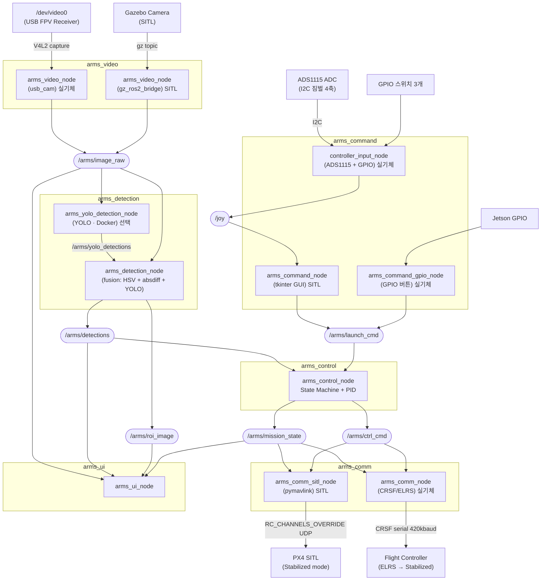
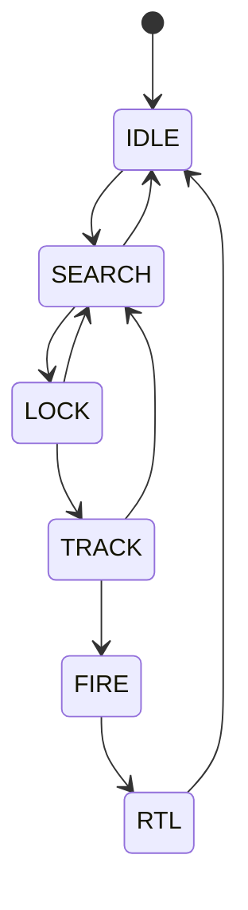
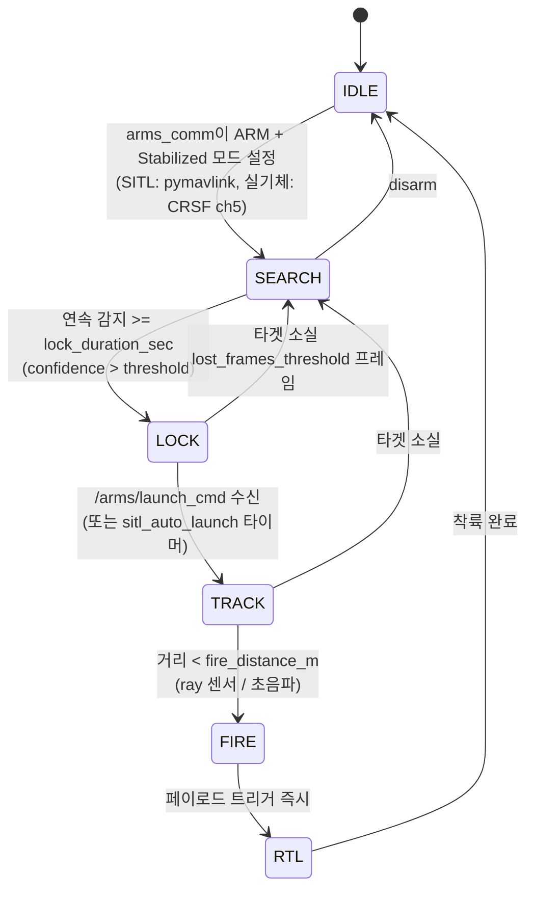

# A.R.M.S. 소프트웨어 설계 문서

_Anti-drone Reusable Modular System — Software Architecture_

## 목차

1. [시스템 개요](#1-시스템-개요)
2. [ROS 패키지 구조](#2-ros-패키지-구조)
3. [노드 및 토픽 구조](#3-노드-및-토픽-구조)
4. [상태 머신](#4-상태-머신-arms_control-내부)
5. [영상 수신 (arms_video)](#5-영상-수신-arms_video)
6. [객체 인식 (arms_detection)](#6-객체-인식-arms_detection)
7. [비행 제어 및 상태 관리 (arms_control)](#7-비행-제어-및-상태-관리-arms_control)
8. [오퍼레이터 UI (arms_ui)](#8-오퍼레이터-ui-arms_ui)
9. [런치 파일 구조](#9-런치-파일-구조)
10. [전체 데이터 흐름 요약](#10-전체-데이터-흐름-요약)

## 1. 시스템 개요

### 1.1 물리 구성


### 1.2 소프트웨어 레이어

```
+----------------------------------------------------------+
|                    Operator Interface                    |
|                    (Monitor Display)                     |
+----------------------------------------------------------+
|   Video Pipeline   |  Detection  |  Control  |   Comm   |
|  (V4L2 -> ROS)     |  (YOLO)     |  PID      | SITL:    |
|                    |             |  State    | pymavlink|
|                    |             |  Machine  | HW: CRSF |
+----------------------------------------------------------+
|              ROS 2 Middleware (Humble)                   |
+----------------------------------------------------------+
|         Jetson Hardware (CUDA, V4L2, UART/ELRS)          |
+----------------------------------------------------------+
```

## 2. ROS 패키지 구조

```
arms_ws/
└── src/
    ├── arms_bringup/          # 최상위 런치 파일 및 설정
    ├── arms_video/            # 영상 소스 추상화 (usb_cam / gz_ros2_bridge)
    ├── arms_detection/        # 융합 검출 노드 + YOLO Docker 노드
    ├── arms_command/          # 발사 명령 인터페이스 (tkinter GUI / GPIO 버튼 / ADS1115 조종기 입력)
    ├── arms_control/          # 상태 머신 + PID 제어 → /arms/ctrl_cmd 발행
    ├── arms_comm/             # 통신 레이어 (SITL: pymavlink, 실기체: CRSF/ELRS)
    ├── arms_ui/               # 오퍼레이터 디스플레이 (OpenCV 오버레이)
    └── arms_msgs/             # 커스텀 메시지 정의
```

## 3. 노드 및 토픽 구조

### 3.1 노드 그래프



| 노드                       | subscribe                                                                                | publish                                                              |
| -------------------------- | ---------------------------------------------------------------------------------------- | -------------------------------------------------------------------- |
| `arms_video_node`          | —                                                                                        | `/arms/image_raw`                                                    |
| `arms_yolo_detection_node` | `/arms/image_raw`                                                                        | `/arms/yolo_detections`                                              |
| `arms_detection_node`      | `/arms/image_raw`<br/>`/arms/yolo_detections`                                            | `/arms/detections`<br/>`/arms/roi_image`                             |
| `arms_command_node`        | `/arms/mission_state`<br/>`/joy`                                                         | `/arms/launch_cmd`                                                   |
| `arms_command_gpio_node`   | `/arms/mission_state`                                                                    | `/arms/launch_cmd`                                                   |
| `controller_input_node`    | —                                                                                        | `/joy`                                                               |
| `arms_control_node`        | `/arms/detections`<br/>`/arms/launch_cmd`<br/>`/arms/scan_raw`                           | `/arms/ctrl_cmd`<br/>`/arms/mission_state`<br/>`/arms/control_debug` |
| `arms_comm_sitl_node`      | `/arms/ctrl_cmd`<br/>`/arms/mission_state`                                               | —                                                                    |
| `arms_comm_node`           | `/arms/ctrl_cmd`<br/>`/arms/mission_state`                                               | —                                                                    |
| `arms_ui_node`             | `/arms/image_raw`<br/>`/arms/detections`<br/>`/arms/mission_state`<br/>`/arms/roi_image` | —                                                                    |
| `gz_scan_bridge`           | `/arms_drone/upward_ray/scan` (gz)                                                       | `/arms/scan_raw`                                                     |

### 3.2 노드별 역할

| 노드                       | 패키지           | 역할                                                                                                         | 실행 환경     |
| -------------------------- | ---------------- | ------------------------------------------------------------------------------------------------------------ | ------------- |
| `arms_video_node`          | `arms_video`     | 영상 소스 추상화. 실기체는 usb_cam, SITL은 gz_ros2_bridge로 `/arms/image_raw` 발행                           | 호스트        |
| `arms_yolo_detection_node` | `arms_detection` | YOLO 추론 후 `/arms/yolo_detections` 발행. **선택적** — Docker 컨테이너 안에서 실행                          | Docker (선택) |
| `arms_detection_node`      | `arms_detection` | HSV·absdiff·YOLO 결과를 융합해 `/arms/detections` 발행. YOLO 노드 없이도 독립 동작 가능                      | 호스트        |
| `arms_command_node`        | `arms_command`   | SITL용 tkinter GUI 패널. 발사 명령·검출 모드·PID 게인 등을 제어. `/joy` 구독으로 조종기 스틱/스위치 실시간 표시 | 호스트        |
| `arms_command_gpio_node`   | `arms_command`   | 실기체용 GPIO 버튼 입력. `arms_command_node`와 동일한 토픽 인터페이스                                        | 호스트        |
| `controller_input_node`    | `arms_command`   | ADS1115 ADC(I2C)로 짐벌 4축 읽기 + GPIO 스위치 3개 읽기 → `sensor_msgs/Joy` `/joy` 발행. fake_mode 지원     | 호스트        |
| `arms_control_node`        | `arms_control`   | 상태 머신 + PID 제어. 제어 명령을 `/arms/ctrl_cmd`로 발행. FC 직접 통신 없음                                 | 호스트        |
| `arms_comm_sitl_node`      | `arms_comm`      | SITL 전용. pymavlink로 PX4에 UDP 연결. `/arms/ctrl_cmd` → `RC_CHANNELS_OVERRIDE` 50Hz. ARM·RTL·페이로드 처리 | 호스트        |
| `arms_comm_node`           | `arms_comm`      | 실기체 전용. `/arms/ctrl_cmd` → CRSF 프레임 → pyserial → ELRS TX → FC (Stabilized 모드). 420000 baud         | 호스트        |
| `arms_ui_node`             | `arms_ui`        | 카메라 영상에 바운딩박스·상태·오차값 오버레이해서 OpenCV 윈도우로 표시                                       | 호스트        |
| `gz_scan_bridge`           | `ros_gz_bridge`  | SITL 전용. Gazebo 거리 센서 토픽을 ROS2로 브릿지                                                             | 호스트        |

### 3.3 커스텀 메시지 정의

```
# arms_msgs/BoundingBox.msg
float32 x_center    # normalized [0.0, 1.0]
float32 y_center    # normalized [0.0, 1.0]
float32 width       # normalized [0.0, 1.0]
float32 height      # normalized [0.0, 1.0]
float32 confidence
int32   class_id
string  class_name
```

```
# arms_msgs/DetectionArray.msg
std_msgs/Header header
BoundingBox[]   detections
```

```
# arms_msgs/MissionState.msg
std_msgs/Header header
string          state                # IDLE | SEARCH | LOCK | TRACK | FIRE | RTL
float32         lock_elapsed_sec     # continuous detection duration so far [s]
float32         error_x              # current normalized pixel error (for UI)
float32         error_y
bool            target_locked
float32         kp_now               # 현재 적용 중인 P 게인 (시간 램프 값)
```

```
# arms_msgs/CtrlCmd.msg
std_msgs/Header header
float32         roll_deg             # PID 출력 roll 각도 [deg]
float32         pitch_deg            # PID 출력 pitch 각도 [deg]
float32         yaw_deg              # 0 고정
float32         thrust               # [0.0, 1.0]
```

## 4. 상태 머신 (arms_control 내부)

### 4.1 상태별 동작 정의

| 상태       | 드론 동작                       | 제어 출력                                     | UI 표시                   |
| ---------- | ------------------------------- | --------------------------------------------- | ------------------------- |
| **IDLE**   | 정지 대기                       | thrust=0, roll/pitch=0                        | 회색 테두리               |
| **SEARCH** | Arm 완료, 타겟 탐색 중          | thrust=0, roll/pitch=0                        | 노란색, "Searching..."    |
| **LOCK**   | 타겟 포착 확인 중 (잠금 타이머) | thrust=0, roll/pitch=0                        | 주황색 박스, "Locking..." |
| **TRACK**  | 위치 보정 추적                  | PID (P 램프 kp_start→kp_max) + track_throttle | 빨간 박스, "LOCKED"       |
| **FIRE**   | 추적 유지 + 페이로드 즉시 발사  | PID 유지 + 페이로드 트리거 (1회)              | 빨간 박스, "FIRED!"       |
| **RTL**    | 귀환                            | arms_comm이 RTL 모드 전환                     | "Returning..."            |

### 4.2 상태 전이 다이어그램



### 4.3 상태 전이 조건



> `/arms/reset_cmd` 수신 시 어느 상태에서든 SEARCH로 강제 복귀.

### 4.4 전이 조건 파라미터

```yaml
# arms_control/config/control_params.yaml
mission:
  detection_confidence_threshold: 0.65 # 이 이상이어야 감지로 인정
  lock_duration_sec: 2.0 # SEARCH→LOCK: 연속 감지 유지 시간 [s]
  lost_frames_threshold: 10 # 소실 프레임 수 초과 시 SEARCH 복귀
  fire_distance_m: 5.0 # TRACK→FIRE: ray 센서 거리 임계값 [m]
  sitl_auto_launch: false # true: LOCK 후 auto_launch_delay_sec 뒤 자동 발사
  auto_launch_delay_sec: 1.0

control:
  track_throttle: 0.85 # TRACK/FIRE 스로틀
  kp_start: 60.0 # TRACK 진입 시 초기 P (약하게 시작)
  kp_max: 150.0 # 램프 끝 최대 P
  kp_ramp_sec: 5.0 # kp_start→kp_max 선형 증가 시간 [s]
```

## 5. 영상 수신 (arms_video)

### 5.1 구성

arms_video_node는 영상 소스에 따라 두 가지 모드로 동작한다.
어느 모드든 `/arms/image_raw`를 동일하게 발행하므로 downstream 노드(detection, UI)는 소스를 알 필요가 없다.

**실기체 모드**

- FPV 수신기 → USB Video Capture 장치 (`/dev/video0`)
- V4L2 드라이버를 통해 프레임 수신
- `image_transport`를 통해 `/arms/image_raw` 발행

**SITL 모드**

- Gazebo가 발행하는 카메라 토픽을 구독
- `/arms/image_raw`로 relay 발행 (포맷 변환만 수행)

### 5.2 런치 파라미터

```yaml
# arms_video/config/video_params.yaml
video:
  mode: "v4l2" # "v4l2" (실기체) | "gazebo" (SITL)
  device: "/dev/video0" # v4l2 모드에서만 사용
  gazebo_topic: "/camera/image_raw" # gazebo 모드에서만 사용
  width: 1280
  height: 720
  fps: 30
  pixel_format: "YUYV" # or MJPG, v4l2 모드에서만 사용
  topic_name: "/arms/image_raw"
```

## 6. 객체 인식 (arms_detection)

### 6.1 Docker 통합 구조

arms_detection_node 자체가 Docker 컨테이너 안에서 실행된다.
호스트에 별도 ROS2 노드 없이 컨테이너가 ROS2 네트워크에 직접 참여한다.

```
/arms/image_raw (sensor_msgs/Image)
        |
        | DDS (network_mode: host)
        v
    arms_detection_node.py (Docker 내부)
        |
    YOLO inference
        |
    BoundingBox 변환 (normalized coords)
        |
        v
/arms/detections (arms_msgs/DetectionArray)
```

### 6.2 Docker Compose

플랫폼에 따라 compose 파일을 선택한다.

```bash
# Jetson
docker compose -f docker-compose.jetson.yml up --build

# 노트북 (x86)
docker compose -f docker-compose.laptop.yml up --build
```

### 6.3 Dockerfile 구성

- base image
  - Jetson : `ultralytics/ultralytics:latest-jetson-jetpack6`
  - Laptop : `ultralytics/ultralytics:latest`
- 구성
  - ROS2 Humble (rclpy, sensor_msgs, rosidl)
  - arms_msgs (소스 COPY 후 colcon build)
  - arms_detection_node.py

### 6.4 YOLO 모델 학습 및 변환

- 데이터셋: [Roboflow — Balloon Project](https://universe.roboflow.com/balloon-kutdi/balloon-project-az6w8)에서 다운로드. 풍선을 단일 클래스로 학습
- 모델: YOLOv11 small
- 경량화: FP16 양자화 후 TensorRT 형식으로 변환

#### 플랫폼별 변환

| 플랫폼       | TensorRT 변환                  |
| ------------ | ------------------------------ |
| 노트북 (x86) | `trtexec` (CUDA 드라이버 필요) |
| Jetson (ARM) | `trtexec` (JetPack 내장)       |

> TensorRT engine은 변환한 GPU 아키텍처에서만 동작한다. Jetson용 engine은 Jetson에서, 노트북용은 노트북에서 각각 변환해야 한다.

## 7. 비행 제어 및 상태 관리 (arms_control + arms_comm)

### 7.1 좌표계 및 오차 정의

하늘을 향하는 카메라 기준으로 픽셀 오차를 드론 제어 오차로 변환한다.

```
  Image Frame (sky-facing camera, drone body frame)

        ^ pitch+ (drone forward)
        |
        |
  ------+------> roll+ (drone right)
        |
        |
  (0,0) = image center

  error_x = (bbox_cx - img_cx) / img_w    [-0.5, +0.5]
  error_y = (bbox_cy - img_cy) / img_h    [-0.5, +0.5]
```

**카메라 장착 방향에 따라 roll/pitch 매핑 주의 필요.**

### 7.2 PID 제어

$$
u(t) = K_p \cdot e(t) + K_i \int_0^t e(\tau)d\tau + K_d \frac{de(t)}{dt}
$$

- `error_x` → **roll 각도** 명령 [deg]
- `error_y` → **pitch 각도** 명령 [deg]
- **throttle** → 상수 (파라미터로 설정)
- **yaw** → 0 (고정)

```
roll_angle  = PID_roll (error_x)    # [deg], clamped to output_limit
pitch_angle = PID_pitch(error_y)    # [deg], clamped to output_limit
throttle    = CONSTANT_THROTTLE
yaw_angle   = 0.0                   # hold heading
```

### 7.3 PID 파라미터

arms_control은 C++ (ament_cmake) 로 구현되며, ROS2 파라미터로 런타임 설정이 가능하다.

```yaml
# arms_control/config/control_params.yaml
arms_control_node:
  ros__parameters:
    control:
      roll_pid:
        kp: 15.0
        ki: 0.5
        kd: 1.0
        output_limit: 90.0 # max roll angle [deg]
      pitch_pid:
        kp: 15.0
        ki: 0.5
        kd: 1.0
        output_limit: 90.0 # max pitch angle [deg]
      throttle: 0.55 # constant throttle [0.0, 1.0]
      track_throttle: 0.85
      kp_start: 60.0 # TRACK 진입 시 초기 P
      kp_max: 150.0 # 램프 끝 최대 P
      kp_ramp_sec: 5.0 # kp_start→kp_max 선형 증가 시간 [s]
      control_rate_hz: 30.0
```

PID 구현 특이사항:

- **anti-windup**: integral 값을 `[-output_limit/ki, +output_limit/ki]` 로 clamp
- **derivative kick 방지**: 첫 번째 호출에서 미분항 생략
- **시간 기반 P 램프**: TRACK 진입 직후 약한 P(kp_start)에서 kp_ramp_sec 동안 kp_max까지 선형 증가
- **출력 단위**: [deg] → `/arms/ctrl_cmd`로 발행 → arms_comm이 RC 채널값으로 변환

### 7.4 제어 루프 흐름

```
/arms/detections  +  /arms/launch_cmd  +  /arms/scan_raw
         |
         v
  [State Machine]  ─────────────────────────────────────
    update state per detection/distance callback          |
    LOCK + launch_cmd → TRACK                            |
    TRACK + distance < fire_distance_m → FIRE             |
         |                                               |
    state == TRACK / FIRE?                               |
         | yes                                           |
         v                                               |
  compute error_x, error_y (PID)                        |
         |                                               v
         v                                    publish /arms/mission_state
  publish /arms/ctrl_cmd                          (arms_ui + arms_comm)
    {roll_deg, pitch_deg, yaw_deg, thrust}
         |
         v
  arms_comm_sitl_node  →  RC_CHANNELS_OVERRIDE  →  PX4 (Stabilized)
  arms_comm_node       →  CRSF serial           →  ELRS → FC (Stabilized)
```

### 7.5 arms_comm 통신 상세

#### SITL (arms_comm_sitl_node — pymavlink)

```
/arms/ctrl_cmd  →  RC channel 값 계산  →  RC_CHANNELS_OVERRIDE (50Hz)

  ch1 (roll)     = 1500 + (roll_deg  / max_angle) × 500   [1000–2000]
  ch2 (pitch)    = 1500 + (pitch_deg / max_angle) × 500
  ch3 (throttle) = 1000 + thrust × 1000
  ch4 (yaw)      = 1500 (고정)
  ch5 (arm)      = 1811 (SEARCH 이상) / 988 (IDLE)

/arms/mission_state  →  ARM / 모드 전환 / 페이로드
  IDLE→SEARCH  :  MAV_CMD_COMPONENT_ARM_DISARM + Stabilized 모드
  state==RTL   :  MAV_CMD_DO_SET_MODE (Auto·RTL sub-mode)
  state==FIRE  :  MAV_CMD_DO_SET_ACTUATOR
```

#### 실기체 (arms_comm_node — pyserial CRSF)

```
/arms/ctrl_cmd  →  CRSF RC_CHANNELS_PACKED 프레임  →  serial 420000 baud

  ch1 (roll)     = 992 + (roll_deg  / max_angle) × 820   [172–1811]
  ch2 (pitch)    = 992 + (pitch_deg / max_angle) × 820
  ch3 (throttle) = 172 + thrust × 1639
  ch4 (yaw)      = 992 (고정)
  ch5 (arm)      = 1811 (armed) / 172 (disarmed)
  ch6 (mode)     = 1811 (RTL) / 992 (Stabilized)
  ch7 (payload)  = 1811 (FIRE) / 172 (idle)

CRSF 프레임: [0xC8][len][0x16][22 bytes: 16ch × 11bit][CRC8-D5]
```

### 7.6 arms_control_node 내부 구조

```
arms_control_node
  |
  +-- [Subscribers]
  |     /arms/detections   (DetectionArray)
  |     /arms/scan_raw     (LaserScan → 거리 캐시)
  |     /arms/launch_cmd   (Empty → LOCK→TRACK 트리거)
  |     /arms/reset_cmd    (Empty → 강제 SEARCH 복귀)
  |
  +-- [Publishers]
  |     /arms/ctrl_cmd        (CtrlCmd, 30Hz)
  |     /arms/mission_state   (MissionState, 30Hz)
  |     /arms/control_debug   (Vector3, 30Hz — UI 화살표용)
  |
  +-- [State Machine]
  |     evaluate detections -> update state
  |     launch_cmd (LOCK 상태) -> TRACK 전이
  |     distance < fire_distance_m (TRACK) -> FIRE 전이
  |
  +-- [PID Controller]  (TRACK / FIRE 상태에서 활성)
        error_x -> roll_deg  [deg]
        error_y -> pitch_deg [deg]
        → publish /arms/ctrl_cmd
```

## 8. 오퍼레이터 UI (arms_ui)

### 8.1 화면 레이아웃

```
+----------------------------------------------------+
|  A.R.M.S.  [STATE: TRACK]              2026-05-08  |
+----------------------------------------------------+
|                                                    |
|           FPV CAMERA FEED                          |
|                                                    |
|         +--------+                                 |
|         | TARGET |  <- red bounding box            |
|         +--------+                                 |
|              o    <- frame center crosshair        |
|                                                    |
+----------------------------------------------------+
|  conf: 0.87  |  err_x: +0.03  |  err_y: -0.01      |
|  roll: +0.12 |  pitch: -0.04  |  thr: 0.55         |
+----------------------------------------------------+
```

### 8.2 UI 구현

- OpenCV `imshow` 기반 경량 구현 (or rqt plugin)
- launch 버튼은 GPIO로 직접 처리 (UI에서 별도 발행 없음)

## 9. 런치 파일 구조

### 9.1 SITL 런치

```
# arms_bringup/launch/arms_sitl.launch.py
# arms_bringup/launch/arms_sitl_flying.launch.py  (풍선 referee 포함)

includes:
  - arms_video/launch/video_sitl.launch.py
      → arms_video_node (gz_ros2_bridge)
          /arms_drone/upward_camera/image → /arms/image_raw

nodes:
  - gz_scan_bridge       (ros_gz_bridge)  /arms_drone/upward_ray/scan → /arms/scan_raw
  - arms_detection_node  (arms_detection)
  - arms_control_node    (arms_control)   순수 PID → /arms/ctrl_cmd
  - arms_comm_sitl_node  (arms_comm)      pymavlink udp://:14540, Stabilized mode
  - arms_ui_node         (arms_ui)
  - arms_command_node    (arms_command)   (arms_sitl_flying 에만 포함)

별도 실행:
  cd arms_detection/docker && docker compose -f docker-compose.laptop.yml up
```

### 9.2 실기체 런치

```
# arms_bringup/launch/arms_full.launch.py

includes:
  - arms_video/launch/video.launch.py
      → arms_video_node (usb_cam)  /dev/video0 → /arms/image_raw

nodes:
  - arms_control_node  (arms_control)   순수 PID → /arms/ctrl_cmd
  - arms_comm_node     (arms_comm)      CRSF serial, 420000 baud → ELRS → FC
      파라미터: serial_port=/dev/ttyUSB0, max_angle_deg=35.0
  - arms_ui_node       (arms_ui)

# arms_command/launch/command.launch.py  (별도 실행)
nodes:
  - arms_command_gpio_node  (arms_command)  GPIO 발사 버튼
  - controller_input_node   (arms_command)  ADS1115 조종기 → /joy
      파라미터: config/controller_input_params.yaml (fake_mode: false)

별도 실행:
  cd arms_detection/docker && docker compose -f docker-compose.jetson.yml up
```

## 10. 전체 데이터 흐름 요약

```
FPV Receiver (USB)          Gazebo Camera (SITL)
      |                             |
      | V4L2                        | gz topic
      v                             v
arms_video_node  ──────────────────────────────────────
      |
      | /arms/image_raw  [sensor_msgs/Image, 30Hz]
      +──────────────────────────────> arms_ui_node (display)
      |
      | DDS (network_mode: host)
      v
arms_detection_node  (Docker 컨테이너 내부, YOLO inference)
      |
      | /arms/detections  [arms_msgs/DetectionArray]
      +──────────────────────────────> arms_ui_node (overlay boxes)
      |
      v
arms_control_node  (state machine + PID)
      |
      | /arms/mission_state  [arms_msgs/MissionState, 30Hz]
      +──────────────────────────────> arms_ui_node (state display)
      +──────────────────────────────> arms_comm_*_node (ARM / RTL / FIRE)
      |
      | /arms/ctrl_cmd  [arms_msgs/CtrlCmd, 30Hz]
      +──────────────────────────────> arms_comm_*_node (roll/pitch/thrust)
      |
      v
  SITL: arms_comm_sitl_node
    └─ RC_CHANNELS_OVERRIDE (50Hz, UDP) ──> PX4 Stabilized mode
  실기체: arms_comm_node
    └─ CRSF frame (50Hz, 420kbaud serial) ──> ELRS TX ──> FC Stabilized
                                                              |
                                                              v
                                                  ESC ──> Motors
                                                  Payload ch7 (FIRE state)
```

---

_Document version: 0.4 — 2026-07-07_
