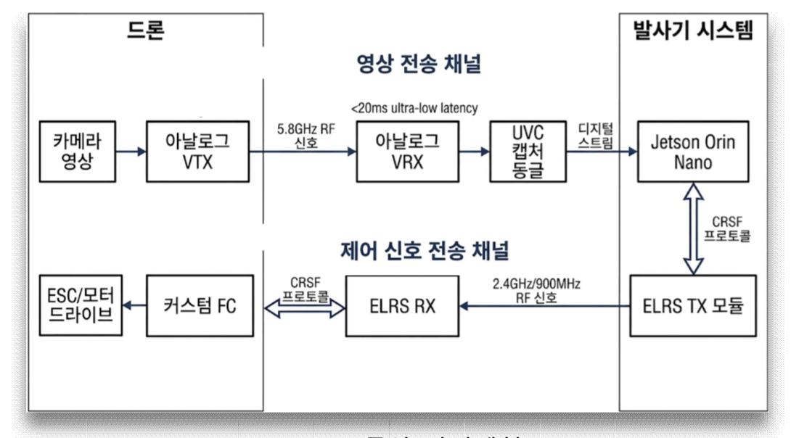
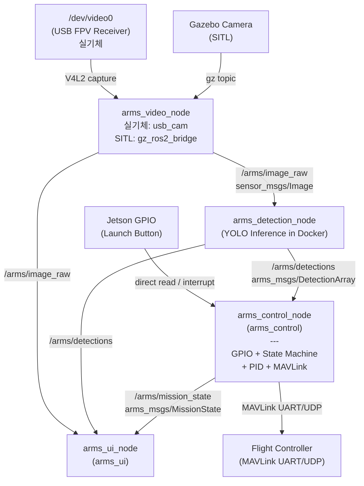
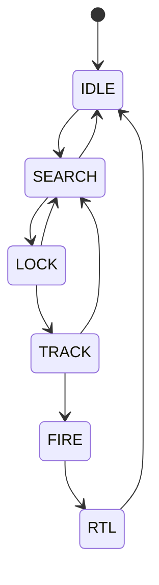
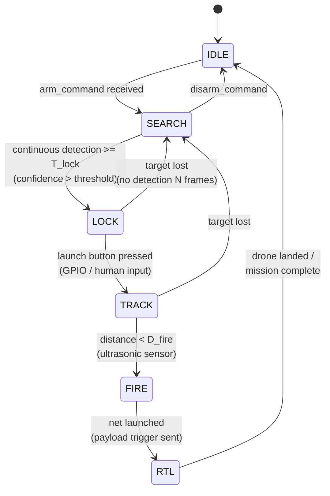

# A.R.M.S. 소프트웨어 설계 문서

_Anti-drone Reusable Modular System — Software Architecture_

## 목차

1. [시스템 개요](#1-시스템-개요)
2. [ROS 패키지 구조](#2-ros-패키지-구조)
3. [노드 및 토픽 구조](#3-노드-및-토픽-구조)
4. [상태 머신](#4-상태-머신-arms_control-내부)
5. [영상 수신 (arms_video)](#5-영상-수신-arms_video)
6. [객체 인식 (arms_detection)](#6-객체-인식-arms_detection)
7. [비행 제어 및 상태 관리 (arms_control)](#7-비행-제어-및-상태-관리-arms_control)
8. [오퍼레이터 UI (arms_ui)](#8-오퍼레이터-ui-arms_ui)
9. [런치 파일 구조](#9-런치-파일-구조)
10. [전체 데이터 흐름 요약](#10-전체-데이터-흐름-요약)

## 1. 시스템 개요

### 1.1 물리 구성



### 1.2 소프트웨어 레이어

```
+----------------------------------------------------------+
|                    Operator Interface                    |
|                    (Monitor Display)                     |
+----------------------------------------------------------+
|   Video Pipeline   |  Detection  |   Flight Control      |
|  (V4L2 -> ROS)     |  (YOLO)     |   State Machine +     |
|                    |             |   PID + MAVLink       |
+----------------------------------------------------------+
|              ROS 2 Middleware (Humble)                   |
+----------------------------------------------------------+
|            Jetson Hardware (CUDA, V4L2, UART)            |
+----------------------------------------------------------+
```

## 2. ROS 패키지 구조

```
arms_ws/
└── src/
    ├── arms_bringup/          # launch files, top-level config
    ├── arms_video/            # V4L2 -> ROS Image topic
    ├── arms_detection/        # YOLO Docker bridge + detection topic
    ├── arms_control/          # State machine + PID controller + MAVLink telemetry
    ├── arms_ui/               # Operator display (rqt plugin or OpenCV window)
    └── arms_msgs/             # Custom message/service definitions
```

## 3. 노드 및 토픽 구조

### 3.1 노드 그래프



| 노드                  | subscribe                                                          | publish               |
| --------------------- | ------------------------------------------------------------------ | --------------------- |
| `arms_video_node`     | —                                                                  | `/arms/image_raw`     |
| `arms_detection_node` | `/arms/image_raw`                                                  | `/arms/detections`    |
| `arms_control_node`   | `/arms/detections`                                                 | `/arms/mission_state` |
| `arms_ui_node`        | `/arms/image_raw`<br/>`/arms/detections`<br/>`/arms/mission_state` | —                     |
| `gz_scan_bridge`      | `/arms_drone/upward_ray/scan` (gz)                                 | `/arms/scan_raw`      |

### 3.2 노드별 역할

| 노드                  | 패키지           | 역할                                                                                                                                                           | 실행 환경 |
| --------------------- | ---------------- | -------------------------------------------------------------------------------------------------------------------------------------------------------------- | --------- |
| `arms_video_node`     | `arms_video`     | 영상 소스 추상화. 실기체는 usb_cam으로 USB 캡처 카드 수신, SITL은 gz_ros2_bridge로 Gazebo 카메라 수신.                                                         | 호스트    |
| `arms_detection_node` | `arms_detection` | YOLO 추론 수행 후 바운딩박스 발행. **Docker 컨테이너 안에서 실행**되며 `network_mode: host`로 ROS2 DDS 네트워크에 직접 참여                                    | Docker    |
| `arms_control_node`   | `arms_control`   | 상태 머신, PID 제어, MAVLink 통신 담당. 감지 결과로 상태 전이 판단, PID로 roll/pitch 명령 계산, MAVLink로 FC에 자세 명령 전송. GPIO로 발사 버튼 입력 직접 읽음 | 호스트    |
| `arms_ui_node`        | `arms_ui`        | 카메라 영상에 바운딩박스·상태·오차값 오버레이해서 OpenCV 윈도우로 표시                                                                                         | 호스트    |
| `gz_scan_bridge`      | `ros_gz_bridge`  | SITL 전용. Gazebo 거리 센서 토픽을 ROS2로 브릿지. arms_sitl.launch.py에서 직접 실행                                                                            | 호스트    |

### 3.3 커스텀 메시지 정의

```
# arms_msgs/BoundingBox.msg
float32 x_center    # normalized [0.0, 1.0]
float32 y_center    # normalized [0.0, 1.0]
float32 width       # normalized [0.0, 1.0]
float32 height      # normalized [0.0, 1.0]
float32 confidence
int32   class_id
string  class_name
```

```
# arms_msgs/DetectionArray.msg
std_msgs/Header header
BoundingBox[]   detections
```

```
# arms_msgs/MissionState.msg
std_msgs/Header header
string          state                # IDLE | SEARCH | LOCK | TRACK | FIRE | RTL
float32         lock_elapsed_sec     # continuous detection duration so far [s]
float32         error_x              # current normalized pixel error (for UI)
float32         error_y
bool            target_locked
```

## 4. 상태 머신 (arms_control 내부)

### 4.1 상태별 동작 정의



| 상태       | 드론 동작                    | 제어 출력                 | UI 표시                   |
| ---------- | ---------------------------- | ------------------------- | ------------------------- |
| **IDLE**   | 정지 대기                    | 제어 없음 (Disarmed)      | 회색 테두리               |
| **SEARCH** | Arm                          | 고정 스로틀, roll/pitch=0 | 노란색, "Searching..."    |
| **LOCK**   | 목표 추적 시작, 잠금 확인 중 | PID 활성화 (약한 스로톨)  | 주황색 박스, "Locking..." |
| **TRACK**  | 완전 추적                    | PID 활성화 (풀 스로틀)    | 빨간 박스, "LOCKED"       |
| **FIRE**   | 추적 유지 + 발사             | PID 유지 + 발사 트리거    | 빨간 박스, "FIRED!"       |
| **RTL**    | 귀환                         | MAVLink RTL 명령          | "Returning..."            |

### 4.2 상태 전이 다이어그램 (조건 포함)



### 4.3 전이 조건 파라미터

```yaml
# arms_control/config/control_params.yaml (mission section)
mission:
  detection_confidence_threshold: 0.65
  lock_duration_sec: 2.0 # continuous detection duration required to enter LOCK [s]
  lost_frames_threshold: 10 # frames without detection -> back to SEARCH
  lock_box_tolerance: 0.15 # normalized bbox center tolerance from frame center
  fire_distance_m: 3.0 # ultrasonic distance threshold to trigger FIRE (net launch) [m]
```

## 5. 영상 수신 (arms_video)

### 5.1 구성

arms_video_node는 영상 소스에 따라 두 가지 모드로 동작한다.
어느 모드든 `/arms/image_raw`를 동일하게 발행하므로 downstream 노드(detection, UI)는 소스를 알 필요가 없다.

**실기체 모드**

- FPV 수신기 → USB Video Capture 장치 (`/dev/video0`)
- V4L2 드라이버를 통해 프레임 수신
- `image_transport`를 통해 `/arms/image_raw` 발행

**SITL 모드**

- Gazebo가 발행하는 카메라 토픽을 구독
- `/arms/image_raw`로 relay 발행 (포맷 변환만 수행)

### 5.2 런치 파라미터

```yaml
# arms_video/config/video_params.yaml
video:
  mode: "v4l2" # "v4l2" (실기체) | "gazebo" (SITL)
  device: "/dev/video0" # v4l2 모드에서만 사용
  gazebo_topic: "/camera/image_raw" # gazebo 모드에서만 사용
  width: 1280
  height: 720
  fps: 30
  pixel_format: "YUYV" # or MJPG, v4l2 모드에서만 사용
  topic_name: "/arms/image_raw"
```

## 6. 객체 인식 (arms_detection)

### 6.1 Docker 통합 구조

arms_detection_node 자체가 Docker 컨테이너 안에서 실행된다.
호스트에 별도 ROS2 노드 없이 컨테이너가 ROS2 네트워크에 직접 참여한다.

```
/arms/image_raw (sensor_msgs/Image)
        |
        | DDS (network_mode: host)
        v
    arms_detection_node.py (Docker 내부)
        |
    YOLO inference
        |
    BoundingBox 변환 (normalized coords)
        |
        v
/arms/detections (arms_msgs/DetectionArray)
```

### 6.2 Docker Compose

플랫폼에 따라 compose 파일을 선택한다.

```bash
# Jetson
docker compose -f docker-compose.jetson.yml up --build

# 노트북 (x86)
docker compose -f docker-compose.laptop.yml up --build
```

### 6.3 Dockerfile 구성

- base image
  - Jetson : `ultralytics/ultralytics:latest-jetson-jetpack6`
  - Laptop : `ultralytics/ultralytics:latest`
- 구성
  - ROS2 Humble (rclpy, sensor_msgs, rosidl)
  - arms_msgs (소스 COPY 후 colcon build)
  - arms_detection_node.py

### 6.4 YOLO 모델 학습 및 변환

- 데이터셋: [Roboflow — Balloon Project](https://universe.roboflow.com/balloon-kutdi/balloon-project-az6w8)에서 다운로드. 풍선을 단일 클래스로 학습
- 모델: YOLOv11 small
- 경량화: FP16 양자화 후 TensorRT 형식으로 변환

#### 플랫폼별 변환

| 플랫폼       | TensorRT 변환                  |
| ------------ | ------------------------------ |
| 노트북 (x86) | `trtexec` (CUDA 드라이버 필요) |
| Jetson (ARM) | `trtexec` (JetPack 내장)       |

> TensorRT engine은 변환한 GPU 아키텍처에서만 동작한다. Jetson용 engine은 Jetson에서, 노트북용은 노트북에서 각각 변환해야 한다.

## 7. 비행 제어 및 상태 관리 (arms_control)

### 7.1 좌표계 및 오차 정의

하늘을 향하는 카메라 기준으로 픽셀 오차를 드론 제어 오차로 변환한다.

```
  Image Frame (sky-facing camera, drone body frame)

        ^ pitch+ (drone forward)
        |
        |
  ------+------> roll+ (drone right)
        |
        |
  (0,0) = image center

  error_x = (bbox_cx - img_cx) / img_w    [-0.5, +0.5]
  error_y = (bbox_cy - img_cy) / img_h    [-0.5, +0.5]
```

**카메라 장착 방향에 따라 roll/pitch 매핑 주의 필요.**

### 7.2 PID 제어

$$
u(t) = K_p \cdot e(t) + K_i \int_0^t e(\tau)d\tau + K_d \frac{de(t)}{dt}
$$

- `error_x` → **roll 각도** 명령 [deg]
- `error_y` → **pitch 각도** 명령 [deg]
- **throttle** → 상수 (파라미터로 설정)
- **yaw** → 0 (고정 또는 별도 로직)

```
roll_angle  = PID_roll (error_x)    # [deg], clamped to max_tilt_deg
pitch_angle = PID_pitch(error_y)    # [deg], clamped to max_tilt_deg
throttle    = CONSTANT_THROTTLE
yaw_angle   = 0.0                   # hold heading
```

### 7.3 PID 파라미터

arms_control은 C++ (ament_cmake) 로 구현되며, ROS2 파라미터로 런타임 설정이 가능하다.

```yaml
# arms_control/config/control_params.yaml
arms_control_node:
  ros__parameters:
    control:
      roll_pid:
        kp: 15.0
        ki: 0.5
        kd: 1.0
        output_limit: 30.0 # max roll angle [deg], anti-windup clamp 도 동일 값 적용
      pitch_pid:
        kp: 15.0
        ki: 0.5
        kd: 1.0
        output_limit: 30.0 # max pitch angle [deg]
      throttle: 0.55 # constant throttle [0.0, 1.0]
      control_rate_hz: 30.0

    mavlink:
      connection: "udp:127.0.0.1:14550" # SITL
      # connection: "/dev/ttyTHS1"        # 실 기체 (Jetson UART)
      baud: 115200
      system_id: 255
      component_id: 1

    gpio:
      enabled: false # 실 기체: true
      launch_button_pin: 18 # BOARD 핀 번호 (libgpiod)
```

PID 구현 특이사항:

- **anti-windup**: integral 값을 `[-output_limit/ki, +output_limit/ki]` 로 clamp
- **derivative kick 방지**: 첫 번째 호출에서 미분항 생략
- **출력 단위**: [deg],
  - MAVSDK `Offboard::Attitude` (roll_deg, pitch_deg, yaw_deg)에 전달
  - MAVSDK가 내부적으로 euler→quaternion 변환 후 SET_ATTITUDE_TARGET으로 FC에 전송

### 7.4 제어 루프 흐름

```
/arms/detections  +  GPIO (launch button)
         |
         v
  [State Machine]
    +---------------+
    | update state  |
    | (per detection|
    |  callback)    |
    +---------------+
         |
    state == LOCK / TRACK / FIRE?
         | yes
         v
  compute error_x, error_y from best detection
         |
         v
  PID roll, PID pitch
         |
         v
  pack MAVLink SET_ATTITUDE_TARGET
         |
         v
  UART -> Flight Controller
         |
  publish /arms/mission_state (for UI)
```

### 7.5 MAVLink 명령

제어 명령은 `SET_ATTITUDE_TARGET` (MAVLink #82) 메시지에 쿼터니언 자세값을 담아 전송.

```
MAVLink Message: SET_ATTITUDE_TARGET (#82)
  - type_mask: 0b00000111  (ignore body rates, use attitude quaternion)
  - q[0..3]     <- quaternion from (roll_angle, pitch_angle, yaw_angle)
  - thrust      <- throttle

  roll_angle, pitch_angle: PID 출력 [deg] -> rad 변환 후 quaternion 생성
  yaw_angle  : 0.0 (heading 고정)
```

> `RC_CHANNELS_OVERRIDE` (#70) 방식은 FC의 각도 제어 모드(Angle/Stabilize)에 의존하므로,
> `SET_ATTITUDE_TARGET`으로 직접 자세를 지정하는 것이 더 정확.

### 7.6 arms_control_node 내부 구조

```
arms_control_node
  |
  +-- [Subscribers]
  |     /arms/detections  (DetectionArray)
  |
  +-- [GPIO]
  |     Jetson GPIO pin (Launch Button) — interrupt callback
  |
  +-- [Publishers]
  |     /arms/mission_state  (MissionState)
  |
  +-- [State Machine]
  |     evaluate detections -> update state
  |     launch button (GPIO, LOCK 상태) -> TRACK 전이
  |     distance < D_fire (TRACK 상태) -> FIRE 전이
  |
  +-- [PID Controller]  (active in LOCK / TRACK / FIRE)
  |     error_x -> roll_angle  [deg]
  |     error_y -> pitch_angle [deg]
  |
  +-- [MAVLink Interface]
        (roll_angle, pitch_angle, yaw_angle) -> quaternion
        SET_ATTITUDE_TARGET (quaternion + thrust) -> FC
        RTL command -> FC (RTL state)
```

## 8. 오퍼레이터 UI (arms_ui)

### 8.1 화면 레이아웃

```
+----------------------------------------------------+
|  A.R.M.S.  [STATE: TRACK]              2026-05-08  |
+----------------------------------------------------+
|                                                    |
|           FPV CAMERA FEED                          |
|                                                    |
|         +--------+                                 |
|         | TARGET |  <- red bounding box            |
|         +--------+                                 |
|              o    <- frame center crosshair        |
|                                                    |
+----------------------------------------------------+
|  conf: 0.87  |  err_x: +0.03  |  err_y: -0.01      |
|  roll: +0.12 |  pitch: -0.04  |  thr: 0.55         |
+----------------------------------------------------+
```

### 8.2 UI 구현

- OpenCV `imshow` 기반 경량 구현 (or rqt plugin)
- launch 버튼은 GPIO로 직접 처리 (UI에서 별도 발행 없음)

## 9. 런치 파일 구조

### 9.1 SITL 런치

```
# arms_bringup/launch/arms_sitl.launch.py

includes:
  - arms_video/launch/video_sitl.launch.py
      → arms_video_node (gz_ros2_bridge)
          /arms_drone/upward_camera/image → /arms/image_raw

nodes:
  - gz_scan_bridge    (ros_gz_bridge)  /arms_drone/upward_ray/scan → /arms/scan_raw
  - arms_control_node (arms_control)   MAVLink: udp://:14540, GPIO: off
  - arms_ui_node      (arms_ui)

별도 실행:
  cd arms_detection/docker && docker compose -f docker-compose.laptop.yml up
```

### 9.2 실기체 런치

```
# arms_bringup/launch/arms_full.launch.py

includes:
  - arms_video/launch/video.launch.py
      → arms_video_node (usb_cam)  /dev/video0 → /arms/image_raw

nodes:
  - arms_control_node (arms_control)  MAVLink: /dev/ttyTHS1, GPIO: on
  - arms_ui_node      (arms_ui)

별도 실행:
  cd arms_detection/docker && docker compose -f docker-compose.jetson.yml up
```

## 10. 전체 데이터 흐름 요약

```
FPV Receiver (USB)          Gazebo Camera (SITL)
      |                             |
      | V4L2                        | gz topic
      v                             v
arms_video_node  ─────────────────────────────
      |
      | /arms/image_raw  [sensor_msgs/Image, 30Hz]
      +─────────────────────────────> arms_ui_node (display)
      |
      | DDS (network_mode: host)
      v
arms_detection_node  (Docker 컨테이너 내부, YOLO inference)
      |
      | /arms/detections  [arms_msgs/DetectionArray]
      +─────────────────────────────> arms_ui_node (overlay boxes)
      |
      v
arms_control_node  (Jetson GPIO: launch button)
      | state machine + PID
      |
      | /arms/mission_state  [arms_msgs/MissionState]
      +─────────────────────────────> arms_ui_node (state display)
      |
      | MAVLink UART (/dev/ttyTHS1) or UDP (SITL)
      v
Flight Controller ──> ESC ──> Motors
                  ──> Payload Trigger (FIRE state)
```

---

_Document version: 0.2 — 2026-05-15_
