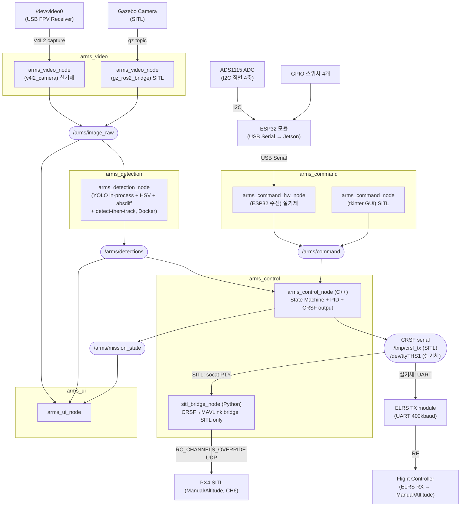
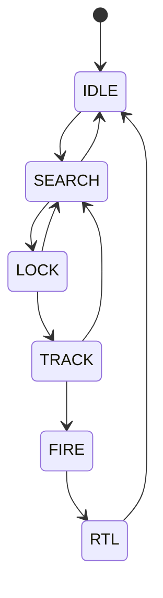
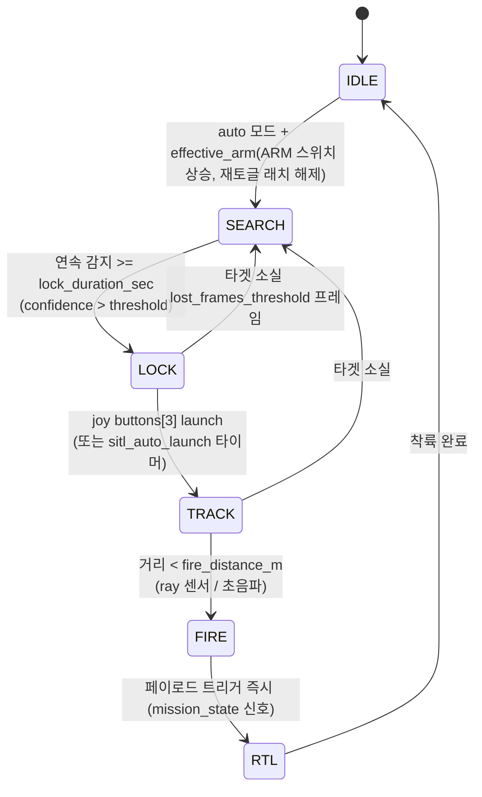

# A.R.M.S. 소프트웨어 설계 문서

_Anti-drone Reusable Modular System — Software Architecture_

## 목차

1. [시스템 개요](#1-시스템-개요)
2. [ROS 패키지 구조](#2-ros-패키지-구조)
3. [노드 및 토픽 구조](#3-노드-및-토픽-구조)
4. [상태 머신](#4-상태-머신-arms_control-내부)
5. [영상 수신 (arms_video)](#5-영상-수신-arms_video)
6. [객체 인식 (arms_detection)](#6-객체-인식-arms_detection)
7. [비행 제어 및 통신 (arms_control)](#7-비행-제어-및-통신-arms_control)
8. [오퍼레이터 UI (arms_ui)](#8-오퍼레이터-ui-arms_ui)
9. [런치 파일 구조](#9-런치-파일-구조)
10. [전체 데이터 흐름 요약](#10-전체-데이터-흐름-요약)

## 1. 시스템 개요

### 1.1 물리 구성


### 1.2 소프트웨어 레이어

```
+----------------------------------------------------------+
|                    Operator Interface                    |
|                    (Monitor Display)                     |
+----------------------------------------------------------+
|   Video Pipeline   |  Detection  |      Control         |
|  (V4L2 -> ROS)     |  (YOLO)     |  PID + State Machine |
|                    |             |  CRSF serial output  |
+----------------------------------------------------------+
|              ROS 2 Middleware (Humble)                   |
+----------------------------------------------------------+
|         Jetson Hardware (CUDA, V4L2, UART/ELRS)          |
+----------------------------------------------------------+
```

## 2. ROS 패키지 구조

```
arms_ws/
└── src/
    ├── arms_bringup/          # 최상위 런치 파일 및 설정
    ├── arms_video/            # 영상 소스 추상화 (v4l2_camera / gz_ros2_bridge)
    ├── arms_detection/        # 융합 검출 노드 (YOLO in-process + HSV + absdiff, Docker)
    ├── arms_command/          # 조종 인터페이스 (tkinter GUI / ADS1115 + GPIO)
    ├── arms_control/          # 상태 머신 + PID + CRSF 출력 (C++/Python hybrid)
    │     ├── src/             #   C++: arms_control_node, crsf_output
    │     └── arms_control/    #   Python: sitl_bridge_node (SITL 전용)
    ├── arms_ui/               # 오퍼레이터 디스플레이 (OpenCV 오버레이)
    └── arms_msgs/             # 커스텀 메시지 정의
```

> `arms_control`은 C++/Python hybrid ament_cmake 패키지다.  
> 실기체에서는 C++ 노드만, SITL에서는 C++ 노드 + Python bridge 노드를 함께 실행한다.

## 3. 노드 및 토픽 구조

### 3.1 노드 그래프



| 노드                       | subscribe                                                                                | publish                                                         |
| -------------------------- | ---------------------------------------------------------------------------------------- | --------------------------------------------------------------- |
| `arms_video_node`          | —                                                                                        | `/arms/image_raw`                                               |
| `arms_detection_node`      | `/arms/image_raw`                                                                        | `/arms/detections`<br/>`/arms/roi_image`<br/>`/arms/debug_image`<br/>`/arms/debug_absdiff` |
| `arms_command_node`        | `/arms/mission_state`                                                                    | `/arms/command`                                                 |
| `arms_command_hw_node` | —                                                                                        | `/arms/command`                                                 |
| `arms_control_node`        | `/arms/detections`<br/>`/arms/command`<br/>`/arms/scan_raw`<br/>`/arms/reset_cmd`        | `/arms/mission_state`<br/>`/arms/control_debug`<br/>CRSF serial |
| `sitl_bridge_node`         | CRSF serial (`/tmp/crsf_rx`)                                                             | MAVLink RC_CHANNELS_OVERRIDE → PX4                              |
| `arms_ui_node`             | `/arms/image_raw`<br/>`/arms/detections`<br/>`/arms/mission_state`<br/>`/arms/control_debug` | —                                                           |
| `gz_scan_bridge`           | `/arms_drone/upward_ray/scan` (gz)                                                       | `/arms/scan_raw`                                                |

### 3.2 노드별 역할

| 노드                       | 패키지           | 역할                                                                                                                                        | 실행 환경     |
| -------------------------- | ---------------- | ------------------------------------------------------------------------------------------------------------------------------------------- | ------------- |
| `arms_video_node`          | `arms_video`     | 영상 소스 추상화. 실기체는 v4l2_camera, SITL은 gz_ros2_bridge로 `/arms/image_raw` 발행                                                      | 호스트        |
| `arms_detection_node`      | `arms_detection` | YOLO(in-process)·HSV·absdiff 를 우선순위 융합 + detect-then-track(CSRT/KCF, ROI) 후 `/arms/detections` 발행. 실기체는 GPU Docker, SITL/호스트는 YOLO 자동 비활성(HSV/absdiff만) | Docker(실기체) / 호스트(SITL) |
| `arms_command_node`        | `arms_command`   | SITL용 tkinter GUI 패널. 드래그 스틱·스위치 클릭으로 `/arms/command` 발행                                                                   | 호스트        |
| `arms_command_hw_node` | `arms_command`   | ESP32 모듈이 ADS1115(I2C 짐벌 4축) + GPIO 스위치를 읽어 USB Serial로 Jetson에 전달 → `sensor_msgs/Joy` `/arms/command` 발행. fake_mode 지원 | 호스트        |
| `arms_control_node`        | `arms_control`   | 상태 머신 + PID 제어. `/arms/command`에서 조종 입력을 받아 auto/manual 모드 전환. CRSF 프레임을 시리얼로 직접 출력                          | 호스트        |
| `sitl_bridge_node`         | `arms_control`   | **SITL 전용.** 가상 시리얼(`/tmp/crsf_rx`)에서 CRSF 수신 → MAVLink `RC_CHANNELS_OVERRIDE` 50Hz → PX4. CH5=arm(레벨), CH6=flight mode(Manual/Altitude) | 호스트 (SITL) |
| `arms_ui_node`             | `arms_ui`        | 카메라 영상에 바운딩박스·상태·오차값 오버레이해서 OpenCV 윈도우로 표시                                                                      | 호스트        |
| `gz_scan_bridge`           | `ros_gz_bridge`  | SITL 전용. Gazebo 거리 센서 토픽을 ROS2로 브릿지                                                                                            | 호스트        |

### 3.3 커스텀 메시지 정의

```
# arms_msgs/BoundingBox.msg
float32 x_center    # normalized [0.0, 1.0]
float32 y_center    # normalized [0.0, 1.0]
float32 width       # normalized [0.0, 1.0]
float32 height      # normalized [0.0, 1.0]
float32 confidence
int32   class_id
string  class_name
```

```
# arms_msgs/DetectionArray.msg
std_msgs/Header header
BoundingBox[]   detections
```

```
# arms_msgs/MissionState.msg
std_msgs/Header header
string          state                # IDLE | SEARCH | LOCK | TRACK | FIRE | RTL
float32         lock_elapsed_sec     # continuous detection duration so far [s]
float32         error_x              # current normalized pixel error (for UI)
float32         error_y
bool            target_locked
float32         kp_now               # 현재 적용 중인 P 게인 (시간 램프 값)
bool            armed                # 유효 ARM (effective_arm, CH5 실제 arm) — UI 효과음/표시
bool            manual_mode          # true=manual, false=auto — UI 효과음/표시
```

## 4. 상태 머신 (arms_control 내부)

### 4.1 상태별 동작 정의

| 상태       | 드론 동작                       | CRSF 출력                                   | 서보 잠금장치       | UI 표시                   |
| ---------- | ------------------------------- | ------------------------------------------- | ------------------- | ------------------------- |
| **IDLE**   | 정지 대기                       | CH3=min, CH1/2=center, CH5=disarm           | **OPEN**(진입 시)   | 회색 테두리               |
| **SEARCH** | 타겟 탐색 중 (FC 미무장)        | CH3=min, CH5=disarm                         | **LOCK**(IDLE→SEARCH 엣지) | 노란색, "Searching..."    |
| **LOCK**   | 타겟 포착 확인 중 (잠금 타이머) | CH5=arm → PX4 arm                           | LOCK 유지           | 주황색 박스, "Locking..." |
| **TRACK**  | 위치 보정 추적                  | PID → CH1/2 + track_throttle → CH3          | **OPEN**(LOCK→TRACK 엣지) | 빨간 박스, "LOCKED"       |
| **FIRE**   | 추적 유지 + 페이로드 즉시 발사  | PID 유지 (전용 fire 채널 없음; mission_state로 신호) | OPEN 유지           | 빨간 박스, "FIRED!"       |
| **RTL**    | 귀환 및 착륙                    | 전용 land 채널 없음 (수동 Altitude 착륙 등 별도 경로) | OPEN 유지           | "Returning..."            |

> **서보 잠금장치(발사 클램프)**: 발사 전 기체를 발사기에 고정하고 발사 순간에만 놓아준다.
> 방아쇠(launch 버튼)가 아니라 **상태 전이 엣지**로 제어한다(SEARCH 중 방아쇠를 눌러도 안 풀림).
> · IDLE 진입 → OPEN(무조건 열림, 기체 장착/탈거) · IDLE→SEARCH(auto) → LOCK · LOCK→TRACK(발사) → OPEN.
> 자세한 하드웨어/구현은 [7.8](#78-발사-잠금장치-서보-servo-lock) 참고.

### 4.2 상태 전이 다이어그램



### 4.3 상태 전이 조건



> `/arms/reset_cmd` 수신 시 어느 상태에서든 SEARCH로 강제 복귀.

### 4.4 전이 조건 파라미터

```yaml
# arms_control/config/control_params.yaml
mission:
  detection_confidence_threshold: 0.65
  lock_duration_sec: 2.0
  lost_frames_threshold: 10
  fire_distance_m: 5.0
  sitl_auto_launch: false
  auto_launch_delay_sec: 1.0

control:
  track_throttle: 0.85
  kp_start: 60.0
  kp_max: 150.0
  kp_ramp_sec: 5.0
```

## 5. 영상 수신 (arms_video)

### 5.1 구성

arms_video_node는 영상 소스에 따라 두 가지 모드로 동작한다.
어느 모드든 `/arms/image_raw`를 동일하게 발행하므로 downstream 노드(detection, UI)는 소스를 알 필요가 없다.

**실기체 모드**

- FPV 수신기 → USB Video Capture 장치 (`/dev/video0`)
- `v4l2_camera`(C++) 노드로 프레임 수신 → `/arms/image_raw` 발행
- 아날로그→USB 캡처 동글(MS210x/EasierCAP)은 프레임 간격을 stepwise 로
  보고해 `usb_cam` 이 포맷 열거에 실패한다. 그래서 `v4l2_camera` 를 사용.
  (파이썬+OpenCV 캡처도 가능하나 대형 프레임에서 rclpy 오버헤드로 지연이 커
  C++ 드라이버를 쓴다.)
- 아날로그 신호 락에 ~5초 걸릴 수 있어 기동 직후 몇 초는 검은 화면(정상).

**SITL 모드**

- Gazebo가 발행하는 카메라 토픽을 구독
- `/arms/image_raw`로 relay 발행 (포맷 변환만 수행)

### 5.2 런치 파라미터

```yaml
# arms_video/config/video_params.yaml  (v4l2_camera 파라미터)
/**:
  ros__parameters:
    video_device: "/dev/video0"
    pixel_format: "YUYV"          # 캡처 동글은 YUYV만 출력
    image_size: [720, 480]        # NTSC=720x480 / PAL=720x576
    output_encoding: "rgb8"       # YUYV → rgb8 변환 발행
    camera_info_url: "package://arms_video/config/camera_info.yaml"
```

`/arms/image_raw` 로의 remapping 은 `launch/video.launch.py` 에서 수행한다.
캘리브레이션은 `config/camera_info.yaml`(기본 미보정 플레이스홀더)에서 로드하며,
실측 보정 시 이 파일을 교체한다.

## 6. 객체 인식 (arms_detection)

### 6.1 Docker 통합 구조

```
/arms/image_raw (sensor_msgs/Image)
        |
        | DDS (network_mode: host)
        v
    arms_detection_node.py (Docker 내부, GPU)
        |
    검출 stack: YOLO(in-process) > HSV > absdiff
        |
    detect-then-track (CSRT/KCF): TRACK 중엔 ROI 크롭에만 YOLO
        |
    BoundingBox 변환 (normalized coords)
        |
        v
/arms/detections (arms_msgs/DetectionArray)  [+ /arms/roi_image, debug]
```

### 6.2 Docker Compose

```bash
# Jetson
docker compose -f docker-compose.jetson.yml up --build

# 노트북 (x86)
docker compose -f docker-compose.laptop.yml up --build
```

### 6.3 Dockerfile 구성

- base image
  - Jetson : `ultralytics/ultralytics:latest-jetson-jetpack6`
  - Laptop : `ultralytics/ultralytics:latest`
- 구성
  - ROS2 Humble (rclpy, sensor_msgs, rosidl)
  - arms_msgs (소스 COPY 후 colcon build)
  - arms_detection_node.py

### 6.4 YOLO 모델 학습 및 변환

- 데이터셋: [Roboflow — Balloon Project](https://universe.roboflow.com/balloon-kutdi/balloon-project-az6w8)에서 다운로드. 풍선을 단일 클래스로 학습
- 모델: YOLOv11 small
- 모델 포맷

| 플랫폼       | 포맷        | 비고                                       |
| ------------ | ----------- | ------------------------------------------ |
| 노트북 (x86) | `.pt`       | PyTorch, ultralytics가 직접 로드           |
| Jetson (ARM) | `.engine`   | TensorRT 변환 후 사용 (`trtexec`, JetPack) |

## 7. 비행 제어 및 통신 (arms_control)

### 7.1 아키텍처 개요

`arms_control`이 제어와 통신 출력을 모두 담당한다.
FC와의 인터페이스는 **CRSF 시리얼 프로토콜** 하나로 통일된다.

```
실기체:
  arms_control_node → CRSF serial (UART) → ELRS TX → [RF] → ELRS RX → FC

SITL:
  arms_control_node → CRSF serial (/tmp/crsf_tx)
                              ↓ socat PTY pair
  sitl_bridge_node  ← CRSF serial (/tmp/crsf_rx)
                              ↓
                       RC_CHANNELS_OVERRIDE (MAVLink UDP) → PX4
```

### 7.2 CRSF 채널 매핑

| CH  | 기능        | 값                                                        | PX4 RC_MAP (실기체) |
| --- | ----------- | --------------------------------------------------------- | ------------------- |
| 1   | roll        | -1..1 → 172..1811                                         | RC_MAP_ROLL=1       |
| 2   | pitch       | -1..1 → 172..1811                                         | RC_MAP_PITCH=2      |
| 3   | throttle    | 0..1 → 172..1811                                          | RC_MAP_THROTTLE=3   |
| 4   | yaw         | -1..1 → 172..1811 (auto: 992)                             | RC_MAP_YAW=4        |
| 5   | arm switch  | disarm=172, arm=1811 (auto=상태머신, manual=arm 스위치)   | RC_MAP_ARM_SW=5     |
| 6   | flight mode | Manual=172(auto), Altitude=1811(manual)                   | RC_MAP_FLTMODE=6    |
| 7   | kill switch | 정상=172, kill=1811 (상태 머신 무관, FC가 직접 모터 차단) | RC_MAP_KILL_SW=7    |
| 8   | (미사용)    | 172 고정                                                  | —                   |

> - **CH6 flight mode**는 오퍼레이터 모드 스위치(joy buttons[2])와 1:1이다.
>   auto(영상유도)=PX4 **Manual**(172), manual(손제어)=PX4 **Altitude**(1811).
>   실기체는 PX4쪽 `RC_MAP_FLTMODE=6` + `COM_FLTMODE1/COM_FLTMODE6` 설정 필요.
> - **CH5 arm**은 양쪽 모드 모두 유효 ARM(`effective_arm` = arm 스위치 && 재토글 래치 해제)을
>   따른다. auto 모드에서는 이 유효 ARM 이 미션 게이트(IDLE↔SEARCH)도 함께 연다.
>   모드 전환/부팅 직후에는 재토글 전까지 disarm 유지 (ARM 재토글 안전장치, [7.3](#73-auto--manual-모드) 참고).
> - **launch 버튼(buttons[3])** 과 **land/fire** 는 CRSF 채널로 내보내지 않는다.
>   launch는 상태 머신 LOCK→TRACK 전이 트리거로만 쓰이고, CH8은 비워 둔다.

CRSF 프레임 포맷: `[0xC8][24][0x16][22 bytes: 16ch × 11bit][CRC8-DVB-S2]`  
전송 속도: 400000 baud (커스텀 baud, termios2 `BOTHER`. 실기체 UART에서 확정)

### 7.3 auto / manual 모드

모드 스위치(`joy buttons[2]`, **레벨 스위치**)로 arms_control_node 내부에서 전환한다.
오퍼레이터 관점의 두 모드이며, 모드 스위치가 CH1-4 소스와 CH6 flight mode를 함께 결정한다.

- **auto (영상유도)**: 젯슨이 FPV 영상으로 각도 제어 명령 생성. PX4는 **Manual** 모드.
  arm은 상태 머신이 관리(arm 스위치 무시).
- **manual (손제어)**: 사람이 스틱으로 직접 조종. PX4는 **Altitude** 모드(손조종 편의).
  arm은 arm 스위치(buttons[1])를 따름.

| 모드   | PX4 flight mode | CH1-4 소스                                              | CH5 arm      |
| ------ | --------------- | ------------------------------------------------------- | ------------ |
| auto   | Manual          | PID 계산 (roll/pitch), throttle=track_throttle, yaw=992 | 상태 머신    |
| manual | Altitude        | Mode2 스틱 패스스루 (아래 축 재배치)                    | arm 스위치   |

> **ARM 재토글 안전장치**: 모드 스위치를 바꾸는 순간 ARM 스위치가 올라가 있으면 즉시 arm 되는
> 위험을 막는다. 예로 auto+SEARCH(=ARM 올림)에서 manual 로 바꾸면 CH5 가 곧바로 arm 되어 FC 가
> 무장된다. 그래서 **모드 전환 시(및 노드 부팅 시)** 재토글 래치를 걸어, ARM 스위치가 올라가
> 있어도 arm 되지 않게 하고, **반드시 DISARM 으로 내렸다가 다시 올려야** arm 된다(`effective_arm =
> joy_arm_ && !require_arm_reset_`). 이 유효 ARM 은 auto 미션 게이트(IDLE→SEARCH)와 CH5(FC arm)
> 양쪽에 동일 적용된다. auto↔manual 대칭.
>
> **수동 모드 = 상태머신 IDLE 고정**: manual 모드에서는 자동 상태머신을 항상 IDLE 로 강제한다.
> 따라서 manual→auto 로 돌아오면 **기본이 IDLE**이고, SEARCH 는 ARM 재토글(DISARM→ARM)로만 진입한다
> (SEARCH 재토글 안전장치). 아울러 수동 비행 중 영상/방아쇠로 미션 상태가 멋대로 진행되는 것도 막는다.

manual 모드 축→채널 매핑 (Mode2 조종기 → AETR 채널 순서):

| CH          | joy axis  | Mode2 스틱   |
| ----------- | --------- | ------------ |
| CH1 roll    | axes[2]   | R-stick X    |
| CH2 pitch   | axes[3]   | R-stick Y    |
| CH3 throttle| axes[1]   | L-stick Y    |
| CH4 yaw     | axes[0]   | L-stick X    |

> GUI 좌측 스틱의 세로(throttle, axes[1])는 실제 조종기처럼 **기본 바닥(-1.0,
> CRSF 172 ≈ 988µs), 놓아도 그 자리 유지**한다(가로 yaw만 중앙 복귀). 나머지
> 축(roll/pitch/yaw)은 스프링 복귀형(중앙=992 ≈ 1500µs). QGC RC 캘리브레이션은
> 각 스틱을 최소↔최대로 끝까지 훑으면 CH별 172~1811(≈988~2012µs)이 잡힌다.

### 7.4 좌표계 및 오차 정의

```
  Image Frame (sky-facing camera, drone body frame)

        ^ pitch+ (drone forward)
        |
        |
  ------+------> roll+ (drone right)
        |
  (0,0) = image center

  error_x = (bbox_cx - img_cx) / img_w    [-0.5, +0.5]
  error_y = (bbox_cy - img_cy) / img_h    [-0.5, +0.5]
```

### 7.5 PID 제어

$$
u(t) = K_p \cdot e(t) + K_i \int_0^t e(\tau)d\tau + K_d \frac{de(t)}{dt}
$$

- `error_x` → **roll 각도** 명령 [deg] → CH1 (정규화 후 CRSF 변환)
- `error_y` → **pitch 각도** 명령 [deg] → CH2
- **throttle** → 상수 (파라미터) → CH3
- **yaw** → 0 고정 → CH4=992

```yaml
# arms_control/config/control_params.yaml
arms_control_node:
  ros__parameters:
    control:
      roll_pid:
        kp: 15.0
        ki: 0.5
        kd: 1.0
        output_limit: 90.0
      pitch_pid:
        kp: 15.0
        ki: 0.5
        kd: 1.0
        output_limit: 90.0
      throttle: 0.55
      track_throttle: 0.85
      kp_start: 60.0
      kp_max: 150.0
      kp_ramp_sec: 5.0
      control_rate_hz: 30.0
    crsf:
      port: "/tmp/crsf_tx" # SITL 기본값(socat PTY). 실기체는 crsf_hw.yaml로 오버레이
      baud: 400000         # 커스텀 baud (termios2 BOTHER). 실기체 UART 확정값
      max_angle_deg: 35.0  # roll/pitch deg → CRSF 정규화 기준각
```

PID 구현 특이사항:

- **anti-windup**: integral 값을 `[-output_limit/ki, +output_limit/ki]` 로 clamp
- **derivative kick 방지**: 첫 번째 호출에서 미분항 생략
- **시간 기반 P 램프**: TRACK 진입 직후 kp_start에서 kp_ramp_sec 동안 kp_max까지 선형 증가

### 7.6 sitl_bridge_node 동작 (SITL 전용)

```
CRSF serial (/tmp/crsf_rx)
  └─ decode frame → channels[0..15]
        │
        ├─ CH5 레벨 (arm 스위치) → 실제 armed 상태와 다르면 재전송
        │       MAV_CMD_COMPONENT_ARM_DISARM (arm/disarm)
        ├─ CH6 에지 → MAV_CMD_DO_SET_MODE
        │       low(<1500)=Manual(auto), high(≥1500)=Altitude(manual)
        └─ CH1-4, CH7 → RC_CHANNELS_OVERRIDE (50Hz, UDP → PX4)
```

> 실기체는 PX4가 CRSF를 직접 읽으므로 이 브리지가 없다. flight mode는
> PX4 `RC_MAP_FLTMODE=6` + `COM_FLTMODE*` 슬롯으로 CH6를 매핑해 처리한다.

### 7.7 arms_control_node 내부 구조

```
arms_control_node
  |
  +-- [Subscribers]
  |     /arms/detections   (DetectionArray)
  |     /arms/scan_raw     (LaserScan → 거리 캐시)
  |     /arms/command               (Joy → 조종 입력 + 버튼)
  |     /arms/reset_cmd    (Empty → 강제 SEARCH 복귀)
  |
  +-- [Publishers]
  |     /arms/mission_state   (MissionState, 30Hz)
  |     /arms/control_debug   (Vector3, 30Hz — UI 화살표용)
  |
  +-- [Serial Output]
  |     CRSF frames → crsf.port (30Hz)
  |
  +-- [State Machine]
  |     evaluate detections → update state
  |     auto arm: effective_arm(ARM 스위치+재토글 래치) → IDLE → SEARCH
  |     launch button (joy buttons[3]) → LOCK→TRACK
  |     distance < fire_distance_m (TRACK) → FIRE
  |
  +-- [PID Controller]  (TRACK / FIRE 상태에서 활성)
  |     error_x → roll_deg  [deg]
  |     error_y → pitch_deg [deg]
  |
  +-- [ServoLock]  (발사 잠금장치, sysfs 하드웨어 PWM)
        상태 전이 엣지 → lock() / open()
```

### 7.8 발사 잠금장치 서보 (Servo Lock)

발사 전 기체를 발사기에 고정(LOCK)하고 발사 순간에만 놓아주는(OPEN) 클램프 서보다.
별도 노드/토픽 없이 **`arms_control_node`(C++) 내부에 통합**되어 있다 — 개폐 판정이 상태머신
상태·모드 스위치에 달려 있어 제어 노드가 소유하는 것이 자연스럽기 때문이다. 구동은 `ServoLock`
클래스(`include/arms_control/servo_lock.hpp`, `src/servo_lock.cpp`)가 담당한다.

**제어 규칙 (상태 전이 엣지로만 판정)**

| 트리거 (전이)                      | 동작 |
| ---------------------------------- | ---- |
| IDLE 진입 (어느 상태에서든)        | OPEN — IDLE 은 무조건 열림(기체 장착/탈거) |
| IDLE → SEARCH (auto, 상승엣지)     | LOCK — 발사기에 고정 |
| LOCK → TRACK (발사)                | OPEN — 기체를 놓아줌 |

- 방아쇠(launch 버튼)가 아니라 **LOCK→TRACK 전이**가 OPEN 트리거다(SEARCH 에서 방아쇠를 눌러도
  안 풀림). SEARCH/LOCK/TRACK 은 auto 모드에서만 발생하므로 전이만으로 판정 가능.
- LOCK→SEARCH(표적 소실)·TRACK→SEARCH 등은 서보를 건드리지 않는다. 시작 상태 IDLE → 기본 OPEN.
- 판정은 `control_loop` 말미에서 in-tick 전이(arm/disarm) 반영 후 최신 `sm_->state()` 로 한다.

**하드웨어 (Jetson Orin Nano)**

- 물리 **핀 15 = GPIO12 / GP88_PWM1 → `3280000.pwm` → `/sys/class/pwm/pwmchip0` 채널 0**
  (Jetson.GPIO `gpio_pin_data.py` 기준, 본 기기 sysfs 실측 확인).
- 원본 파이썬 드라이버(`arms_command/servo/servo_motor.py`, Jetson.GPIO)와 **동일한 신호**를 C++ 에서
  sysfs 로 직접 쓴다: 50Hz(period 20ms), 90°=1.5ms(LOCK 기본), 180°=2.5ms(OPEN 기본).
- 시퀀스: `export` → `duty_cycle=0` → `period` → `duty_cycle` → `enable=1`. duty 는 값이 바뀔 때만 기록.
- 노드 종료 시 unexport/disable 하지 않는다 → 마지막 잠금 위치 유지(종료·크래시에 클램프가 풀리지 않게).
- **전제**: jetson-io 로 핀15 PWM1 pinmux 설정 + `/sys/class/pwm` 쓰기 권한(`99-gpio.rules` udev).
  (README_SERVO_TEST.md 의 파이썬 경로와 동일 요건.) 미충족/비-Jetson/SITL 에서는 경고 1회 후 no-op.

**파라미터** (`arms_control_node`, `control_params.yaml` / 실기체 `crsf_hw.yaml` 오버레이)

```yaml
servo:
  enabled: false          # 기본 off(SITL). 실기체는 crsf_hw.yaml 이 true 로 덮어씀
  chip_path: "/sys/class/pwm/pwmchip0"
  channel: 0
  period_ns: 20000000     # 50Hz
  lock_duty_ns: 1500000   # 90°  = LOCK (기본)
  open_duty_ns: 2500000   # 180° = OPEN
```

> 조립 방향(어느 각도가 잠금인지)이 반대면 `lock_duty_ns`/`open_duty_ns` 값을 스왑한다.

## 8. 오퍼레이터 UI (arms_ui)

### 8.1 화면 레이아웃

```
+----------------------------------------------------+
|  A.R.M.S.  [STATE: TRACK]              2026-05-08  |
+----------------------------------------------------+
|                                                    |
|           FPV CAMERA FEED                          |
|                                                    |
|         +--------+                                 |
|         | TARGET |  <- red bounding box            |
|         +--------+                                 |
|              o    <- frame center crosshair        |
|                                                    |
+----------------------------------------------------+
|  conf: 0.87  |  err_x: +0.03  |  err_y: -0.01      |
|  roll: +0.12 |  pitch: -0.04  |  thr: 0.55         |
+----------------------------------------------------+
```

### 8.2 상태 전환 효과음

오퍼레이터에게 모드·상태 변화를 소리로 알린다. `ffplay`(비동기, UI 렌더링 non-blocking)로
`arms_ui/sounds/*.mp3` 를 재생하며, 파일 경로는 ROS 파라미터로 교체 가능하다.

| 이벤트                         | 소스 (콜백)                              | 파일 / 파라미터                          |
| ------------------------------ | ---------------------------------------- | ---------------------------------------- |
| 모드 → 수동                    | `/arms/command` buttons[2] (`_cb_command`) | `manual.mp3` / `ui.sound_manual`         |
| 모드 → 자동                    | `/arms/command` buttons[2] (`_cb_command`) | `auto.mp3` / `ui.sound_auto`             |
| 수동: arm                      | `MissionState.armed` 엣지 (`_cb_state`)  | `arm.mp3` / `ui.sound_arm`               |
| 수동: disarm                   | `MissionState.armed` 엣지 (`_cb_state`)  | `disarm.mp3` / `ui.sound_disarm`         |
| 자동: IDLE→SEARCH              | `MissionState.state` 엣지 (`_cb_state`)  | `search.mp3` / `ui.sound_search`         |
| 자동: SEARCH→IDLE              | `MissionState.state` 엣지 (`_cb_state`)  | `idle.mp3` / `ui.sound_idle`             |

> - 수동 arm/disarm 은 `MissionState.armed`(= `effective_arm`, 재토글 래치 반영)를 따르므로
>   래치로 막힌 동안엔 소리가 나지 않는다. 자동 idle/search 는 `MissionState.state` 를 따른다.
>   (이를 위해 `MissionState` 에 `armed`, `manual_mode` 필드를 추가했다.)
> - 모드가 막 바뀐 틱에서는 arm/state 값이 동시에 튀므로 `_cb_state` 가 상태 효과음을 억제한다
>   (모드 전환음과 중복 방지).

## 9. 런치 파일 구조

### 9.1 SITL 런치

```
# arms_bringup/launch/arms_sitl.launch.py  (메인 SITL 런치)

전제: run_arms.sh 실행 시 socat PTY 쌍 자동 생성
  socat PTY,link=/tmp/crsf_tx PTY,link=/tmp/crsf_rx

nodes:
  - gz_scan_bridge          (ros_gz_bridge)  Gazebo 거리 센서 → /arms/scan_raw
  - arms_detection_node     (arms_detection) 호스트 실행 → YOLO 자동 비활성, HSV/absdiff만
  - arms_control_node       (arms_control)   상태머신 + PID + CRSF → /tmp/crsf_tx
  - sitl_bridge_node        (arms_control)   /tmp/crsf_rx → MAVLink UDP → PX4
  - arms_ui_node            (arms_ui)
  - arms_command_node       (arms_command)   tkinter GUI → /arms/command 발행

별도 실행:
  PX4 SITL: cd PX4-Autopilot && make px4_sitl gz_arms_drone
  YOLO 포함 검출(선택): docker compose -f docker-compose.laptop.yml up
    (컨테이너의 arms_detection_node 가 YOLO 포함 → 호스트 노드와 중복 실행 금지)

# arms_control/launch/control_sitl.launch.py  (단독 실행용)
  arms_control_node + sitl_bridge_node
```

### 9.2 실기체 런치

```
# arms_bringup/launch/arms_full.launch.py

nodes:
  - arms_control_node  (arms_control)   상태머신 + PID + CRSF → /dev/ttyTHS1
      파라미터: config/crsf_hw.yaml 오버레이 (crsf.port=/dev/ttyTHS1, crsf.baud=400000)
  - arms_ui_node       (arms_ui)

# arms_command/launch/command.launch.py  (별도 실행)
  - arms_command_hw_node  (arms_command)  ESP32(ADS1115 + GPIO) USB Serial 수신 → /arms/command

별도 실행:
  docker compose -f docker-compose.jetson.yml up

# arms_control/launch/control.launch.py  (단독 실행용)
  arms_control_node only (control_params.yaml + crsf_hw.yaml 오버레이)
```

## 10. 전체 데이터 흐름 요약

```
FPV Receiver (USB)          Gazebo Camera (SITL)
      |                             |
      | V4L2                        | gz topic
      v                             v
arms_video_node  ──────────────────────────────────────
      |
      | /arms/image_raw  [sensor_msgs/Image, 30Hz]
      +──────────────────────────────> arms_ui_node (display)
      |
      v
arms_detection_node  (Docker, YOLO in-process + HSV/absdiff + detect-then-track)
      |
      | /arms/detections  [arms_msgs/DetectionArray]
      +──────────────────────────────> arms_ui_node (overlay boxes)
      |
      v
arms_control_node  (state machine + PID)
      |
      | /arms/mission_state  [arms_msgs/MissionState, 30Hz]
      +──────────────────────────────> arms_ui_node (state display)
      |
      | CRSF serial (30Hz)
      |   CH1: roll   CH2: pitch      CH3: throttle   CH4: yaw
      |   CH5: arm    CH6: flightmode CH7: kill        CH8: (미사용)
      |
      +─── SITL ──────────────────────────────────────────────
      |    /tmp/crsf_tx → [socat] → /tmp/crsf_rx
      |         sitl_bridge_node
      |           ├─ CH5 레벨 → ARM/DISARM (MAVLink)
      |           ├─ CH6 에지 → SET_MODE Manual(low)/Altitude(high)
      |           └─ CH1-4,7 → RC_CHANNELS_OVERRIDE (50Hz UDP)
      |                              → PX4 (Manual/Altitude)
      |
      +─── 실기체 ─────────────────────────────────────────────
           /dev/ttyTHS1 (UART 400000)
                → ELRS TX module → [RF 433/868/915MHz]
                       → ELRS RX → FC (CH6로 Manual/Altitude 전환)
                                     └─ ESC → Motors
```

---

_Document version: 0.7 — 2026-08-07_
