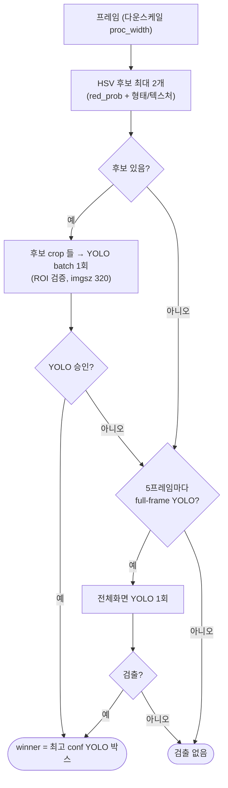

# arms_detection_node 동작 상세

A.R.M.S. 의 빨간 풍선 검출 노드. `/arms/image_raw` 를 받아 표적 하나를
`/arms/detections` 로 발행한다. 구조는 **HSV proposal → ROI YOLO verification**:
HSV 로 붉은 원형 후보를 싸게 만들고, 그 crop 들을 **YOLO batch 추론 한 번**으로
확인해 승인된 것만 발행한다. HSV 가 놓치는 경우를 위해 저주기 전체화면 YOLO fallback 을 둔다.

> ⚠️ 과거 버전의 ABSDIFF / cv_fused(HSV+ABSDIFF 융합)는 **현재 코드에 없다.**
> 검출기는 YOLO + HSV 두 가지뿐이다.

- 코드: `SW/arms_ws/src/arms_detection/arms_detection/arms_detection_node.py`
- 배포: GPU 도커 컨테이너(`docker-compose.jetson.yml`, 소스 바인드마운트).
  코드 수정은 `docker restart docker-arms_detection-1` 로 반영.

---

## 1. 토픽

| 방향 | 토픽 | 타입 | 설명 |
| --- | --- | --- | --- |
| 구독 | `/arms/image_raw` | `sensor_msgs/Image` | 입력 영상 (rgb8·bgr8·mono8) — 기본 경로 |
| 구독 | `/arms/image_raw/compressed` | `sensor_msgs/CompressedImage` | 입력 영상(JPEG/PNG) — `ARMS_INPUT_COMPRESSED=1` 일 때 (§2) |
| 발행 | `/arms/detections` | `arms_msgs/DetectionArray` | 표적 **0 또는 1개** |
| 발행 | `/arms/roi_image` | `sensor_msgs/Image` | 추적 표적 확대 크롭 (bgr8) |
| 발행 | `/arms/debug_image` | `sensor_msgs/Image` | YOLO/HSV 결과 + 최종 시각화 (bgr8) |
| 발행 | `/arms/hsv_debug_image` | `sensor_msgs/Image` | HSV 마스크·후보 시각화 (bgr8) |
| 발행 | `/arms/detector_status` | `std_msgs/Float32MultiArray` | 검출값 + **단계별 처리시간 진단** (§7) |

입력은 **둘 중 하나만** 구독한다: `ARMS_INPUT_COMPRESSED=1` 이면 `.../compressed`(디코드),
아니면 raw `image_raw`. `roi_image`·`debug_image`·`hsv_debug_image` 는 **구독자가 있을 때만**
그려서 발행한다. 특히 `hsv_debug_image` 는 구독자가 있고 TRACK/ROI 구간이라 HSV 가 안 돌던
프레임이면 그 프레임에 한해 HSV 후보를 **온디맨드로 한 번 더 계산**해 보여준다(UI 의 S키 일회성 캡처용).

---

## 2. 파이프라인 (`_cb_image` / `_cb_compressed` → `_process`)

입력 콜백은 얇다. `_cb_image`(raw)와 `_cb_compressed`(JPEG/PNG → `cv2.imdecode`)가 각각
BGR ndarray 로 만들어 공통 `_process(bgr_full, header)` 로 넘긴다. **압축 입력**은
컨테이너로 오는 UDP 데이터량을 크게 줄여(≈920KB → 수십 KB) 경계 조각 드롭을 없앤다(§8).

`_process` 는 프레임마다:

1. 빈 프레임 스킵 → `frame_interval_ms` 기록(입력 간격) → `_frame_i++`.
2. `_diag` 초기화 (단계별 타이밍 담을 dict).
3. **다운스케일**: `proc_width`(기본 320) 로 축소 — 원본(`bgr_full`)은 ROI 크롭용 보관. (입력이 그보다 작으면 스킵)
4. **`_TargetTracker.update(bgr, detect_fn, cfg)`** → 발행할 박스. FSM 이 검출을 언제/어디에 돌릴지 결정(§6). `detect_fn = _run_detectors`.
5. 각 단계 `perf_counter` 로 계측 → `total_ms` → **`_publish_detector_status()`**.
6. `DetectionArray` 발행(표적 있으면 1개), ROI/debug 영상 발행(구독자 있을 때).

> BGR 변환은 콜백에서 끝난다(raw 는 `imgmsg_to_bgr`, rgb8 은 뒤집음 / 압축은 `imdecode` 가 바로 BGR).

---

## 3. HSV 후보 (`_detect_hsv_candidates` + `_red_probability`)

하드 `inRange` 대신 **빨강 soft-확률 + 형태 + 텍스처** 로 붉은 원형 후보를 뽑는다.

- **`_red_probability`**: 픽셀별 0~1 빨강 점수 = `hue(원형 Gaussian) × sat(sigmoid) × val_low × val_high`.
  OpenCV hue 의 0/179 경계 빨강을 원형 hue 거리로 평가, 포화 LED/조명은 감점(하드컷 없음).
  → **프레임 전체 픽셀에 exp/sigmoid 를 계산하므로 이 단계가 고정 연산비용이 크다(§8).**
- `prob_threshold`(0.35)로 이진화 → `MORPH_CLOSE`(작은 구멍만) → 컨투어.
  (실기체 튜닝: 저채도 핑크 배경 억제 위해 `sat_center`=100, `min_circularity`=0.35 로 상향.)
- 컨투어별 게이팅·점수: 면적비(`hsv.min/max_area_ratio`), 형태(circularity·aspect, `min_circularity`),
  색(`red_prob` 평균), 텍스처(주변 라플라시안 분산 → 배경 매끈=하늘 우대, `texture_scale`).
- 상위 **`hsv.max_candidates`(기본 2)** 개를 반환. confidence 는 크기·색·형태 가중(상한 있음).

---

## 4. ROI YOLO 검증 & 전체화면 fallback (`_detect_acquire`)

획득(FULL) 경로:

1. **HSV 후보 생성**(§3). 없으면 아래 fallback 로.
2. **`_detect_yolo_proposals_batch`**: 각 후보 중심 주변을 `yolo.proposal_crop_px`(192px)로 크롭 →
   **여러 crop 을 YOLO batch 추론 1회**(`_detect_yolo_batch`, `ARMS_ROI_IMGSZ`=320)로 확인 →
   YOLO 가 승인한 박스만 원본 좌표로 역변환. **winner = 최고 confidence.**
   (crop 을 imgsz 로 확대 추론하므로 원거리 소형 표적도 학습 ROI 크기로 보인다.)
3. **전체화면 fallback**: ROI 가 아무것도 못 얻었고 `_frame_i % yolo.full_fallback_interval`(5)==0 이면
   전체 프레임 YOLO 1회(`ARMS_FULL_IMGSZ`=320). HSV 가 색으로 후보를 놓친 경우 보완.

> **최종 판정은 항상 YOLO** 다. HSV 는 "어디를 볼지" 만 제안 → 붉은 건물/조명에 헛-LOCK 되지 않는다.

추적 재검증 경로(`_run_detectors`, roi_box 주어짐): ROI 크롭에 YOLO 1회 → 역변환.

---

## 5. YOLO (`_detect_yolo` / `_detect_yolo_batch`)

- 같은 프로세스에서 ultralytics **TensorRT 엔진**(현재 기본 `best_nano_v6.engine`, FP16) 추론.
  (모델은 `ARMS_MODEL` 로 교체 — compose/런치 기본값. 이 젯슨에서 빌드한 `.engine` 이어야 함.)
- 입력은 **BGR 그대로**(ultralytics 가 내부 RGB 변환 — 미리 뒤집으면 빨강 성능 급락).
- 입력 크기 두 가지: `ARMS_ROI_IMGSZ`(ROI 크롭용), `ARMS_FULL_IMGSZ`(전체화면용).
  **정적 엔진은 단일 크기라 둘 다 엔진 빌드 크기(320)와 일치해야 한다**(안 맞으면 추론 실패).
- **OOM/실패 복구**: 첫 predict 지연로딩이 GPU OOM 등으로 실패해도 노드가 안 죽는다. 쿨다운
  (`ARMS_YOLO_RETRY_SEC`) 후 재시도, 그동안 검출 보류. 연속 `ARMS_YOLO_MAX_FAILS`(3)회 실패 시
  YOLO 영구 비활성(엔진/모델 없거나 OOM 이면 HSV 만으로라도 후보는 계속 만든다).
- `.pt`(PyTorch) 를 직접 로드하면 프레임워크 전체가 올라가 **GPU OOM** 나기 쉽다 → **반드시 `.engine`**
  (변환: `SW/yolo/export_trt.py`, NvMap 워크어라운드 포함).

---

## 6. detect-then-track FSM (`_TargetTracker`)

CSRT/KCF 로 ROI 만 추적해 TRACK 구간 비용을 줄이는 옵션. **`track.enable`** 로 켜고 끈다.

- **`track.enable = False` (현재 기본)**: 추적기 미사용. **매 프레임 풀프레임 검출(`_detect_acquire`)**
  으로 표적을 다시 찾는다. 추적기 드리프트로 표적을 "놓치는(락 풀리는)" 문제가 없다. 대신 매 프레임
  검출이라 연산은 늘고 Kalman 스무딩/ACQUIRE 시간확인은 생략된다.
- **`track.enable = True`**: ACQUIRE → TRACK → LOST 3상태.
  - ACQUIRE: 매 프레임 검출, 연속 `confirm_frames` 회 같은 위치면 CSRT init → TRACK.
  - TRACK: CSRT 추적 + `redetect_interval` 마다 ROI YOLO 재검증(드리프트 보정). 실패 누적 → LOST.
  - LOST: 매 프레임 재획득, 예측 근처면 TRACK 복귀, `reacquire_frames` 초과면 ACQUIRE.

---

## 7. detector_status (진단·UI)

`Float32MultiArray`, 16개 값. 0~3 은 UI 호환, 4~ 는 성능 진단:

| idx | 내용 | idx | 내용 |
| --- | --- | --- | --- |
| 0 | yolo conf(-1 off, -2 사용불가) | 8 | resize_ms |
| 1 | hsv conf | 9 | **hsv_ms** |
| 2 | (미사용, -1) | 10 | **yolo_ms** |
| 3 | mode(0=FULL,1=ROI) | 11 | tracker_ms |
| 4 | hsv 후보 수 | 12 | **total_ms** |
| 5 | yolo 입력 crop 수 | 13 | state(0 ACQUIRE/1 TRACK/2 LOST) |
| 6 | yolo 승인 수 | 14 | frame_i |
| 7 | **frame_interval_ms**(입력 간격) | 15 | full_frame(1=전체화면 YOLO) |

arms_ui 가 이 값으로 실시간 성능 패널을 그린다(`ui.cv_debug=true` 일 때).

---

## 8. 성능 프로파일 (실측) & 최적화 이력

빨간풍선 영상(`red_ballon_*`) 30fps 발행, 압축 입력, warm, 739프레임/30초 기준:

| 단계 | 평균 | 비고 |
| --- | --- | --- |
| resize | ~1 ms | 원본→320 축소 |
| **hsv (red_probability)** | **~7.6 ms** | `proc_width=320` — 픽셀별 exp/sigmoid 고정비용(640 대비 1/4) |
| **yolo (ROI crop batch@320)** | **~25 ms** | 후보 수 비례 |
| tracker | ~2 ms | track.enable=False 라 CSRT 미사용 |
| **total** | **median ~35.7 ms → ~28 Hz 처리 여력** | |

측정: **입력 24.6Hz, 검출 발행 24.6Hz (1:1 추종)**. 처리여력(~28Hz)이 입력보다 커
프레임 드롭 없이 따라간다.

**해결한 병목(3~4Hz → 24.6Hz):**

1. **입력 전송 (가장 컸던 병목) — 압축으로 해결.** raw `image_raw` 640×480 bgr8 ≈920KB/프레임을
   FastDDS **UDP 로 컨테이너 경계**로 넘기면 조각화/재조립 드롭으로 도착률이 ~10Hz 이하로 떨어졌다.
   → **video 노드가 `image_transport` 압축 서브토픽(`/arms/image_raw/compressed`)을 발행**하고
   detection 이 `ARMS_INPUT_COMPRESSED=1` 로 그걸 구독·디코드하니 데이터량이 급감해 드롭이 사라졌다.
   (video/replay 런치가 압축 서브토픽 리매핑을 명시해야 이름이 맞는다 — §video 런치 주석 참고.)
2. **hsv red_probability.** `proc_width` 640→**320** 으로 픽셀 1/4 → ~26ms→~7.6ms.
3. **커널 UDP 버퍼** `net.core.rmem_max/wmem_max` 16MB + FastDDS `send/receiveBufferSize` 16MB
   (`fastdds_udp.xml`) — 재조립 실패 감소(재부팅 후에도 유지되게 설정).
4. **YOLO TensorRT 엔진**(FP16) — `.pt` 대비 GPU 메모리·지연 대폭 감소(§5).

**추가 여지:** `hsv.max_candidates` 2→1 이면 ROI crop 절반 → yolo ~절반, `full_fallback_interval`↑ 도 절감.

---

## 9. 주요 파라미터

| 파라미터 | 기본 | 설명 |
| --- | --- | --- |
| `use_yolo` / `use_hsv` | true | 검출/후보 on/off |
| `proc_width` | 320 | 검출 처리 가로 해상도(0=원본) — HSV 비용 직결 |
| `yolo.full_fallback_interval` | 5 | 전체화면 YOLO fallback 주기(프레임) |
| `yolo.proposal_crop_px` | 192 | HSV 후보 crop 크기[px] |
| `hsv.max_candidates` | 2 | YOLO 로 검증할 HSV 후보 수 |
| `hsv.prob_threshold` | 0.35 | 빨강 확률 이진화 임계 |
| `hsv.hue_sigma` / `sat_center` / `val_*` | — / 100 / — | 빨강 soft-확률 및 저채도 핑크 배경 억제 파라미터 |
| `hsv.min/max_area_ratio` | 3e-5 / 0.02 | 후보 면적비 게이트 |
| `hsv.min_circularity` / `texture_scale` | 0.35 / 120 | 형태·텍스처 게이트 |
| `track.enable` | **false** | false=매프레임 풀프레임 검출, true=CSRT/KCF ROI 추적 |
| `track.tracker_type` | CSRT | "CSRT"\|"KCF" |
| `track.confirm_frames` / `redetect_interval` / `reacquire_frames` | 3 / 5 / 8 | FSM 파라미터 |
| `roi.margin` | 1.8 | ROI 확대 크롭 배율 |
| `debug.detector_status` / `publish_debug` | true | 진단/디버그 발행 |

### 환경변수 (compose 주입)

| 변수 | 기본 | 설명 |
| --- | --- | --- |
| `ARMS_MODEL` | `/models/best_nano_v6.engine` | YOLO 가중치(없으면 YOLO 비활성) |
| `ARMS_CONF` / `ARMS_IOU` | 0.32 / 0.45 | YOLO conf/IoU |
| `ARMS_FULL_IMGSZ` / `ARMS_ROI_IMGSZ` | 320 / 320 | 전체화면/ROI YOLO 입력 크기(엔진 크기와 일치必) |
| `ARMS_YOLO_RETRY_SEC` / `ARMS_YOLO_MAX_FAILS` | 3.0 / 3 | 실패 재시도/영구비활성 |
| `ARMS_INPUT_COMPRESSED` | 0 | 1=압축(`.../compressed`) 구독·디코드, 0=raw `image_raw` (§2·§8) |
